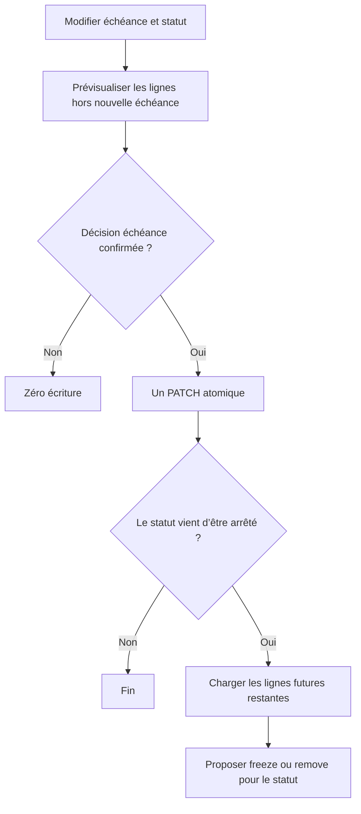

# Instruction: Corriger l’orchestration Angular

## Architecture projection

> Tree of the final files. ✅ create · ✏️ modify · ❌ delete

```txt
frontend
├── e2e/tests/features
│   └── ✏️ savings-goals-progress.spec.ts
└── projects/webapp/src/app/feature/savings-goals
    ├── components
    │   └── ✏️ savings-goal-form-dialog.spec.ts
    └── detail
        ├── ✏️ savings-goal-detail-page.ts
        └── ✏️ savings-goal-detail-page.spec.ts
```

- Création : aucune. Suppression : aucune.

## User Journey



## Tasks to do

### `1)` Reproduire la transition échéance et statut

> Verrouiller le cas où un même formulaire avance l’échéance et arrête l’objectif.

1. Remplacer l’attente actuelle « aucun generation-stop » par un test qui décrit les deux ensembles successifs.
2. Vérifier l’ordre réseau : preview d’échéance, PATCH atomique, preview de statut, puis POST uniquement si l’utilisateur confirme cette seconde décision.
3. Couvrir annulation, erreur de preview, conflit de PATCH et liste restante vide ; aucun de ces cas ne doit produire de faux succès.

### `2)` Continuer après un PATCH d’échéance réellement appliqué

> Ne plus sortir de `onEdit` avant le traitement d’une transition de statut.

1. Faire retourner à `#editAdvancedDeadline` un résultat minimal indiquant si le PATCH a été appliqué.
2. Après succès seulement, réutiliser la garde de transition `ACTIVE → PAUSED|COMPLETED` et `#proposeGenerationStop`.
3. Conserver une seule mutation d’objectif : le second choix agit uniquement via le POST generation-stop existant.
4. Sur annulation ou échec d’échéance, ne charger aucun candidat de statut et n’écrire rien de plus.

### `3)` Faire tester le rendu public du formulaire

> Remplacer l’accès aux signaux privés par une interaction qui casse si le binding UI casse.

1. Piloter les contrôles publics du formulaire pour activer cible et échéance.
2. Vérifier dans le DOM la contribution mensuelle proposée et sa mise à jour.
3. Garder les tests de schéma pour le contrat pur ; ne dupliquer aucune formule dans le spec de composant.
4. Ajouter le scénario échéance+statut à l’E2E déterministe existant, avec mocks stricts et `--retries=0`.

## Test acceptance criteria

| Task | Acceptance criteria |
| --- | --- |
| 1 | Annuler la décision d’échéance produit zéro PATCH et aucune preview de statut. |
| 1 | Un conflit ou une erreur recharge la donnée utile sans succès affiché ni seconde décision prématurée. |
| 2 | Une échéance avancée combinée à `PAUSED` ou `COMPLETED` produit exactement un PATCH atomique, puis propose le traitement des lignes futures restantes. |
| 2 | Refuser la seconde décision laisse le PATCH d’échéance/statut committé et n’écrit aucune modification de ligne supplémentaire. |
| 2 | Confirmer la seconde décision produit un seul POST generation-stop avec les IDs de la preview de statut, jamais ceux de la preview d’échéance. |
| 2 | Une transition sans lignes futures restantes n’ouvre aucun second dialogue. |
| 3 | Le test du formulaire échoue si le champ ou le texte de contribution mensuelle n’est plus relié au calcul visible. |
| 3 | Le scénario E2E vérifie l’ordre et les payloads des deux décisions sans retry masquant un premier échec. |
| 3 | Les suites Angular ciblées, le type-check et les E2E savings-goal passent. |
