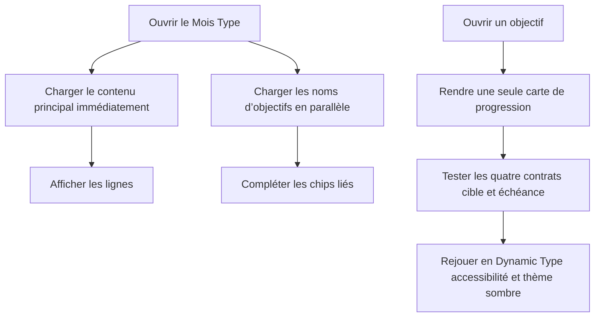

# Instruction: Consolider et prouver les surfaces iOS

## Architecture projection

> Tree of the final files. ✅ create · ✏️ modify · ❌ delete

```txt
ios
├── Pulpe
│   ├── App
│   │   └── ✏️ SavingsGoalIntervalUITestHarness.swift
│   ├── Domain/Formulas
│   │   └── ✏️ SavingsPlanCalculator.swift
│   └── Features
│       ├── SavingsGoals
│       │   ├── ✏️ SavingsGoalDetailView.swift
│       │   └── Components
│       │       ├── ✏️ GoalProgressCard.swift
│       │       └── ✏️ GoalProjectionChart.swift
│       └── Templates/TemplateDetails
│           └── ✏️ TemplateDetailsView.swift
└── PulpeUITests
    └── ✏️ SavingsGoalIntervalUITests.swift
```

- Création : aucune. Suppression : aucune.

## User Journey



## Tasks to do

### `1)` Décorréler le chargement auxiliaire du Mois Type

> Ne pas maintenir le skeleton principal pendant le GET des noms d’objectifs.

1. Remplacer la `.task` séquentielle par deux tâches SwiftUI indépendantes, une pour le détail du modèle et une pour `SavingsGoalStore`.
2. Conserver `loadIfNeeded` et les caches existants ; ne créer ni coordinator ni nouveau store.
3. Vérifier que le détail et les lignes libres restent utilisables si le chargement auxiliaire échoue ou tarde.

### `2)` Garder une seule carte de progression et une base Swift lintable

> Supprimer la divergence entre la carte privée active et `GoalProgressCard`.

1. Porter dans `GoalProgressCard` le comportement actuel correct : libellé Épargné, barre seulement avec cible, `plannedProjection` disponible sans cible et rythme conditionnel.
2. Remplacer `progressCard(progress:)` par `GoalProgressCard`, puis supprimer les helpers privés devenus identiques.
3. Préserver les labels d’accessibilité et les montants sensibles lors de la consolidation.
4. Extraire la validation des ajustements de `SavingsPlanCalculator.simulate` dans une fonction privée minimale.
5. Envelopper la ligne longue restante de `GoalProjectionChart`; ne désactiver aucune règle SwiftLint.

### `3)` Rendre la matrice XCUITest réellement probante

> Vérifier toutes les régions conditionnelles et les variantes visuelles demandées.

1. Enrichir les données du harness avec une timeline et une ligne liée déterministes, sans réseau ni base locale.
2. Étendre `DetailExpectation` aux régions : cible, échéance, projection, requis, estimation, suggestion, trajectoire et action d’ajustement.
3. Vérifier présence et absence pour nom-seul, cible-seule, échéance-seule et cible+échéance ; aucune valeur fictive ne doit satisfaire le test.
4. Ajouter au harness deux overrides uniquement test : Dynamic Type accessibilité pour formulaire+détail et apparence sombre pour la confirmation.
5. Interagir avec les contrôles essentiels dans ces variantes, faire défiler jusqu’aux actions et conserver des `XCTAttachment` nommés avec `keepAlways`.
6. Réutiliser les vues de production et les libellés existants ; ajouter un identifiant d’accessibilité uniquement lorsqu’aucune cible stable et univoque n’existe.

## Test acceptance criteria

| Task | Acceptance criteria |
| --- | --- |
| 1 | Le Mois Type quitte son skeleton dès que son détail est chargé, indépendamment de la latence de la liste d’objectifs. |
| 1 | Une ligne libre reste utilisable sans liste d’objectifs ; une ligne liée affiche son nom lorsque le store auxiliaire arrive. |
| 2 | `SavingsGoalDetailView` utilise une seule implémentation de carte de progression et ne conserve aucun helper dupliqué. |
| 2 | Sans cible, aucune barre ni cible fictive n’apparaît et `plannedProjection` reste visible ; avec cible, les couches prévues/confirmées et leurs labels restent corrects. |
| 2 | `swiftlint lint --no-cache --strict` ne rapporte aucune violation dans les fichiers Swift modifiés. |
| 3 | Les quatre combinaisons cible/échéance prouvent présence et absence de chaque région applicable, pas seulement la cible, l’échéance et le rythme. |
| 3 | Formulaire et détail restent lisibles, scrollables et actionnables en taille Dynamic Type d’accessibilité. |
| 3 | La confirmation sombre conserve ses textes, montants et trois décisions sans troncature ni contraste manifestement cassé. |
| 3 | Les captures iOS sont conservées dans le `.xcresult` réussi avec un nom indiquant scénario, thème et taille de texte. |
| 3 | `SavingsGoalIntervalUITests` passe sans réseau, authentification ni état local partagé. |
