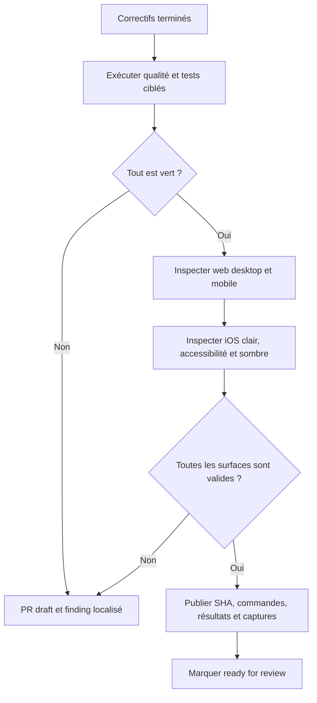

# Instruction: Produire la preuve de merge cross-platform

## Architecture projection

> Tree of the final files. ✅ create · ✏️ modify · ❌ delete

```txt
.
└── Aucun fichier produit
    ├── captures web exportées comme artefacts de PR
    └── captures et journaux iOS exportés depuis le .xcresult
```

## User Journey



## Tasks to do

### `1)` Rejouer les preuves au même SHA

> Éviter de combiner des résultats provenant de versions différentes.

1. Exécuter `pnpm quality`, les suites shared/backend/Angular ciblées et les intégrations Supabase sur le SHA final.
2. Exécuter les specs Playwright savings-goal avec `--retries=0` à 1440×900 et 390×844.
3. Sur un seul iPhone Simulator, exécuter les tests Swift ciblés, `SavingsGoalIntervalUITests`, `PulpeUITests/testAppLaunches`, `BudgetLineLongPressTests` et la build `PulpeLocal`.
4. Conserver le `.xcresult` final ; un résultat partiel, une build seule ou un retry après premier échec ne vaut pas validation.

### `2)` Inspecter les surfaces qui portent les findings

> Contrôler le rendu réel après consolidation, pas seulement les assertions.

1. Inspecter formulaire, détails des quatre contrats, double confirmation échéance/statut, ligne liée et mode Tableau sur le web.
2. Inspecter formulaire, détails représentatifs, confirmation et ligne liée sur iOS en clair, Dynamic Type accessibilité et sombre selon la phase 3.
3. Vérifier coupe, chevauchement, scroll, focus, cibles tactiles, hiérarchie des actions, contenu conditionnel fantôme et montants sensibles.
4. Nommer chaque capture avec surface, viewport ou simulateur, OS, thème, taille de texte et SHA.

### `3)` Fermer le review et appliquer le gate de readiness

> Rendre la décision de merge vérifiable depuis la PR.

1. Garder la PR en draft tant qu’un test, une inspection ou un des 15 findings reste ouvert.
2. Publier dans la PR le SHA, les commandes exactes, leurs résultats finaux et les captures web/iOS exportées.
3. Rejouer `aidd-dev:05-review` sur le diff corrigé et rattacher son verdict au même SHA.
4. Marquer la PR `ready for review` uniquement après verdict `approved`; commit, push, commentaire et changement de statut restent des actions explicites à exécuter quand ils sont autorisés.

## Test acceptance criteria

| Task | Acceptance criteria |
| --- | --- |
| 1 | Qualité, shared, backend, Angular, Playwright, Swift ciblé, UI iOS, lancement, long-press et build PulpeLocal passent sur le même SHA final. |
| 1 | Aucun succès n’est déduit d’un retry, d’une suite partielle ou d’une build sans test de comportement. |
| 2 | Les surfaces web sont utilisables à 1440×900 et 390×844 sans coupe, chevauchement, scroll bloqué ni contenu conditionnel fantôme. |
| 2 | Les surfaces iOS sont utilisables en clair, Dynamic Type d’accessibilité et sombre sans contrôle ou montant essentiel tronqué. |
| 2 | Chaque capture publiée identifie sans ambiguïté la surface, l’environnement et le SHA inspectés. |
| 3 | Les 15 findings actionnables du review initial sont fermés par un diff ou une preuve explicite ; les deux exclusions restent documentées comme `not-applicable`. |
| 3 | La PR contient résultats et captures consultables, pas seulement leur chemin local dans un `.xcresult`. |
| 3 | La PR reste en draft pour tout échec et ne passe ready qu’après un review `approved` du SHA publié. |
