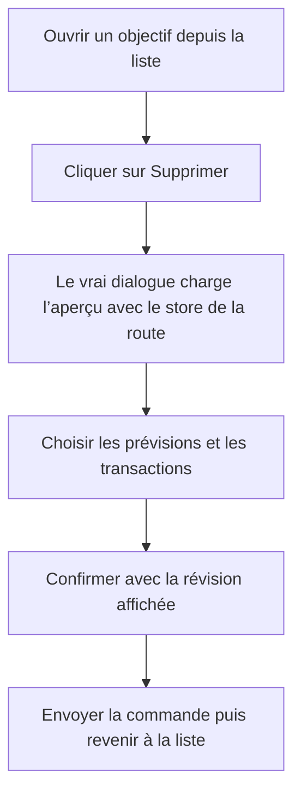

# Instruction: Reproduire, corriger et verrouiller le parcours web

## Architecture projection

> Tree of the final files. ✅ create · ✏️ modify · ❌ delete

```txt
.
└── frontend
    ├── e2e/tests/features
    │   └── savings-goal-deletion.spec.ts ✅
    └── projects/webapp/src/app/feature/savings-goals/detail
        ├── savings-goal-detail-page.ts ✏️
        └── savings-goal-detail-page.spec.ts ✏️
```

## User Journey



## Tasks to do

### `1)` Écrire la régression E2E avant la correction

> Reproduire le joint absent entre la route, `MatDialog` et `SavingsGoalStore`.

1. Ajouter un test Playwright dans la suite `Feature Tests (Mocked)` avec un objectif, sa progression, ses contributions et un impact de suppression contenant une prévision, un budget et une transaction.
2. Parcourir la liste puis le détail, cliquer sur le vrai bouton de suppression et attendre le résumé réel du dialogue, sans remplacer `MatDialog` ni fournir le store au composant.
3. Constater avant correction l’échec sur l’ouverture du dialogue et conserver dans la preuve d’implémentation la page error `NG0201`.
4. Compléter le même test par le choix « prévisions et transactions », la confirmation, l’assertion du `mode` et de la `revision` du POST, puis le retour à la liste.

### `2)` Transmettre l’injecteur de la route au dialogue

> Rendre le store fourni par `savingsGoalsRoutes` visible depuis l’overlay.

1. Injecter l’`Injector` courant dans `SavingsGoalDetailPage`.
2. Le passer à `MatDialog.open` via l’option `injector`, selon le motif déjà utilisé par les autres dialogues dépendant d’un store de route.
3. Étendre l’attente unitaire de `SavingsGoalDetailPage` pour verrouiller cette option sans modifier les dimensions, les données, l’annulation ni les chemins de succès et d’erreur existants.

### `3)` Valider le correctif au bon niveau

> Prouver la régression, le happy path et l’absence de dommage collatéral.

1. Exécuter la spec unitaire de la page et la spec existante du dialogue, dont le cas de 76 budgets scrollables.
2. Exécuter le nouveau test Playwright seul, puis toute la suite `Feature Tests (Mocked)`.
3. Exécuter `pnpm quality` et `git diff --check`.

## Test acceptance criteria

| Task | Acceptance criteria |
| --- | --- |
| 1 | Avant le correctif, le nouveau test échoue après le clic sur Supprimer parce que le dialogue réel ne peut pas résoudre `SavingsGoalStore`, avec `NG0201` observé. |
| 1 | Après le correctif, le résumé d’impact réel s’affiche et aucune page error n’est émise pendant l’ouverture. |
| 1 | La confirmation envoie `goal_forecasts_and_transactions` avec exactement la révision affichée, puis ramène l’utilisateur à la liste. |
| 2 | `MatDialog.open` reçoit l’injecteur de la route en plus des données et dimensions actuelles. |
| 2 | L’annulation, le conflit de révision et l’erreur post-commit conservent leurs comportements actuels. |
| 3 | Les specs ciblées, la suite Playwright `Feature Tests (Mocked)`, `pnpm quality` et `git diff --check` passent. |
