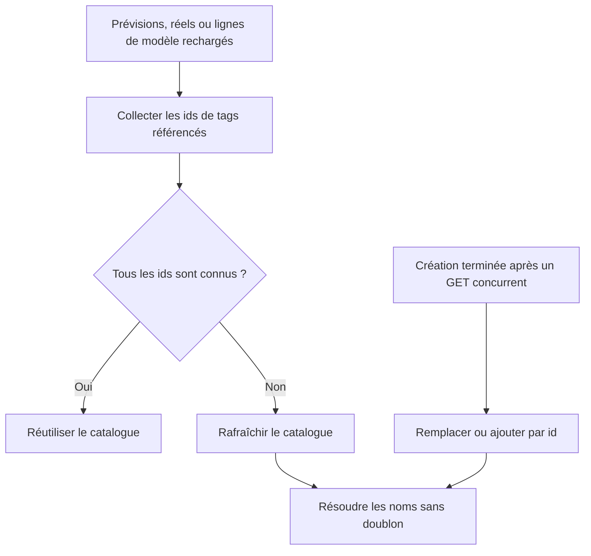

# Instruction: Rendre le catalogue idempotent et réactif

## Architecture projection

> Tree of the final files. ✅ create · ✏️ modify · ❌ delete

```txt
ios/
├── Pulpe/
│   ├── Domain/
│   │   └── Store/
│   │       └── ✏️ TagStore.swift                    # upsert de création et résolution des ids inconnus
│   └── Features/
│       ├── CurrentMonth/
│       │   └── ✏️ CurrentMonthView.swift            # réagir aux ids présents après retry ou refresh
│       └── Templates/
│           └── TemplateDetails/
│               └── ✏️ TemplateDetailsView.swift     # réagir aux ids présents après retry ou refresh
└── PulpeTests/
    └── Domain/
        └── Store/
            └── ✏️ TagStoreTests.swift                # reproduire la duplication et verrouiller la résolution

✅ aucun nouveau fichier
❌ aucun fichier
```

## User Journey



## Tasks to do

### `1)` Reproduire puis supprimer la duplication

> Garantir un seul élément par `Tag.id`, quel que soit l’ordre de fin du GET et du POST.

1. Étendre le test de concurrence existant avec un GET qui contient déjà l’id retourné par la création suspendue.
2. Remplacer l’ajout brut dans `TagStore.create` par un upsert minimal sur l’id, puis conserver le tri existant.
3. Vérifier que `namesById` reste constructible et que le tag créé apparaît exactement une fois.

### `2)` Charger les noms requis par les données visibles

> Réagir aux ids chargés plutôt qu’aux seuls cycles de vie initiaux des écrans.

1. Ajouter au store une opération ciblée qui ne fait rien pour une liste vide ou entièrement connue et force un refresh lorsqu’un id référencé manque.
2. Tester les trois cas : aucun id, ids connus, id inconnu malgré un cache récent.
3. Dans Mois en cours, dériver l’ensemble des ids depuis les prévisions et réels puis appeler l’opération via une tâche identifiée par cet ensemble.
4. Dans le détail d’un modèle, dériver l’ensemble depuis les lignes et appliquer le même mécanisme.
5. Retirer les chargements conditionnels initiaux devenus redondants.

## Test acceptance criteria

| Task | Acceptance criteria |
| ---- | ------------------- |
| 1 | Un GET concurrent contenant le tag créé puis la fin du POST laisse un seul élément pour cet id, trié, et `namesById` ne rencontre aucune clé dupliquée |
| 2 | Une liste vide ou entièrement connue ne déclenche aucun GET supplémentaire; un id inconnu rafraîchit le catalogue même si son cache est encore valide |
| 2 | Après un retry, un pull-to-refresh ou un retour d’onglet qui introduit des ids, Mois en cours et Modèles résolvent leurs noms sans recréer les vues |
| 1, 2 | Les tests ciblés du `TagStore` et le build `PulpeLocal` passent |
