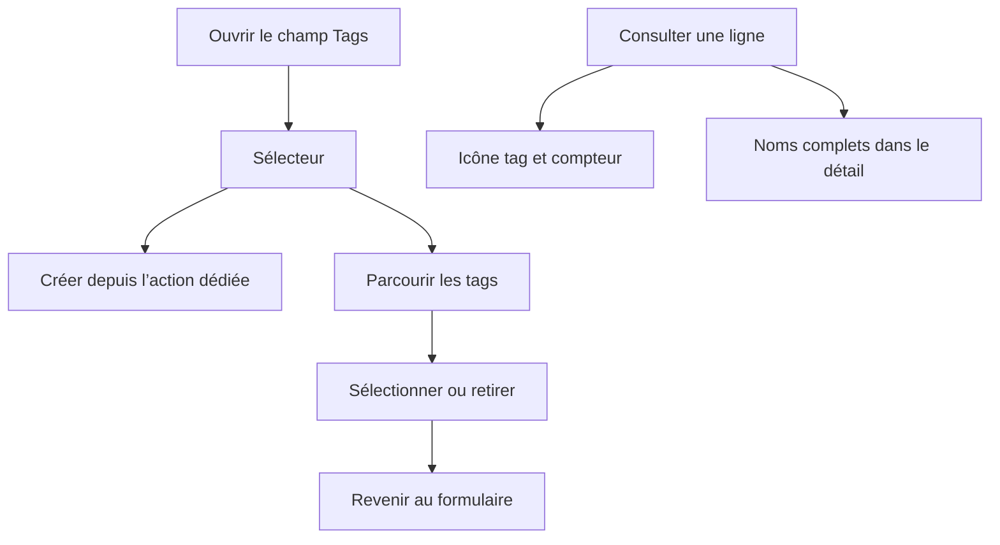

# Instruction: Conformer le sélecteur et l’affichage

## Architecture projection

> Tree of the final files. ✅ create · ✏️ modify · ❌ delete

```txt
.
├── aidd_docs/
│   └── tasks/2026_07/2026_07_26_ajouter-consulter-tags-ios/
│       └── ✏️ phase-3.md                            # aligner le rendu documenté sur icône + compteur
└── ios/
    └── Pulpe/
        └── Shared/
            └── Components/
                ├── ✏️ TagPickerField.swift          # cibles 44 pt, styles partagés et libellés VoiceOver
                └── ✏️ TagChips.swift                # style lisible sur cartes et fond d’application

✅ aucun nouveau fichier
❌ aucun fichier
```

## User Journey



## Wireframe

```txt
┌────────────────────────────────────┐
│ (1) Barre du sélecteur             │
├────────────────────────────────────┤
│ (2) Nouveau tag [____________] [+] │
├────────────────────────────────────┤
│ (3) Catalogue               n / 10 │
│     [tag] Nom               [état] │
│     [tag] Nom               [état] │
└────────────────────────────────────┘

┌────────────────────────────────────┐
│ (4) Ligne                  montant │
│     [tag · compteur]               │
└────────────────────────────────────┘
```

1. Barre: titre et action de fermeture.
2. Création: champ texte et action dédiée.
3. Catalogue: liste des noms et état de chaque ligne.
4. Ligne: métadonnée compacte sous son identité.

## Tasks to do

### `1)` Corriger les interactions et VoiceOver

> Appliquer les primitives déjà présentes sans nouveau style ni composant.

1. Déplacer les frames minimales et `contentShape` des labels vers les `Button`.
2. Remplacer les styles système bruts par `plainPressedButtonStyle` pour le champ et les lignes.
3. Appliquer `circleIconButtonStyle` au bouton de création.
4. Donner à chaque ligne le nom du tag comme libellé VoiceOver et garder son état dans la valeur.

### `2)` Utiliser un rendu de tag sûr sur tous les fonds

> Garder un seul rendu partagé, lisible sur les cartes comme sur `appBackground`.

1. Utiliser le style `outlined` existant pour les noms et les compteurs de `TagChips`.
2. Conserver l’icône + compteur sur les lignes denses et tous les noms dans le détail.
3. Aligner la phase 3 du plan PUL-294 sur ce rendu validé et retirer les attentes « deux noms + débordement ».

### `3)` Vérifier sans élargir le périmètre

> Prouver le rendu et les invariants existants sans ajouter de nouvelle infrastructure de test.

1. Exécuter les tests ciblés `TagPickerFieldTests` et `TagChipsTests`.
2. Exécuter SwiftLint sur les fichiers Swift modifiés et l’invariant d’architecture iOS.
3. Construire `PulpeLocal` puis vérifier le sélecteur et les deux présentations de tags sur simulateur.

## Test acceptance criteria

| Task | Acceptance criteria |
| ---- | ------------------- |
| 1 | Le champ, chaque ligne et le bouton de création ont une cible tactile d’au moins 44×44 pt avec feedback pressé |
| 1 | VoiceOver annonce une fois le nom du tag puis « Sélectionné » ou « Non sélectionné », sans lire les symboles décoratifs |
| 2 | Les tags restent lisibles sur `appBackground` et sur les cartes; les lignes denses gardent l’icône + compteur et le détail garde tous les noms |
| 2 | Le plan PUL-294 décrit le rendu effectivement validé |
| 3 | Les tests ciblés, SwiftLint, l’invariant d’architecture et le build `PulpeLocal` passent; les captures simulateur ne montrent aucune régression de mise en page |
