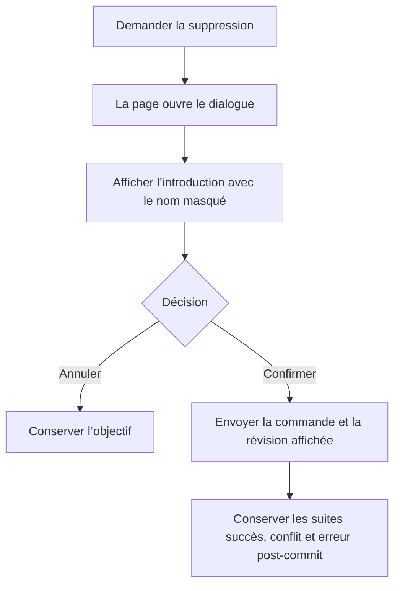

# Instruction: Web — conformer le dialogue sans changer l’expérience

## Architecture projection

> Tree of the final files. ✅ create · ✏️ modify · ❌ delete

```txt
frontend/projects/webapp/src/app/feature/savings-goals/
├── services/
│   └── ✏️ savings-goals-dialog.service.ts
│       # retire uniquement l’ouverture mono-consommateur du dialogue de suppression
└── detail/
    ├── ✏️ savings-goal-detail-page.ts
    │   # ouvre directement le dialogue avec sa configuration actuelle
    ├── ✏️ savings-goal-detail-page.spec.ts
    │   # verrouille l’ouverture directe, l’annulation et les suites de suppression
    └── components/
        ├── ✏️ goal-deletion-dialog.spec.ts
        │   # reproduit l’absence de masquage du nom d’objectif
        └── goal-deletion-dialog/
            └── ✏️ goal-deletion-dialog.html
                # masque le texte utilisateur dans l’introduction
```

## User Journey



## Tasks to do

### `1)` Écrire les reproductions web

> Les tests doivent échouer tant que le nom reste capturable et que la page délègue l’ouverture au service.

1. Vérifier dans la spec du dialogue que l’élément affichant `goalName` porte `ph-no-capture`.
2. Remplacer dans la spec de page le mock `openDeletion` par un mock `MatDialog.open` dont `afterClosed()` renvoie la commande ou `undefined`.
3. Vérifier le composant ouvert, les données et la configuration exacte du dialogue.
4. Conserver les assertions d’annulation, succès, conflit et erreur post-commit.

### `2)` Appliquer la correction minimale

> La correction change la responsabilité technique, pas le rendu ni le parcours.

1. Ajouter `ph-no-capture` au paragraphe non interactif qui affiche le nom d’objectif.
2. Injecter `MatDialog` dans la page détail et y ouvrir `GoalDeletionDialog`.
3. Attendre `afterClosed()` avec le mécanisme RxJS déjà employé dans le projet.
4. Reprendre sans changement les données, largeur et limites de hauteur actuelles.
5. Retirer uniquement `openDeletion` et ses imports devenus inutiles de `SavingsGoalsDialogService`.
6. Ne créer ni helper, ni nouveau service, ni nouveau composant.

## Test acceptance criteria

| Task | Acceptance criteria |
| --- | --- |
| 1 | Le nom d’objectif interpolé dans l’introduction est couvert par `ph-no-capture`, sans appliquer cette classe à un bouton ou un lien. |
| 1 | La page ouvre `GoalDeletionDialog` avec les mêmes données, `width`, `maxWidth`, `height` et `maxHeight` qu’avant. |
| 2 | Fermer le dialogue sans commande ne supprime rien ; confirmer transmet exactement la commande et sa révision au store. |
| 2 | Les chemins succès, conflit et erreur post-commit conservent leur navigation et leur message actuels. |
| 2 | `SavingsGoalsDialogService` conserve ses autres responsabilités et ne contient plus l’ouverture mono-consommateur de suppression. |
