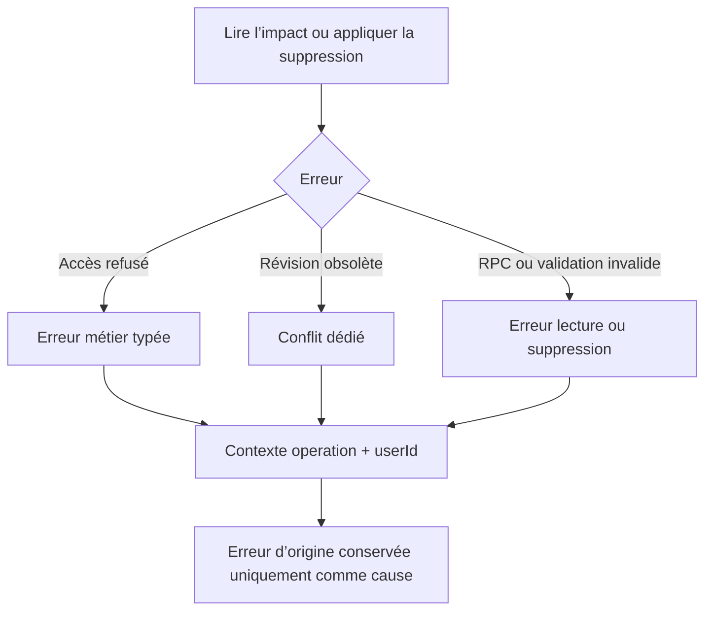

# Instruction: Backend — normaliser les contextes d’erreur de suppression

## Architecture projection

> Tree of the final files. ✅ create · ✏️ modify · ❌ delete

```txt
backend-nest/src/modules/savings-goal/
├── application/
│   ├── ✏️ remove-savings-goal.use-case.spec.ts
│   │   # reproduit le userId absent du conflit remappé
│   └── ✏️ remove-savings-goal.use-case.ts
│       # enrichit le conflit applicatif avec l’utilisateur authentifié
└── infrastructure/persistence/
    ├── ✏️ supabase-savings-goal.repository.spec.ts
    │   # verrouille contextes, absence d’erreur brute et chaîne de cause
    └── ✏️ supabase-savings-goal.repository.ts
        # normalise tous les contextes des deux opérations de suppression
```

## User Journey



## Tasks to do

### `1)` Reproduire les contextes incomplets

> Les specs doivent observer le contrat de diagnostic, pas seulement le code HTTP.

1. Couvrir une erreur RPC de lecture d’impact et une erreur RPC d’application.
2. Vérifier `operation`, `userId`, l’identité de `cause` et l’absence de `supabaseError` dans `loggingContext`.
3. Étendre le test du conflit remappé par le cas d’usage pour exiger le `userId`.
4. Conserver les assertions existantes sur codes et statuts.

### `2)` Conformer les exceptions de suppression

> Le provider et le cas d’usage possèdent déjà l’utilisateur ; aucune nouvelle abstraction n’est nécessaire.

1. Ajouter le `userId` du provider à chaque `BusinessException` émise par `getSavingsGoalDeletionImpact` et `applySavingsGoalDeletion`, y compris les erreurs de validation.
2. Retirer `supabaseError` de ces seuls contextes et conserver l’erreur d’origine dans `cause`.
3. Transmettre `user.id` au remapping du conflit dans `RemoveSavingsGoalUseCase`.
4. Ne modifier ni les définitions d’erreur, ni les codes HTTP, ni l’ordre des mutations et traitements post-commit.
5. Laisser les contextes préexistants hors de ces deux opérations hors périmètre.

## Test acceptance criteria

| Task | Acceptance criteria |
| --- | --- |
| 1 | Toute erreur de lecture d’impact ou d’application de suppression expose `operation` et le `userId` authentifié dans son contexte de log. |
| 1 | L’erreur Supabase ou de validation est accessible par `cause` et absente de `loggingContext`. |
| 2 | Le conflit remappé conserve son code et son statut 409, avec `operation`, `savingsGoalId` et `userId`. |
| 2 | Les erreurs accès refusé, conflit, RPC générique et validation conservent leurs définitions métier actuelles. |
| 2 | Aucun effet de suppression, d’invalidation de cache ou de recalcul n’est modifié. |
