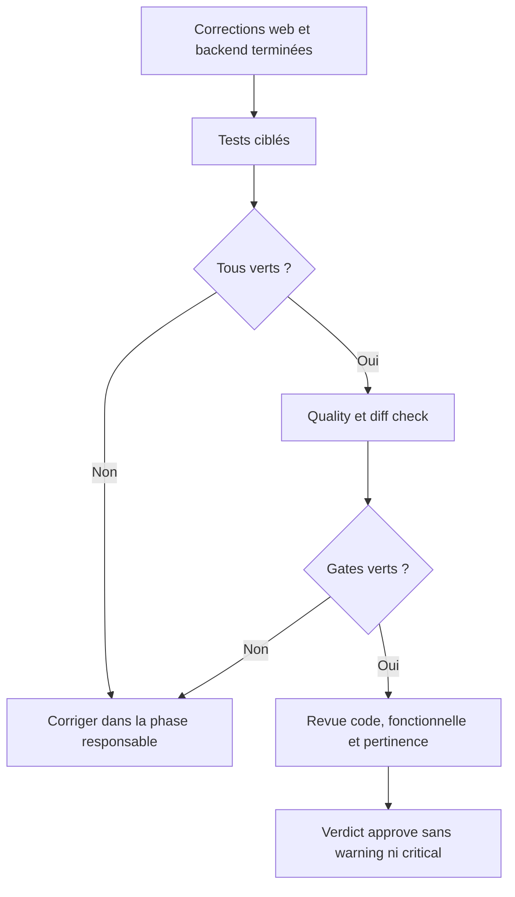

# Instruction: Validation ciblée et revue finale

## Architecture projection

> Tree of the final files. ✅ create · ✏️ modify · ❌ delete

```txt
aidd_docs/tasks/2026_07/2026_07_27_suppression-objectif-impact-conformite/
└── ✅ review.md  # porte le verdict final sur le diff PUL-319 corrigé
```

## User Journey



## Tasks to do

### `1)` Exécuter les preuves ciblées

> Chaque warning doit être fermé par une preuve qui échouerait sans sa correction.

1. Exécuter ensemble les specs du dialogue et de la page détail Angular.
2. Exécuter ensemble les specs du repository Supabase et du cas d’usage de suppression.
3. Associer chaque résultat au warning de confidentialité, d’architecture ou de contexte d’erreur correspondant.

### `2)` Passer les gates du dépôt

> Les corrections de conformité ne doivent introduire aucune dérive fonctionnelle.

1. Exécuter `pnpm quality`.
2. Exécuter `git diff --check`.
3. Vérifier que le diff produit reste limité aux neuf fichiers projetés et aux artefacts AIDD attendus.
4. Ne modifier aucun workflow, secret GitHub ou métadonnée de PR.
5. Ne créer ni commit, push ou PR sans demande explicite.

### `3)` Refaire la revue complète

> Le warning fonctionnel dérivé se ferme uniquement lorsque les trois causes techniques sont corrigées.

1. Relancer `aidd-dev:05-review` sur les axes code, functional et relevancy du diff PUL-319 complet.
2. Vérifier les critères des plans initial, remédiation, finalisation et conformité.
3. Écrire le verdict dans `review.md` de ce dossier.
4. Exiger 100 % des critères et zéro finding warning ou critical avant `approve`.

## Test acceptance criteria

| Task | Acceptance criteria |
| --- | --- |
| 1 | Les quatre specs ciblées passent et couvrent directement les trois warnings techniques. |
| 2 | `pnpm quality` et `git diff --check` passent sur le même état de travail. |
| 2 | Seuls les neuf fichiers projetés et les artefacts AIDD attendus ont changé ; aucun workflow, secret ou contenu de PR n’est touché. |
| 3 | La revue finale vérifie 100 % des critères des quatre plans PUL-319. |
| 3 | `review.md` conclut `approve` avec zéro warning et zéro critical. |
