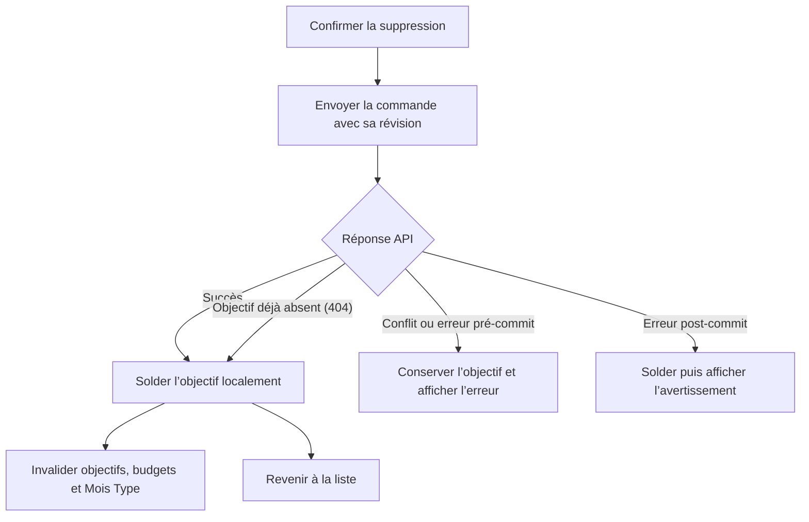

# Instruction: Web — converger quand l’objectif est déjà absent

## Architecture projection

> Tree of the final files. ✅ create · ✏️ modify · ❌ delete

```txt
frontend/projects/webapp/src/app/feature/savings-goals/services/
├── ✏️ savings-goals-store.spec.ts  # reproduit le replay 404 et verrouille ses effets locaux
└── ✏️ savings-goals-store.ts       # solde l’objectif absent au point unique post-commit
```

## User Journey



## Tasks to do

### `1)` Reproduire le replay 404 web

> Le test doit échouer tant que l’absence terminale est relancée comme une erreur.

1. Faire répondre `applyDeletion$` avec `SAVINGS_GOAL_NOT_FOUND`.
2. Partir d’un objectif présent et sélectionné dans le store.
3. Attendre une résolution sans erreur de `deleteGoal`.
4. Vérifier le retrait local et l’invalidation unique des trois caches existants.
5. Conserver les reproductions du conflit et de l’erreur post-commit.

### `2)` Solder l’état terminal au point unique

> Le store porte la sémantique de convergence ; la page conserve son chemin de succès existant.

1. Reconnaître le code partagé `SAVINGS_GOAL_NOT_FOUND` dans le `catch` de `deleteGoal`.
2. Appeler `settleCommittedDeletion` puis retourner sans relancer cette erreur.
3. Conserver la propagation de l’erreur partielle après règlement local.
4. Propager sans mutation toutes les autres erreurs.
5. Ne modifier ni l’API, ni la page détail, ni les textes localisés.

## Test acceptance criteria

| Task | Acceptance criteria |
| --- | --- |
| 1 | Un objectif présent localement puis absent au POST produit une promesse résolue, disparaît du store et n’est plus sélectionné. |
| 1 | Le replay 404 invalide exactement une fois les caches objectifs, budgets et Mois Type. |
| 2 | La page emprunte son chemin de succès existant et revient à la liste sans afficher une erreur 404. |
| 2 | Le conflit conserve toujours l’objectif ; l’erreur post-commit le retire toujours puis reste propagée pour afficher l’avertissement. |
| 2 | Toute autre erreur pré-commit conserve l’objectif et n’invalide aucun cache. |
