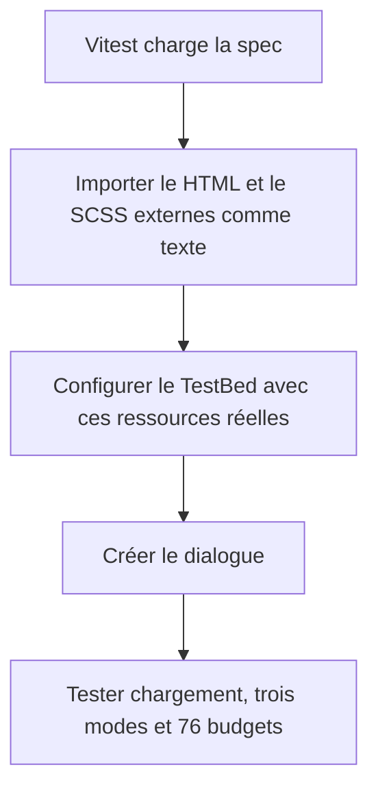

# Instruction: Web — exécuter le dialogue avec le runner Vitest réel

## Architecture projection

> Tree of the final files. ✅ create · ✏️ modify · ❌ delete

```txt
frontend/projects/webapp/src/app/feature/savings-goals/detail/components/
└── ✏️ goal-deletion-dialog.spec.ts  # fournit au TestBed le HTML et le SCSS externes réels sous Vitest direct
```

## User Journey



## Tasks to do

### `1)` Reproduire avec la commande réellement utilisée

> La preuve de départ est le script `test` du package frontend, pas le target Angular qui précompile les ressources.

1. Exécuter la spec avec `pnpm --filter pulpe-frontend test -- projects/webapp/src/app/feature/savings-goals/detail/components/goal-deletion-dialog.spec.ts`.
2. Conserver l’erreur de résolution de `templateUrl` et `styleUrl` comme reproduction.
3. Ne modifier ni le composant, ni ses fichiers HTML et SCSS.

### `2)` Fournir les ressources réelles au TestBed

> Le test DOM continue d’exercer le template externalisé, sans réintroduire de copie inline.

1. Importer le HTML et le SCSS avec `?raw`, selon le pattern test déjà présent dans le frontend.
2. Surcharger uniquement les métadonnées de ressource du dialogue dans le TestBed.
3. Remplacer `templateUrl` et `styleUrl` dans cette surcharge pour éviter toute résolution JIT asynchrone restante.
4. Conserver tous les providers, imports et assertions métier existants.
5. Ne modifier ni `test-setup.ts`, ni `vitest.config.ts`, ni les scripts du package.

### `3)` Vérifier les deux chemins de compilation

> La spec doit être fiable dans la CI et le composant doit rester valide dans le build Angular.

1. Relancer la spec avec le script Vitest direct du package.
2. Exécuter la suite frontend complète avec ce même script.
3. Exécuter le build frontend pour compiler les vrais `templateUrl` et `styleUrl` de production.

## Test acceptance criteria

| Task | Acceptance criteria |
| --- | --- |
| 1 | La reproduction échoue avant correction avec le message demandant `resolveComponentResources()`. |
| 2 | Les tests DOM utilisent le contenu des fichiers HTML et SCSS externalisés, sans duplication du template dans la spec. |
| 2 | Les trois modes, la révision, le retry, l’accessibilité et les 76 budgets conservent leurs assertions actuelles. |
| 3 | La spec puis toute la suite frontend passent via `vitest run`, comme dans le job `Unit Tests`. |
| 3 | Le build Angular compile le dialogue avec ses fichiers externes de production. |
