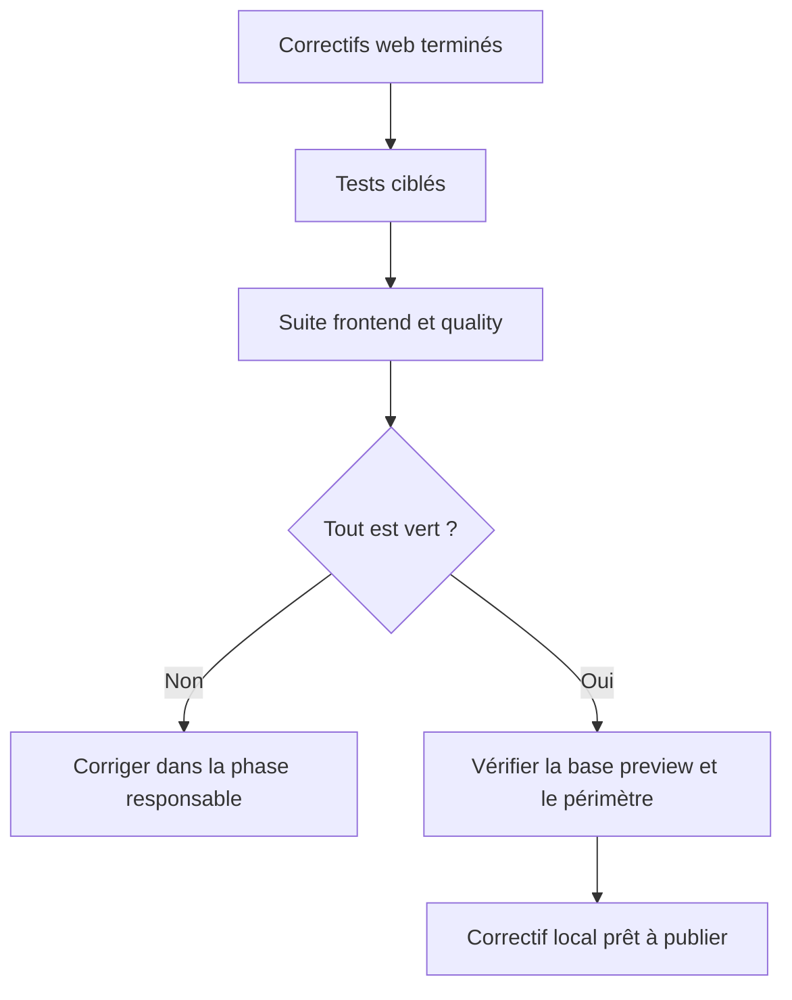

# Instruction: Validation complète du correctif

## User Journey

## Tasks to do

### `1)` Valider le diff local complet

> Les preuves ciblées précèdent les gates générales.

1. Exécuter les specs du store et du dialogue avec le script frontend réel.
2. Exécuter toute la suite frontend, puis `pnpm quality`.
3. Exécuter `git diff --check`.
4. Vérifier que seuls les trois fichiers projetés et les artefacts AIDD attendus ont changé.

### `2)` Contrôler la base et le périmètre

> La validation locale ne doit ni publier la branche ni modifier un workflow externe au correctif.

1. Vérifier à nouveau que `origin/preview` est un ancêtre du HEAD local.
2. Vérifier que le correctif produit ne touche que les trois fichiers web projetés.
3. Conserver les workflows GitHub, secrets et métadonnées de PR hors périmètre.
4. Ne pousser aucune modification sans demande explicite.

## Test acceptance criteria

| Task | Acceptance criteria |
| --- | --- |
| 1 | Les reproductions 404 et ressources externes passent avec le runner frontend réel. |
| 1 | La suite frontend complète, `pnpm quality` et `git diff --check` passent sur le même HEAD. |
| 2 | Le HEAD local reste basé sur le dernier `origin/preview` récupéré avant l’implémentation. |
| 2 | Aucun workflow, secret, métadonnée de PR ou fichier produit hors des trois fichiers projetés n’est modifié par le correctif. |
