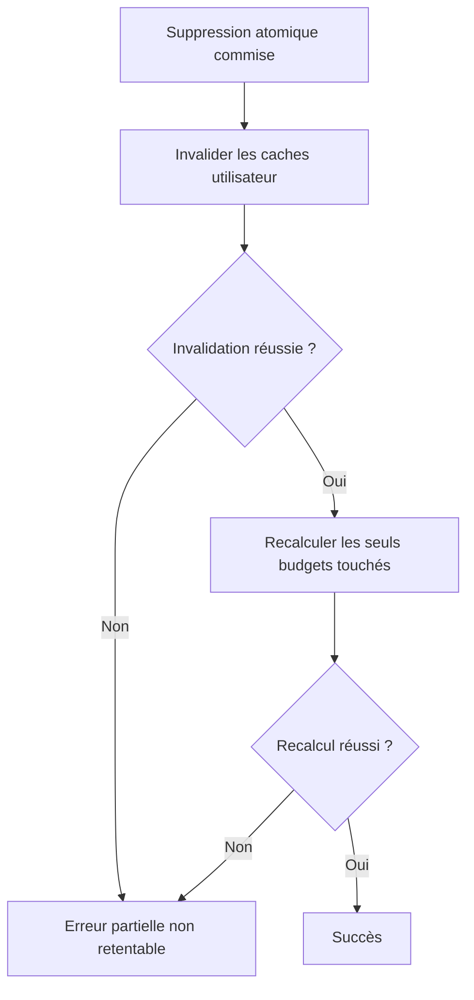

# Instruction: Backend — classifier toute défaillance post-commit

## Architecture projection

> Tree of the final files. ✅ create · ✏️ modify · ❌ delete

```txt
backend-nest/src/modules/savings-goal/application/
├── ✏️ remove-savings-goal.use-case.ts       # unifie l’invalidation et le recalcul dans la frontière post-commit
└── ✏️ remove-savings-goal.use-case.spec.ts  # reproduit l’échec cache après commit et protège les branches existantes
```

## User Journey



## Tasks to do

### `1)` Reproduire l’échec cache après commit

> Prouver que la suppression est déjà irréversible quand l’invalidation échoue.

1. Faire réussir `applyDeletion`, puis faire rejeter `invalidateForUser`.
2. Attendre `ERR_SAVINGS_GOAL_DELETION_RECALCULATION_FAILED`, `partialFailure: true`, la cause originale et les budgets touchés.
3. Vérifier que le recalcul ne démarre pas après une invalidation échouée.
4. Conserver les reproductions du conflit pré-commit et de l’échec de recalcul.

### `2)` Fermer toute la frontière post-commit

> Aucun échec après la RPC ne doit ressembler à une suppression non commise.

1. Regrouper invalidation puis recalcul dans une méthode post-commit unique.
2. Préserver l’ordre obligatoire : invalidation avant recalcul.
3. Traduire toute erreur de cette méthode vers la définition partielle existante avec `cause`, `userId`, `savingsGoalId` et `affectedBudgetIds`.
4. Laisser les erreurs repository et le conflit sortir avant cette frontière, sans invalidation ni recalcul.

### `3)` Protéger les chemins nominal et legacy

> La correction ne change ni les budgets recalculés ni la sémantique de l’ancien DELETE.

1. Vérifier que la commande explicite recalcule chaque budget retourné une seule fois.
2. Vérifier que `goal_only` legacy continue de délier via `repo.delete` sans recalcul.
3. Vérifier qu’un échec cache après l’un ou l’autre commit porte le même statut partiel non retentable.

## Test acceptance criteria

| Task | Acceptance criteria |
| --- | --- |
| 1 | Après un commit DB réussi, un rejet du cache retourne le code partiel dédié avec la cause et tous les IDs de budgets touchés. |
| 1 | Aucun recalcul n’est lancé tant que l’invalidation du cache n’a pas réussi. |
| 2 | Une erreur repository ou un conflit de révision ne déclenche ni invalidation ni recalcul et conserve son code actuel. |
| 2 | Un échec de recalcul conserve le même code, `partialFailure: true` et le même avertissement client qu’avant. |
| 3 | Le chemin nominal invalide une fois puis recalcule uniquement les budgets retournés ; le DELETE legacy ne supprime toujours aucune prévision. |
