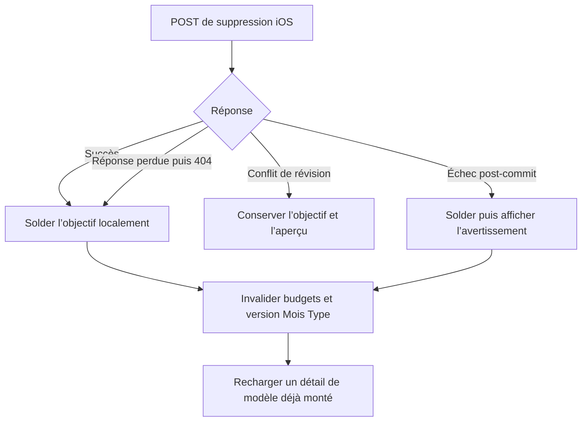

# Instruction: iOS — réconcilier la suppression et rafraîchir le Mois Type

## Architecture projection

> Tree of the final files. ✅ create · ✏️ modify · ❌ delete

```txt
ios/
├── Pulpe/
│   ├── Core/Network/
│   │   └── ✏️ APIError.swift                                      # type l’absence d’un objectif
│   ├── Domain/Store/
│   │   └── ✏️ SavingsGoalStore.swift                              # solde un 404 terminal et publie la version Mois Type
│   └── Features/Templates/TemplateDetails/
│       └── ✏️ TemplateDetailsView.swift                            # recharge sur changement de version observable
└── PulpeTests/
    ├── Domain/Services/
    │   └── ✅ SavingsGoalDeletionRequestTests.swift                # reproduit réponse perdue puis replay 404
    └── Domain/Store/
        └── ✏️ SavingsGoalStoreTests.swift                          # verrouille règlement, conflit, partiel et invalidation template
```

## User Journey



## Tasks to do

### `1)` Reproduire le replay ambigu

> Le deuxième POST ne doit pas transformer un commit réussi en échec visible.

1. Ajouter un test réseau sérialisé avec `InterceptingURLProtocol`.
2. Faire échouer le premier passage par une erreur transitoire, puis répondre au retry avec `ERR_SAVINGS_GOAL_NOT_FOUND`.
3. Vérifier les deux requêtes, le même endpoint et le mapping vers une erreur iOS typée.
4. Ajouter un test store qui part d’un objectif en cache et reçoit cette erreur typée.

### `2)` Réconcilier l’état terminal absent

> Après une commande explicite, « objectif absent » satisfait déjà l’intention utilisateur.

1. Ajouter le cas et le mapping `ERR_SAVINGS_GOAL_NOT_FOUND` dans `APIError`.
2. Dans `SavingsGoalStore.delete`, traiter ce cas comme une suppression commise : retirer l’objectif, invalider les projections puis retourner sans erreur.
3. Garder le conflit comme seul chemin dédié qui conserve l’objectif.
4. Garder l’échec de recalcul comme suppression commise qui solde l’état puis propage l’avertissement.

### `3)` Publier l’invalidation Mois Type

> Une vue de modèle persistante ne doit garder ni lien ni prévision supprimée.

1. Ajouter au store une version observable d’invalidation des données Mois Type.
2. L’incrémenter exactement dans le point unique `settleCommittedDeletion`, succès, 404 terminal et erreur partielle compris.
3. Réinitialiser cette version avec le reste du store à la fin de session.
4. Faire dépendre la tâche de chargement de `TemplateDetailsView` de cette version et forcer une lecture fraîche à chaque changement.
5. Ne créer ni nouveau store global ni bus de notifications.

### `4)` Verrouiller les trois sorties

> Les signaux budget et Mois Type doivent suivre le statut réel du commit.

1. Vérifier succès, 404 terminal et erreur partielle : objectif retiré, invalidation budget une fois, version Mois Type incrémentée une fois.
2. Vérifier conflit et erreur pré-commit : objectif conservé, aucune invalidation, version inchangée.
3. Vérifier qu’un reset remet la version dans son état initial.

## Test acceptance criteria

| Task | Acceptance criteria |
| --- | --- |
| 1 | Une erreur réseau transitoire suivie d’un 404 `SAVINGS_GOAL_NOT_FOUND` produit deux appels identiques et une erreur iOS typée, jamais un message serveur générique. |
| 2 | Le store traite ce 404 terminal comme un succès convergent : l’objectif disparaît et aucun retry destructif n’est proposé. |
| 2 | Le conflit conserve toujours l’objectif ; l’échec de recalcul le retire toujours et conserve son avertissement français. |
| 3 | Toute suppression commise change la version Mois Type exactement une fois et un `TemplateDetailsView` déjà créé recharge ses lignes. |
| 3 | Les échecs pré-commit ne modifient ni la version Mois Type ni les caches budget. |
| 4 | Les tests couvrent succès, replay 404, conflit, erreur partielle et reset avec les mêmes effets locaux que le commit backend. |
