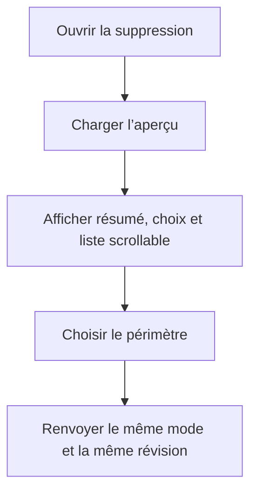

# Instruction: Web — extraire la vue du dialogue sans changer son rendu

## Architecture projection

> Tree of the final files. ✅ create · ✏️ modify · ❌ delete

```txt
frontend/projects/webapp/src/app/feature/savings-goals/detail/components/
├── ✏️ goal-deletion-dialog.ts
└── goal-deletion-dialog/
    ├── ✅ goal-deletion-dialog.html   # reprend à l’identique le template actuellement inline
    └── ✅ goal-deletion-dialog.scss   # reprend à l’identique les styles actuellement inline
```

## User Journey



## Tasks to do

### `1)` Extraire sans réécrire

> Fermer la limite de fichier par un déplacement mécanique.

1. Déplacer le template inline, sans modification, dans le fichier HTML dédié.
2. Déplacer les styles inline, sans modification, dans le fichier SCSS dédié.
3. Remplacer uniquement les métadonnées Angular par `templateUrl` et `styleUrl`.
4. Garder la classe, les signaux, les imports et le contrat du dialogue dans le fichier TypeScript existant.

### `2)` Prouver la parité fonctionnelle

> L’extraction ne doit modifier aucun élément observable du dialogue.

1. Réutiliser la spec existante sans changer ses attentes métier.
2. Vérifier les trois payloads, la révision exacte, le retry de chargement et les 76 budgets.
3. Vérifier que les `data-testid`, rôles, labels ARIA, zone scrollable et actions fixes restent présents.
4. Vérifier que le fichier TypeScript final reste sous 300 lignes.

## Test acceptance criteria

| Task | Acceptance criteria |
| --- | --- |
| 1 | Le dialogue compile avec un template HTML et un style SCSS externes, sans nouveau composant ni nouvelle dépendance. |
| 1 | `goal-deletion-dialog.ts` contient moins de 300 lignes et conserve exclusivement la logique du composant. |
| 2 | Les trois modes renvoient les mêmes commandes et la révision affichée avant l’extraction. |
| 2 | Les 76 budgets restent tous rendus dans la même région scrollable accessible, avec résumé et actions hors défilement. |
| 2 | Aucun texte, ordre visuel, attribut d’accessibilité ou sélecteur de test n’est modifié. |
