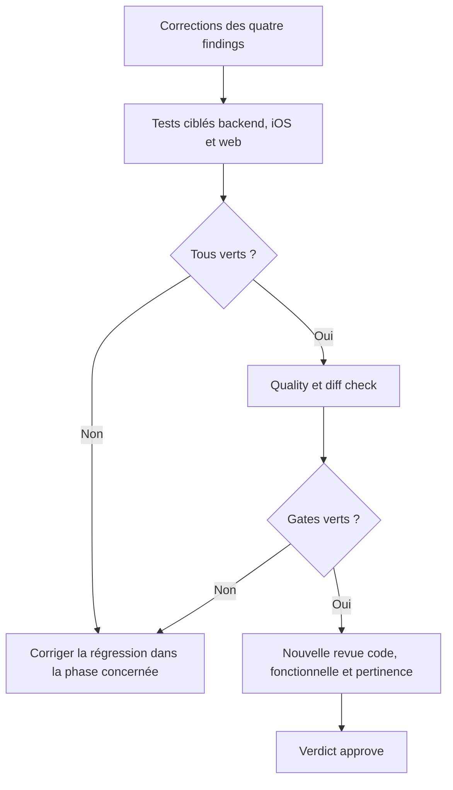

# Instruction: Validation croisée et nouvelle revue

## User Journey

## Tasks to do

### `1)` Exécuter les preuves ciblées

> Chaque finding doit avoir une reproduction qui échoue sans son correctif.

1. Exécuter la spec du cas d’usage de suppression backend.
2. Exécuter les tests iOS du transport de suppression et du store d’objectifs.
3. Exécuter la spec Angular du dialogue de suppression.
4. Associer chaque résultat au finding qu’il ferme.

### `2)` Vérifier les contrats voisins

> Les corrections post-commit ne doivent pas régresser l’aperçu ou les trois modes.

1. Exécuter les tests partagés, repository et intégration PUL-319 pertinents.
2. Exécuter les tests iOS de décodage, présentation des 76 budgets et erreurs localisées.
3. Exécuter les tests web API, store et page détail du parcours de suppression.
4. Exécuter `pnpm quality` puis `git diff --check` sur le même HEAD.

### `3)` Refaire la revue complète

> Le plan n’est terminé que lorsque les constats sont fermés, pas déplacés.

1. Relancer les axes code, functional et relevancy sur le diff complet PUL-319 avec corrections.
2. Exiger 100 % des critères du plan initial et de ce plan de remédiation.
3. Vérifier l’absence de warning ou critical restant et un verdict `approve`.
4. Ne créer ni commit, push ni PR sans demande explicite.

## Test acceptance criteria

| Task | Acceptance criteria |
| --- | --- |
| 1 | Les quatre reproductions ciblées passent et échoueraient chacune sans la correction correspondante. |
| 2 | L’aperçu exhaustif, les trois modes, le conflit, l’erreur partielle et le cas 76 budgets restent verts sur backend, web et iOS. |
| 2 | `pnpm quality` et `git diff --check` passent sur le même état de travail. |
| 3 | La nouvelle revue valide 100 % des critères avec verdict `approve`, sans warning ni critical. |
| 3 | Aucun changement hors projection et aucune action Git distante ne sont inclus. |
