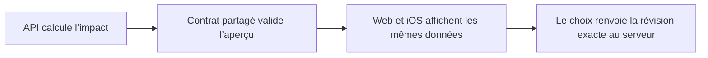

# Instruction: Définir le contrat partagé

## Architecture projection

> Tree of the final files. ✅ create · ✏️ modify · ❌ delete

```txt
shared/
├── ✏️ index.ts
├── ✏️ schemas.ts
└── src/
    ├── ✏️ error-codes.ts
    └── ✏️ savings-goal-schema.spec.ts
```

## User Journey



## Tasks to do

### `1)` Modéliser l’aperçu

> Fournir une seule source de vérité Zod pour les données visibles avant suppression.

1. Ajouter les schémas des prévisions du Mois Type, budgets, prévisions mensuelles et transactions rattachées.
2. Inclure les compteurs, totaux monétaires, nombre de budgets et regroupements nécessaires aux deux interfaces.
3. Inclure une révision composée des couples `id` et `updatedAt` de chaque entité affectée.
4. Ne fixer aucune limite de présentation sur les tableaux : un objectif lié à 76 budgets reste valide.

### `2)` Modéliser la commande

> Rendre les trois effets destructifs impossibles à confondre.

1. Définir les modes `goal_only`, `goal_and_forecasts` et `goal_forecasts_and_transactions`.
2. Exiger la révision issue de l’aperçu dans la commande de suppression.
3. Réutiliser le schéma de réponse de suppression existant quand aucune donnée supplémentaire n’est utile au client.

### `3)` Exposer les erreurs stables

> Donner aux clients une distinction fiable entre aperçu périmé et recalcul post-commit échoué.

1. Ajouter les codes partagés pour `impact changed` et `deletion recalculation failed`.
2. Exporter les nouveaux schémas et types depuis le point d’entrée partagé.
3. Tester les trois modes, les révisions vides/non vides, les doublons refusés et un aperçu de 76 budgets.

## Test acceptance criteria

| Task | Acceptance criteria |
| ---- | ------------------- |
| 1 | Un aperçu contenant Mois Type, 76 budgets, leurs prévisions et leurs transactions est accepté sans troncature et expose des totaux cohérents. |
| 2 | Toute commande invalide, tout identifiant de révision dupliqué et tout mode inconnu est rejeté avant l’appel backend. |
| 3 | Le web, NestJS et iOS peuvent importer des noms de types et des codes d’erreur uniques depuis `pulpe-shared`. |
