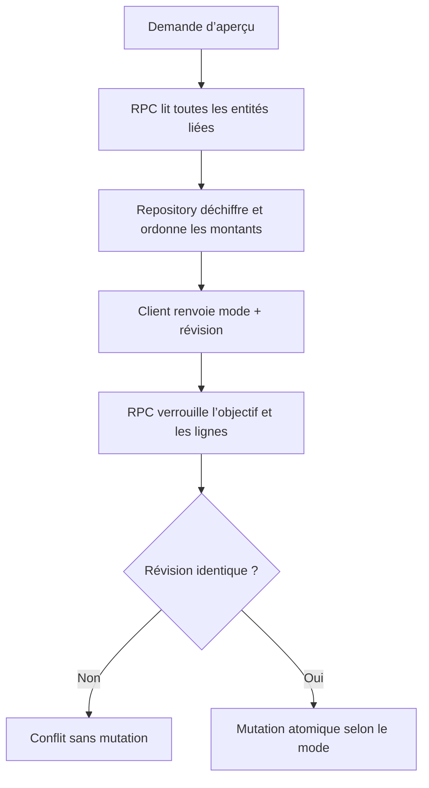

# Instruction: Garantir l’aperçu et la mutation en base

## Architecture projection

> Tree of the final files. ✅ create · ✏️ modify · ❌ delete

```txt
backend-nest/
├── src/
│   ├── modules/savings-goal/
│   │   ├── ✏️ domain/savings-goal.entity.ts
│   │   ├── ✏️ domain/ports/savings-goal-repository.port.ts
│   │   ├── ✏️ infrastructure/persistence/schemas/rpc-payload.schemas.ts
│   │   ├── ✏️ infrastructure/persistence/schemas/rpc-payload.schemas.spec.ts
│   │   ├── ✏️ infrastructure/persistence/supabase-savings-goal.repository.ts
│   │   ├── ✏️ infrastructure/persistence/supabase-savings-goal.repository.spec.ts
│   │   └── ✏️ savings-goal.integration.spec.ts
│   └── ✏️ types/database.types.ts
└── supabase/migrations/
    └── ✅ 20260727120000_apply_savings_goal_deletion.sql
```

## User Journey



## Tasks to do

### `1)` Lire un impact cohérent

> Retourner en une lecture les entités réellement rattachées à l’objectif authentifié.

1. Ajouter une RPC de lecture qui vérifie `auth.uid()`, collecte les `template_line`, `budget_line`, budgets parents et transactions allouées.
2. Retourner les montants chiffrés et les métadonnées nécessaires ; déchiffrer uniquement dans le repository via `ENCRYPTION_PORT`.
3. Construire les groupes Mois Type puis budgets chronologiques et la révision exacte de l’aperçu.
4. Mapper un objectif absent ou appartenant à un autre utilisateur en `404`.

### `2)` Appliquer les trois sémantiques atomiques

> Exécuter une seule décision explicite dans une transaction PostgreSQL.

1. Ajouter une RPC `SECURITY DEFINER` avec `SET search_path = ''`, contrôle `auth.uid()` et noms de schéma qualifiés.
2. Verrouiller l’objectif puis les prévisions concernées avant de comparer les ensembles `id` + `updatedAt`.
3. Rejeter tout ajout, retrait ou modification depuis l’aperçu avec une erreur de conflit avant la première mutation.
4. Pour `goal_only`, supprimer l’objectif et laisser les clés étrangères `SET NULL` délier les prévisions.
5. Pour `goal_and_forecasts`, supprimer les prévisions du modèle et des budgets ; conserver les transactions qui deviennent libres.
6. Pour `goal_forecasts_and_transactions`, supprimer d’abord les transactions rattachées, puis les prévisions et l’objectif.
7. Retourner les budgets touchés pour le recalcul post-commit.

### `3)` Adapter le repository

> Garder SQL, chiffrement et traduction des erreurs hors des cas d’usage.

1. Ajouter les méthodes de lecture d’impact et d’application au port et à l’implémentation Supabase.
2. Valider les payloads RPC avec Zod avant mapping.
3. Traduire l’écart de révision en `409`, l’accès refusé en `404` et les commandes invalides en `422`.
4. Régénérer `database.types.ts` après la migration.

### `4)` Prouver les garanties en intégration

> Couvrir les branches où une erreur silencieuse entraînerait une perte de données.

1. Vérifier les trois résultats sur les mêmes fixtures : délier, supprimer les prévisions, supprimer prévisions et transactions.
2. Vérifier qu’une transaction conservée devient libre après suppression de sa prévision.
3. Modifier une ligne ou rattacher une transaction entre aperçu et commande ; attendre un conflit et aucune mutation.
4. Vérifier l’isolation entre utilisateurs.
5. Construire 76 budgets liés et vérifier que l’aperçu et la suppression portent sur l’ensemble complet.

## Test acceptance criteria

| Task | Acceptance criteria |
| ---- | ------------------- |
| 1 | L’aperçu contient toutes les prévisions du modèle, tous les budgets liés, les transactions imbriquées et des montants déchiffrés, dans l’ordre attendu. |
| 2 | Chaque mode produit exactement son effet ; toute erreur SQL annule l’ensemble des suppressions et déliaisons. |
| 2 | Une révision devenue obsolète retourne un conflit sans supprimer ni délier aucune entité. |
| 3 | Le repository ne laisse sortir aucun ciphertext et expose les IDs des budgets à recalculer. |
| 4 | Un utilisateur ne peut ni prévisualiser ni supprimer les données d’un autre utilisateur, et le cas 76 budgets ne perd aucune ligne. |
