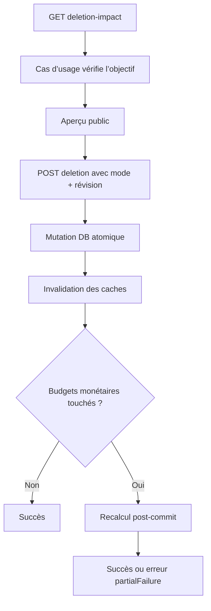

# Instruction: Orchestrer l’API de suppression

## Architecture projection

> Tree of the final files. ✅ create · ✏️ modify · ❌ delete

```txt
.
├── backend-nest/src/
│   ├── common/constants/
│   │   └── ✏️ error-definitions.ts
│   └── modules/savings-goal/
│       ├── application/
│       │   ├── ✅ get-savings-goal-deletion-impact.use-case.ts
│       │   ├── ✅ get-savings-goal-deletion-impact.use-case.spec.ts
│       │   ├── ✏️ remove-savings-goal.use-case.ts
│       │   └── ✏️ remove-savings-goal.use-case.spec.ts
│       ├── infrastructure/http/
│       │   ├── ✏️ dto/savings-goal-swagger.dto.ts
│       │   └── ✏️ savings-goal.controller.ts
│       ├── infrastructure/mappers/
│       │   ├── ✏️ savings-goal.mapper.ts
│       │   └── ✏️ savings-goal.mapper.spec.ts
│       └── ✏️ savings-goal.module.ts
└── docs/
    └── ✏️ SAVINGS.md
```

## User Journey



## Tasks to do

### `1)` Exposer l’aperçu

> Fournir une route fraîche, authentifiée et strictement mappée.

1. Créer le cas d’usage qui vérifie l’existence de l’objectif puis lit son impact.
2. Mapper le domaine vers le schéma partagé sans exposer d’identifiant utilisateur ni montant chiffré.
3. Ajouter `GET /savings-goals/:id/deletion-impact` et sa documentation Swagger.

### `2)` Étendre la suppression existante

> Centraliser la suppression sûre et la suppression avec impact dans le même cas d’usage.

1. Garder l’exécution sans commande pour l’ancien `DELETE /savings-goals/:id`, avec la sémantique `goal_only`.
2. Accepter la commande partagée pour `POST /savings-goals/:id/deletion`.
3. Appeler la primitive atomique uniquement pour la nouvelle route.
4. Enregistrer les deux cas d’usage et leurs loggers dans le module existant.

### `3)` Recalculer et invalider sans masquer un commit

> Rafraîchir les budgets touchés tout en distinguant clairement une mutation déjà commise.

1. Invalider les caches objectifs, Mois Type et budgets après toute mutation réussie.
2. Recalculer uniquement les budgets retournés quand des prévisions ou transactions ont été supprimées.
3. En cas d’échec du recalcul, retourner `SAVINGS_GOAL_DELETION_RECALCULATION_FAILED` avec `partialFailure: true`.
4. Ne jamais proposer un retry aveugle après cette erreur : l’objectif est déjà supprimé.

### `4)` Documenter le contrat métier

> Remplacer la règle « supprimer = délier » par les trois choix réels.

1. Mettre à jour `docs/SAVINGS.md` avec les catégories d’impact et leurs effets.
2. Documenter la garde de révision, l’atomicité de la mutation et la limite post-commit du recalcul.

## Test acceptance criteria

| Task | Acceptance criteria |
| ---- | ------------------- |
| 1 | La route d’aperçu retourne `404` hors propriété et une réponse conforme au schéma partagé pour le propriétaire. |
| 2 | L’ancien `DELETE` continue de délier sans supprimer les prévisions ; le nouveau `POST` applique le mode reçu. |
| 3 | Les caches concernés sont invalidés après commit et seuls les budgets touchés sont recalculés. |
| 3 | Un échec de recalcul est identifiable comme partiel ; un conflit de révision ne déclenche ni invalidation ni recalcul. |
| 4 | La documentation décrit les mêmes trois effets que le contrat et précise que le recalcul n’est pas rollbackable. |
