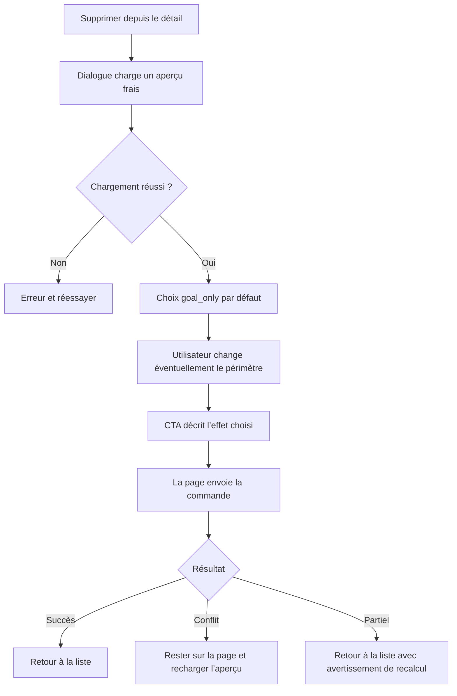

# Instruction: Construire l’expérience web

## Architecture projection

> Tree of the final files. ✅ create · ✏️ modify · ❌ delete

```txt
frontend/projects/webapp/
├── public/i18n/
│   └── ✏️ fr.json
└── src/app/
    ├── core/
    │   ├── api/
    │   │   ├── ✏️ api-error-localizer.ts
    │   │   └── ✏️ api-error-localizer.spec.ts
    │   └── savings-goal/
    │       ├── ✏️ savings-goal-api.ts
    │       └── ✏️ savings-goal-api.spec.ts
    └── feature/savings-goals/
        ├── detail/
        │   ├── components/
        │   │   ├── ✅ goal-deletion-dialog.ts
        │   │   └── ✅ goal-deletion-dialog.spec.ts
        │   ├── ✏️ savings-goal-detail-page.ts
        │   └── ✏️ savings-goal-detail-page.spec.ts
        └── services/
            ├── ✏️ savings-goals-dialog.service.ts
            ├── ✏️ savings-goals-store.ts
            └── ✏️ savings-goals-store.spec.ts
```

## User Journey



## Wireframe

```txt
┌──────────────────────────────────────────────────────────┐
│ (1) En-tête du dialogue                                  │
├──────────────────────────────────────────────────────────┤
│ (2) Résumé d’impact                                      │
│ (3) Choix du périmètre                                   │
├──────────────────────────────────────────────────────────┤
│ (4) Liste d’impact défilable                             │
│     ┌────────────────────────────────────────────────┐   │
│     │ (5) Section Mois Type                          │   │
│     │ (6) Sections budgets + lignes + transactions   │   │
│     └────────────────────────────────────────────────┘   │
├──────────────────────────────────────────────────────────┤
│ (7) Actions fixes                                        │
└──────────────────────────────────────────────────────────┘

1. Identité de l’objectif et fermeture.
2. Compteurs et montants toujours visibles.
3. Trois niveaux d’impact, avec le niveau destructif imbriqué.
4. Zone bornée qui absorbe 76 budgets ou davantage.
5. Prévisions du modèle regroupées séparément.
6. Budgets chronologiques, prévisions puis réels rattachés.
7. Annulation et action primaire dont le libellé reflète le périmètre.
```

## Tasks to do

### `1)` Brancher API et store

> Charger un aperçu frais et appliquer une commande sans état optimiste trompeur.

1. Ajouter les appels d’aperçu et de suppression au feature API.
2. Exposer une lecture fraîche depuis le store et une mutation pessimiste.
3. Après succès, retirer l’objectif puis invalider les caches objectifs, budgets et Mois Type.
4. Sur conflit, conserver la page et permettre de rouvrir un aperçu frais.
5. Sur `partialFailure`, considérer la suppression comme commise, invalider les caches et afficher un avertissement sans retry.

### `2)` Créer le dialogue d’impact

> Afficher la totalité de l’impact dans un espace borné et compréhensible.

1. Créer un composant standalone dédié ; ne pas généraliser le dialogue d’arrêt de génération.
2. Charger l’aperçu depuis le store avec états chargement, erreur et réessayer.
3. Sélectionner `goal_only` par défaut.
4. Afficher les choix de suppression des prévisions puis des transactions comme une option destructive imbriquée uniquement quand elle s’applique.
5. Regrouper Mois Type séparément, puis les budgets chronologiques et leurs transactions imbriquées.
6. Conserver le résumé et les actions hors de la zone scrollable ; borner le dialogue à `90dvh`.
7. Renvoyer au parent le mode et la révision affichée, sans déclencher la mutation dans le dialogue.

### `3)` Intégrer le parcours

> Remplacer la confirmation générique par le flux d’impact.

1. Ajouter l’ouverture typée dans `SavingsGoalsDialogService`.
2. Remplacer `confirmDelete` sur la page détail.
3. Adapter le libellé du CTA au mode exact.
4. Ne naviguer qu’après succès ou suppression commise avec échec de recalcul.

### `4)` Localiser et vérifier

> Rendre les états destructifs et concurrents compréhensibles en français.

1. Ajouter les textes de résumé, groupes, choix, CTA, chargement, retry et avertissement partiel.
2. Localiser le conflit de révision et l’échec de recalcul.
3. Tester les états, les trois payloads, les erreurs, l’accessibilité des contrôles et le rendu exhaustif de 76 budgets.

## Test acceptance criteria

| Task | Acceptance criteria |
| ---- | ------------------- |
| 1 | Aucune suppression n’est envoyée avant un aperçu valide et le payload reprend exactement sa révision. |
| 1 | Un conflit garde l’objectif visible ; une erreur partielle le retire et informe que seul le recalcul reste à rafraîchir. |
| 2 | Le choix par défaut supprime uniquement l’objectif et conserve prévisions et transactions. |
| 2 | Les 76 budgets, leurs prévisions et leurs transactions restent tous consultables dans une liste scrollable sans agrandir les actions hors écran. |
| 2 | Les compteurs, totaux et CTA restent visibles pendant le défilement, au clavier comme au lecteur d’écran. |
| 3 | Le CTA annonce l’effet exact et la page ne quitte le détail qu’après une suppression commise. |
| 4 | Tous les états du dialogue et les deux erreurs dédiées disposent d’un texte français déterministe. |
