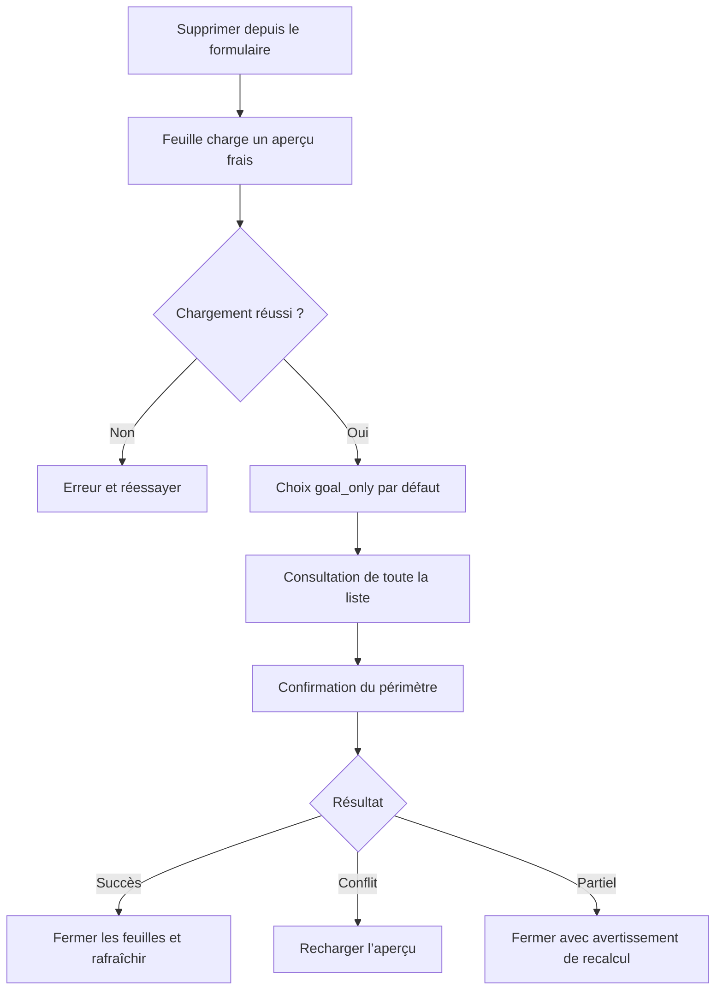

# Instruction: Construire l’expérience iOS

## Architecture projection

> Tree of the final files. ✅ create · ✏️ modify · ❌ delete

```txt
ios/
├── Pulpe/
│   ├── Core/Network/
│   │   ├── ✏️ APIError.swift
│   │   ├── ✏️ DomainErrorLocalizer.swift
│   │   └── ✏️ Endpoints.swift
│   ├── Domain/
│   │   ├── Models/
│   │   │   └── ✅ SavingsGoalDeletion.swift
│   │   ├── Services/
│   │   │   └── ✏️ SavingsGoalService.swift
│   │   └── Store/
│   │       └── ✏️ SavingsGoalStore.swift
│   └── Features/SavingsGoals/
│       ├── Components/
│       │   └── ✅ GoalDeletionSheet.swift
│       └── ✏️ SavingsGoalFormSheet.swift
└── PulpeTests/
    ├── Domain/Models/
    │   └── ✏️ SavingsGoalCodableTests.swift
    ├── Domain/Store/
    │   └── ✏️ SavingsGoalStoreTests.swift
    ├── Features/SavingsGoals/
    │   └── ✏️ SavingsGoalFormSheetTests.swift
    └── Helpers/
        └── ✏️ MockSavingsGoalService.swift
```

## User Journey



## Wireframe

```txt
┌─────────────────────────────────────┐
│ (1) Navigation                      │
├─────────────────────────────────────┤
│ (2) Résumé d’impact fixe            │
├─────────────────────────────────────┤
│ (3) Contenu défilable               │
│     (4) Choix du périmètre          │
│     (5) Section Mois Type           │
│     (6) Budgets + lignes + réels    │
├─────────────────────────────────────┤
│ (7) Action sûre dans la safe area   │
└─────────────────────────────────────┘

1. Titre, annulation et contexte de la feuille.
2. Compteurs et totaux visibles pendant le défilement.
3. Conteneur ScrollView et LazyVStack.
4. Niveaux d’impact lisibles avec Dynamic Type.
5. Prévisions du modèle.
6. Budgets chronologiques et transactions imbriquées.
7. Action destructive fixe, accessible à VoiceOver.
```

## Tasks to do

### `1)` Ajouter le domaine et le réseau

> Décoder le contrat partagé sans dupliquer une autre sémantique métier.

1. Ajouter les modèles `Sendable` et `Codable` de l’aperçu, de la révision et des trois modes.
2. Ajouter les endpoints GET et POST, puis les méthodes du protocole et de l’actor `SavingsGoalService`.
3. Étendre le mock et les tests de décodage.
4. Mapper le conflit et l’échec de recalcul dans `APIError` et `DomainErrorLocalizer`.

### `2)` Adapter le store

> Garder les autres stores cohérents selon que la suppression a échoué ou est déjà commise.

1. Ajouter le chargement frais de l’impact.
2. Envoyer le mode et la révision via une mutation pessimiste.
3. Sur succès, retirer l’objectif et invalider budgets et Mois Type.
4. Sur conflit, conserver l’objectif et permettre un nouvel aperçu.
5. Sur erreur partielle, retirer l’objectif, invalider les stores et propager un avertissement non retentable.

### `3)` Créer la feuille dédiée

> Remplacer la confirmation statique par une liste exhaustive utilisable sur petit écran.

1. Présenter `GoalDeletionSheet` depuis `SavingsGoalFormSheet` avec `.standardSheetPresentation(detents: [.large])`.
2. Gérer chargement, erreur, retry, sélection et confirmation dans un état local `@MainActor`.
3. Placer les compteurs hors du `ScrollView`, la liste dans un `LazyVStack` et l’action dans une `safeAreaInset`.
4. Afficher le Mois Type séparément puis les budgets chronologiques, prévisions et transactions.
5. Appliquer `monospacedDigit`, `sensitiveAmount`, labels VoiceOver et tailles Dynamic Type existants.
6. Fermer le formulaire après succès ou erreur partielle ; rester dans le flux et recharger sur conflit.

### `4)` Vérifier le parcours

> Tester la logique risquée sans introduire de dépendance d’inspection SwiftUI.

1. Tester les trois commandes et les effets store avec le mock existant.
2. Tester l’état de sélection : `goal_only` par défaut et option transactions dépendante de la suppression des prévisions.
3. Tester que le modèle de présentation conserve 76 budgets et toutes les lignes.
4. Vérifier au simulateur le défilement, la safe area, Dynamic Type et VoiceOver.

## Test acceptance criteria

| Task | Acceptance criteria |
| ---- | ------------------- |
| 1 | Le service décode l’aperçu complet et envoie un mode et une révision identiques au contrat backend. |
| 2 | Un conflit conserve l’objectif ; une erreur partielle le retire et déclenche les invalidations attendues. |
| 3 | La feuille affiche par défaut « objectif seul », ne tronque aucun des 76 budgets et garde résumé et action visibles. |
| 3 | L’option de suppression des transactions n’est disponible qu’avec la suppression des prévisions et quand des transactions existent. |
| 3 | Les montants, groupes et boutons restent lisibles avec Dynamic Type et annoncés sans ambiguïté par VoiceOver. |
| 4 | Les tests couvrent les trois payloads, le conflit, l’erreur partielle et l’absence de limite de présentation. |
