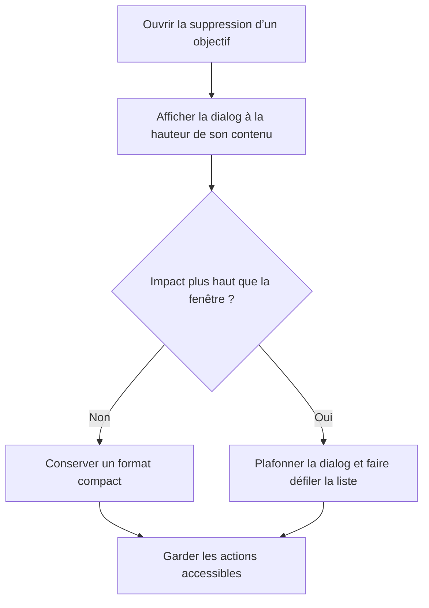

# Instruction: Rendre la dialog content-sized

## Architecture projection

> Tree of the final files. ✅ create · ✏️ modify · ❌ delete

```txt
frontend/projects/webapp/src/app/feature/savings-goals/detail/
├── ✏️ savings-goal-detail-page.ts
└── ✏️ savings-goal-detail-page.spec.ts
```

## User Journey



## Wireframe

```txt
┌────────────────────────────────────────────┐
│ (1) En-tête                                │
├────────────────────────────────────────────┤
│ (2) Introduction et résumé                 │
│                                            │
│ (3) Choix du périmètre                     │
│                                            │
│ ┌────────────────────────────────────────┐ │
│ │ (4) Éléments rattachés                │ │
│ └────────────────────────────────────────┘ │
├────────────────────────────────────────────┤
│ (5) Actions                                │
└────────────────────────────────────────────┘
```

1. En-tête : titre de la dialog.
2. Introduction et résumé : contexte et aperçu synthétique.
3. Choix du périmètre : options disponibles.
4. Éléments rattachés : liste ou état vide dans une zone bornée.
5. Actions : annulation et confirmation.

## Tasks to do

### `1)` Verrouiller la configuration de hauteur attendue

> Reproduire la régression dans la spec de la page avant de modifier l’ouverture.

1. Faire échouer l’attente existante tant que la configuration contient une hauteur fixe.
2. Attendre l’absence de `height` et le maintien de `maxHeight: '90dvh'`.

### `2)` Laisser le contenu déterminer la hauteur

> Retirer uniquement la contrainte qui force la dialog à occuper 90 % du viewport.

1. Supprimer `height: '90dvh'` de l’appel `MatDialog.open`.
2. Conserver la largeur, le plafond `maxHeight`, l’injecteur et les styles internes existants.
3. Exécuter les specs ciblées de la page et de la dialog.

## Test acceptance criteria

| Task | Acceptance criteria |
| ---- | ------------------- |
| 1 | La configuration d’ouverture ne définit aucune hauteur fixe et conserve un plafond de `90dvh`. |
| 2 | Avec aucun élément rattaché, la dialog reste compacte et ses actions suivent directement le contenu. |
| 2 | Avec un impact long, la dialog ne dépasse pas 90 % du viewport, la liste reste consultable et les actions restent accessibles. |
| 2 | Les choix de suppression et la commande retournée restent inchangés. |
