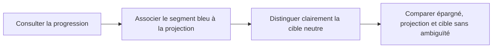

# Instruction: Clarifier la projection et la cible

## Architecture projection

> Tree of the final files. ✅ create · ✏️ modify · ❌ delete

```txt
frontend/projects/webapp/src/app/feature/savings-goals/detail/
├── ✏️ savings-goal-detail-page.ts
├── ✏️ savings-goal-detail-page.spec.ts
└── components/
    ├── ✏️ goal-projection-chart.ts
    ├── ✏️ goal-projection-chart.spec.ts
    ├── ✏️ goal-projection-chart.config.ts
    └── ✏️ goal-projection-chart.config.spec.ts
```

## User Journey



## Wireframe

```txt
Progression
├── ● vert  Épargné
├── ● bleu  Projection planifiée
└── ─ sombre Cible

Ta trajectoire
┌────────────────────────────────────────┐
│ ───────────── cible contrastée ─────── │
│        ┄┄┄ projection bleue ┄┄┄●      │
│ ● épargné                              │
└────────────────────────────────────────┘
```

## Tasks to do

### `1)` Rendre le segment bleu auto-explicatif

> Réutiliser le point de légende des statistiques, sans ajouter une seconde légende.

1. Ajouter le point tertiaire devant « Projection planifiée » lorsque cette statistique pilote le segment bleu.
2. Garder le point conditionnel pour ne pas annoncer une série absente.
3. Verrouiller cette condition dans la spec de la page.

### `2)` Renforcer le contraste de la cible

> La cible reste neutre : augmenter son contraste plutôt que lui attribuer une nouvelle couleur sémantique.

1. Utiliser la couleur neutre `on-surface-variant` résolue sans réduction à 50 % pour la série Cible.
2. Aligner l’échantillon Cible du résumé sur le même niveau de contraste.
3. Conserver une ligne pleine et fine pour la distinguer de la projection bleue en pointillés.

### `3)` Valider la cohérence visuelle

1. Vérifier les datasets Chart.js dans la spec de configuration.
2. Vérifier la sémantique du résumé dans la spec du composant.
3. Contrôler le rendu local en thème clair et sombre, sans introduire de couleur arbitraire.

## Test acceptance criteria

| Task | Acceptance criteria |
| ---- | ------------------- |
| 1 | Quand la barre utilise la projection planifiée, son libellé porte le même repère bleu. |
| 1 | Quand une projection calculée distincte est affichée, aucun repère bleu trompeur n’est ajouté à la statistique de repli. |
| 2 | La ligne Cible et son échantillon utilisent le neutre de premier plan sans alpha atténué. |
| 2 | Épargné reste vert, Projection reste bleue et pointillée, Cible reste neutre et pleine. |
| 3 | Les tests ciblés de la page et du graphique passent. |
