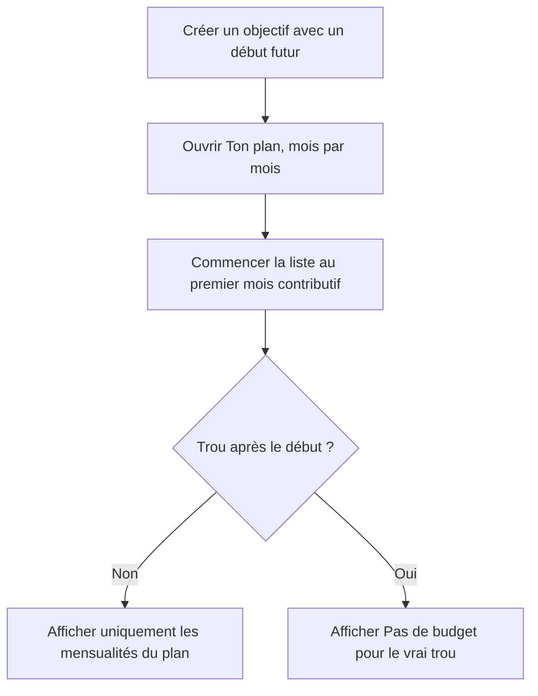

# Instruction: Aligner le plan mensuel sur sa date de début

## Architecture projection

> Tree of the final files. ✅ create · ✏️ modify · ❌ delete

```txt
frontend/projects/webapp/src/app/feature/savings-goals/detail/components/
├── ✏️ goal-plan-timeline.ts
└── ✏️ goal-plan-timeline.spec.ts
```

## User Journey



## Wireframe

```txt
Ton plan, mois par mois
2026
┌────────────────────────────────────────┐
│ 1 sept. – 30 sept.          1’385 CHF │
│ → 2’315 CHF                           │
├────────────────────────────────────────┤
│ 1 oct. – 31 oct.           1’385 CHF │
│ → 3’700 CHF                           │
└────────────────────────────────────────┘

Juillet et août restent disponibles dans la trajectoire comme ancre de
« Maintenant », mais ne sont pas des étapes du plan commencé en septembre.
```

## Tasks to do

### `1)` Reproduire le libellé trompeur

> Couvrir le cas exact : cycle courant en juillet, budget existant en août, début du plan en septembre.

1. Fournir au composant des mois pré-début avec `isContributionEligible: false`.
2. Vérifier que l’ancien rendu expose juillet et « Pas de budget » en août.
3. Conserver un vrai `gap` contributif après la date de début pour éviter une correction trop large.

### `2)` Masquer les périodes hors plan dans la liste

> Réutiliser le contrat existant au lieu de recalculer la date côté client.

1. Filtrer uniquement les mois dont `isContributionEligible === false` avant de construire les rows.
2. Continuer à afficher les anciens payloads où la propriété optionnelle est absente.
3. Laisser la timeline serveur, le graphique et le simulateur inchangés.

### `3)` Préserver la sémantique des vrais trous

1. Calculer le nombre de gaps à partir des rows contributives visibles.
2. Garder « Pas de budget » et son aide pour un mois réellement manquant après le début.
3. Exécuter la spec ciblée du composant.

## Test acceptance criteria

| Task | Acceptance criteria |
| ---- | ------------------- |
| 1 | Avec un début au 1er septembre, juillet et août ne figurent pas dans « Ton plan, mois par mois ». |
| 2 | La première ligne affichée correspond à septembre et les cumuls restent ceux du serveur. |
| 2 | Le graphique conserve son ancre « Maintenant » et le montant de départ avant septembre. |
| 3 | Un budget existant avant le début n’est jamais présenté comme absent. |
| 3 | Un vrai mois sans budget après le début garde la chip « Pas de budget » et l’aide associée. |
