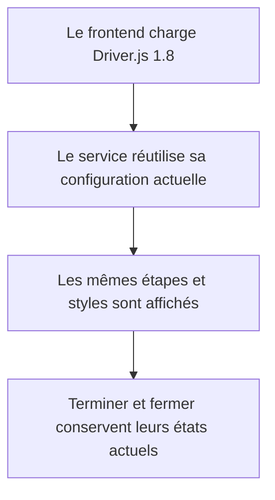

# Instruction: Mettre à niveau la dépendance sans refonte

## Architecture projection

> Tree of the final files. ✅ create · ✏️ modify · ❌ delete

```txt
.
├── package.json ✏️
├── frontend
│   ├── package.json ✏️
│   └── projects
│       └── webapp
│           └── src
│               └── app
│                   └── core
│                       └── product-tour
│                           └── product-tour.service.spec.ts ✏️
└── pnpm-lock.yaml ✏️
```

## User Journey



## Tasks to do

### `1)` Aligner Driver.js sur la version 1.8

> Mettre à niveau les deux déclarations existantes sans modifier l’architecture du workspace.

1. Passer `driver.js` de `^1.4.0` à `^1.8.0` dans le manifeste racine et celui du frontend.
2. Régénérer le lockfile avec pnpm sans mettre à jour les autres dépendances.
3. Vérifier que le lockfile ne résout plus Driver.js 1.4.

### `2)` Prouver la compatibilité avant toute adaptation

> Garder le service, les étapes et le thème inchangés tant qu’aucune régression n’est démontrée.

1. Fournir `index: undefined` au mock de hook conformément au type Driver.js 1.8.
2. Exécuter le test unitaire ciblé de `ProductTourService`.
3. Exécuter les contrôles de types du frontend et des tests E2E.
4. Exécuter le build frontend afin de valider l’import CSS et le bundle Driver.js.
5. Si une autre incompatibilité apparaît, arrêter cette phase et réviser la projection avant de toucher au service ou au thème.

## Test acceptance criteria

| Task | Acceptance criteria |
| ---- | ------------------- |
| 1 | Les deux manifestes demandent Driver.js `^1.8.0`, le lockfile résout `1.8.0` et aucune autre dépendance ne change de version. |
| 2 | Le mock respecte `HookOpts` 1.8 ; la suite ciblée du product tour, les contrôles de types E2E et frontend, puis le build frontend passent sans modification des textes, étapes, états ou styles du tour. |
