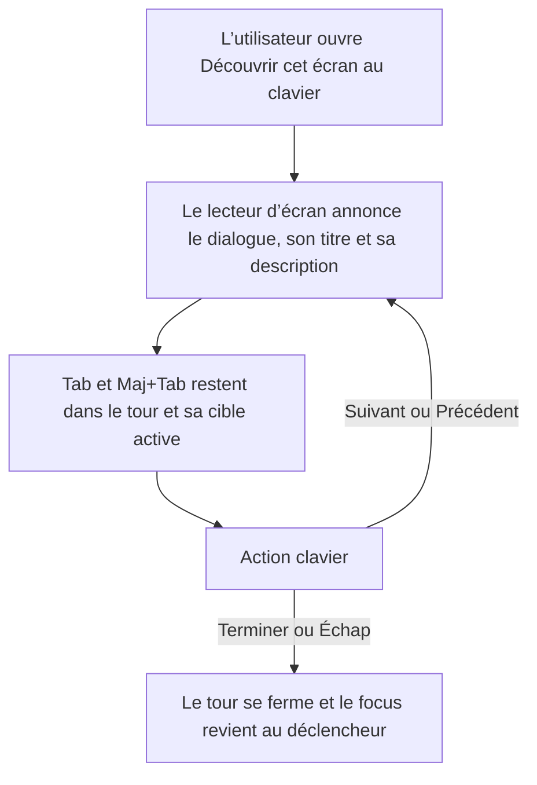

# Instruction: Verrouiller l’accessibilité réelle

## Architecture projection

> Tree of the final files. ✅ create · ✏️ modify · ❌ delete

```txt
.
└── frontend
    └── e2e
        └── tests
            └── features
                └── product-tour-accessibility.spec.ts ✅
```

## User Journey



## Tasks to do

### `1)` Ajouter la régression Playwright ciblée

> Tester le vrai DOM de Driver.js avec les fixtures existantes, sans nouvelle librairie ni nouveau helper.

1. Ouvrir le tour rejouable du dashboard depuis le menu utilisateur avec le clavier.
2. Vérifier le rôle dialogue, le nom et la description accessibles, les libellés des contrôles et le focus visible.
3. Vérifier Tab, Maj+Tab, Entrée, les flèches gauche et droite, puis Échap.
4. Vérifier un parcours terminé et la restauration du focus vers le déclencheur logique.
5. Garder le test limité à la régression clavier et sémantique commune à tous les tours.

### `2)` Valider le lecteur d’écran et le rendu local

> Compléter l’automatisation par une écoute réelle, car Playwright ne remplace pas VoiceOver.

1. Démarrer le frontend et le backend locaux, puis confirmer leurs ports depuis les logs avant d’ouvrir l’application.
2. Avec VoiceOver sur macOS, rejouer le tour du dashboard et confirmer l’annonce du titre, de la description, de la progression et des boutons à chaque étape.
3. Confirmer que Suivant, Précédent, Terminer et Échap produisent l’action annoncée et que le focus revient au menu utilisateur.
4. Avec `@Browser`, capturer un écran du tour sur dashboard, budgets, détail d’un budget, modèles et objectifs afin d’écarter tout recadrage ou débordement lié à la mise à niveau.
5. Exécuter le contrôle qualité du monorepo et le test Playwright ciblé.

## Test acceptance criteria

| Task | Acceptance criteria |
| ---- | ------------------- |
| 1 | Le tour est entièrement opérable sans souris ; le dialogue et ses contrôles ont des noms accessibles ; le focus ne s’échappe pas vers le contenu masqué ; Échap ferme le tour ; Terminer le clôture ; le focus revient au déclencheur logique. |
| 2 | VoiceOver annonce chaque étape et ses contrôles sans silence ni contenu ambigu ; les cinq captures ne montrent ni popover rogné, ni cible incorrecte, ni débordement ; le contrôle qualité et le test Playwright ciblé passent. |
