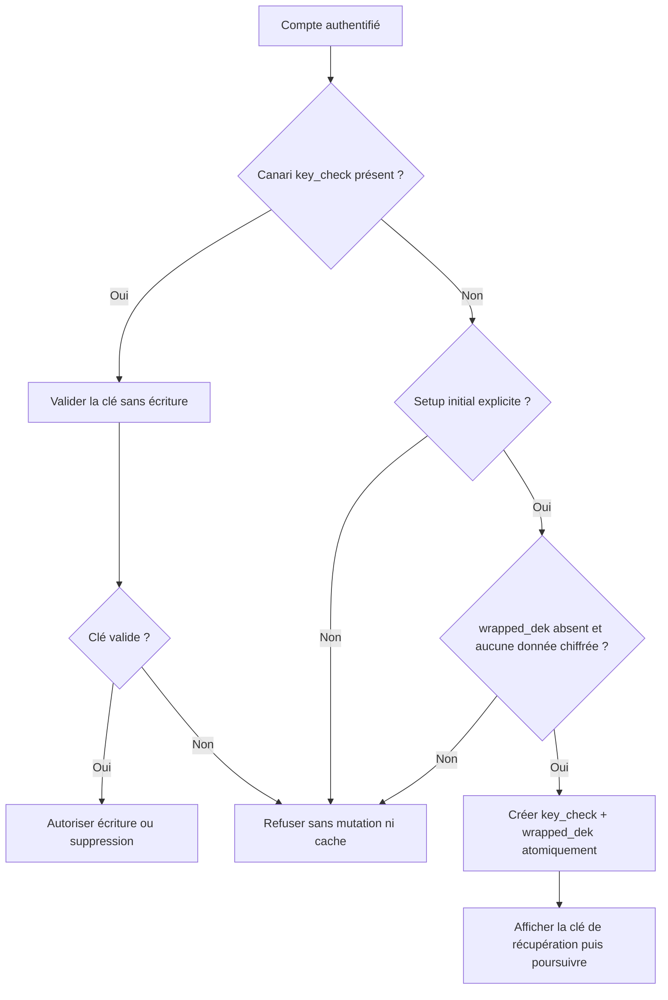

# Instruction: Verrouiller le cycle de vie du coffre et la suppression

## Architecture projection

> Tree of the final files. ✅ create · ✏️ modify · ❌ delete

```txt
.
├── docs/ENCRYPTION.md ✏️
├── backend-nest/src/modules
│   ├── encryption
│   │   ├── application
│   │   │   ├── setup-recovery-key.use-case.ts ✏️
│   │   │   ├── setup-recovery-key.use-case.spec.ts ✏️
│   │   │   ├── validate-user-key.use-case.ts ✏️
│   │   │   └── validate-user-key.use-case.spec.ts ✏️
│   │   ├── domain/ports
│   │   │   ├── encryption-key-repository.port.ts ✏️
│   │   │   └── encryption.port.ts ✏️
│   │   ├── encryption.repo-error.e2e.spec.ts ✏️
│   │   └── infrastructure
│   │       ├── crypto
│   │       │   ├── aes-gcm.crypto-service.ts ✏️
│   │       │   └── aes-gcm.crypto-service.spec.ts ✏️
│   │       ├── http/encryption.controller.ts ✏️
│   │       └── persistence
│   │           ├── supabase-encryption-key.repository.ts ✏️
│   │           └── supabase-encryption-key.repository.spec.ts ✏️
│   └── user/application
│       ├── schedule-account-deletion.use-case.ts ✏️
│       └── schedule-account-deletion.use-case.spec.ts ✏️
├── frontend/projects/webapp/src/app
│   ├── core/encryption/encryption-api.ts ✏️
│   └── feature/auth/setup-vault-code
│       ├── setup-vault-code.ts ✏️
│       └── setup-vault-code.spec.ts ✏️
└── ios
    ├── Pulpe/Features/Auth/Pin/PinSetupView.swift ✏️
    └── PulpeTests/Features/Auth/PinSetupViewModelTests.swift ✏️
```

## User Journey



## Tasks to do

### `1)` Reproduire les trois contournements avant le correctif

> Prouver la faille sur les primitives réelles, pas sur un mock qui retourne déjà `false`.

1. Dans les specs existantes, partir d’une ligne de chiffrement avec `key_check=null`.
2. Prouver qu’une clé arbitraire ne peut ni réussir `validate-key`, ni programmer la suppression, ni entrer dans le cache par une lecture puis être réutilisée par une écriture.
3. Vérifier après chaque refus que `updateKeyCheckIfNull`, l’initialisation du coffre, `scheduleDeletion` et `signOutGlobally` n’ont pas été appelés.
4. Remplacer le scénario e2e qui attend actuellement `204` sur `validate-key` sans canari par le refus contrôlé attendu.

### `2)` Séparer définitivement vérification et bootstrap

> Toute primitive générale d’écriture ou d’action destructive doit exiger une preuve cryptographique déjà établie.

1. Remplacer `verifyAndEnsureKeyCheck` par une vérification strictement non mutable : ligne absente ou `key_check` absent => `false`; canari valide => cache de la DEK; canari invalide => `false` sans cache.
2. Faire utiliser cette même vérification stricte par `ValidateUserKeyUseCase` et `ScheduleAccountDeletionUseCase`.
3. Dans `ensureUserDEK`, refuser toute écriture quand le canari manque, y compris après une lecture antérieure.
4. Dans `getUserDEK`, conserver le comportement de lecture existant mais ne jamais mettre en cache une DEK qui n’a pas été validée par un canari.
5. Conserver l’effacement des buffers et les erreurs métier actuelles; aucune clé, aucun canari et aucun ciphertext ne doit rejoindre les logs.

### `3)` Rendre l’initialisation du coffre atomique et bornée

> Le setup initial est le seul endroit autorisé à créer le canari.

1. Ajouter au repository existant une mise à jour conditionnelle qui écrit `key_check` et `wrapped_dek` ensemble seulement lorsque les deux colonnes sont nulles, puis retourne si une ligne a réellement été modifiée.
2. Faire recevoir au setup le client Supabase authentifié déjà disponible dans le contrôleur.
3. Réutiliser les lectures de données chiffrées déjà présentes dans le service de rekey pour confirmer qu’un coffre sans canari est réellement vide avant tout bootstrap.
4. Pour l’état neuf `key_check=null`, `wrapped_dek=null`, aucune donnée : dériver la DEK, générer canari et clé de récupération, puis effectuer l’écriture atomique.
5. Pour `key_check` présent et `wrapped_dek` absent : vérifier la clé existante puis compléter uniquement la récupération, afin de préserver les setups interrompus.
6. Pour toute donnée chiffrée existante ou l’état legacy `key_check=null`, `wrapped_dek` présent : refuser sans mutation et laisser le parcours de récupération existant prendre le relais.
7. Traiter une course perdue comme un conflit contrôlé; ne jamais retourner une clé de récupération qui n’est pas celle enregistrée.
8. Avant déploiement, inventorier en lecture seule les combinaisons `key_check`/`wrapped_dek` sur preview puis production et confirmer qu’aucun état legacy n’est silencieusement réinitialisé.

### `4)` Préserver les créations de coffre web et iOS

> Le setup crée le coffre; les parcours de retour continuent à le vérifier.

1. Web : après dérivation, stocker la clé cliente puis appeler directement `setup-recovery`; ne plus appeler `validate-key` pendant une création.
2. iOS : en mode création, réutiliser la dérivation sans validation déjà disponible, stocker la clé puis appeler `setupRecoveryKey`; garder le mode saisie existante sur `validateKey`.
3. Si le setup recovery échoue, ne pas marquer `vaultCodeConfigured`, ne pas naviguer et conserver le comportement de retry actuel.
4. Couvrir l’ordre exact des appels sur les deux plateformes et vérifier que PIN entry, biométrie, changement de PIN et récupération continuent à employer la validation stricte.
5. Mettre les commentaires API et `docs/ENCRYPTION.md` en accord avec les deux contrats distincts.

## Test acceptance criteria

| Task | Acceptance criteria |
| --- | --- |
| 1 | Avec `key_check=null`, la séquence lecture avec clé arbitraire → écriture ou suppression est refusée et ne produit aucune mutation ni entrée de cache réutilisable. |
| 1 | Appeler `validate-key` avec une clé arbitraire puis retenter la suppression ne crée aucun canari et laisse `scheduleDeletion` et `signOutGlobally` intacts. |
| 2 | Seule une clé qui déchiffre un `key_check` existant peut alimenter le cache validé, écrire une donnée ou programmer la suppression. |
| 3 | Un coffre vide initialise `key_check` et `wrapped_dek` dans une seule mise à jour conditionnelle; une course ou une erreur ne laisse jamais une seule colonne remplie. |
| 3 | Un compte avec une donnée chiffrée ou `wrapped_dek` existant mais sans canari ne peut pas être repris par une clé arbitraire et reste orientable vers la récupération. |
| 3 | L’inventaire read-only des états existants est conservé dans les preuves d’exécution sans exporter de canari, clé enveloppée ni donnée utilisateur. |
| 4 | Les créations web et iOS aboutissent avec clé de récupération affichée; les retours et déverrouillages continuent à refuser un mauvais PIN. |
