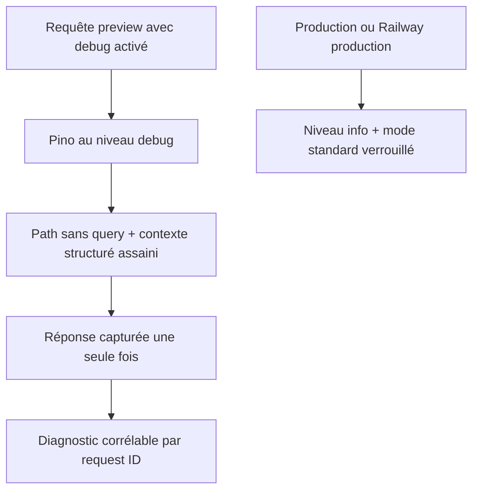

# Instruction: Rendre les logs preview utiles sans fuite

## Architecture projection

> Tree of the final files. ✅ create · ✏️ modify · ❌ delete

```txt
backend-nest/src
├── app.module.ts ✏️
├── common
│   ├── filters
│   │   ├── global-exception.filter.ts ✏️
│   │   └── global-exception.filter.spec.ts ✏️
│   ├── middleware/response-logger.middleware.ts ✏️
│   └── utils
│       ├── log-anonymization.ts ✏️
│       └── log-anonymization.spec.ts ✏️
└── test/redaction.spec.ts ✏️
```

## User Journey



## Tasks to do

### `1)` Reproduire la vraie chaîne Express

> Le mock actuel n’exécute pas `res.json() → res.send()` et masque le défaut.

1. Ajouter dans `redaction.spec.ts` une petite app Express réelle utilisant le middleware existant.
2. Renvoyer un objet JSON contenant une valeur visible et un token imbriqué, puis capturer l’unique log de réponse.
3. Vérifier que la valeur visible reste exploitable, que la sentinelle est absente et qu’aucune chaîne JSON brute ne remplace l’objet assaini.

### `2)` Capturer chaque réponse à une seule frontière logique

> Préserver `json` et `send` sans double capture.

1. Garder les deux méthodes Express originales et empêcher `send` d’écraser une capture déjà effectuée par `json`.
2. Assainir les réponses envoyées directement avec `send` au même point central.
3. Conserver la capture uniquement en mode détaillé et sur l’événement `finish`; ne pas modifier le corps réellement envoyé au client.

### `3)` Aligner le niveau Pino sur la décision de debug

> Un mode détaillé autorisé doit produire ses logs; une production verrouillée doit rester à `info`.

1. Calculer le niveau depuis `loggingDecision.mode` : `debug` en mode détaillé, `info` en production-like standard, comportement local actuel ailleurs.
2. Tester preview opt-in => `debug`, preview par défaut => `info`, production avec flag => `info`.
3. Conserver les serializers assainis et le warning de flag ignoré en production.

### `4)` Retirer les queries brutes des erreurs

> La route reste visible sans recopier le texte recherché ou un token depuis `request.url`.

1. Déplacer le helper path-only déjà présent dans `app.module.ts` vers `log-anonymization.ts` et le réutiliser dans les serializers, messages automatiques et filtre global.
2. Journaliser uniquement le path dans `url`.
3. Ajouter `requestQuery` seulement en mode détaillé, après passage dans `sanitizeLogValue`; l’omettre entièrement en mode standard.
4. Tester une erreur avec query métier, token et champ visible en preview puis en production.

## Test acceptance criteria

| Task | Acceptance criteria |
| --- | --- |
| 1 | La chaîne Express réelle `json → send → finish` produit un seul objet assaini : le champ visible est présent et la sentinelle imbriquée absente. |
| 2 | Une réponse `send` directe reste capturée et assainie; le middleware ne modifie ni le statut ni le payload client. |
| 3 | `NODE_ENV=preview` avec opt-in émet les corps au niveau `debug`; preview standard et tout signal production restent au niveau `info`. |
| 4 | Aucun log d’erreur standard ne contient de query; en preview détaillée seuls les champs de query non sensibles survivent au sanitizer. |
