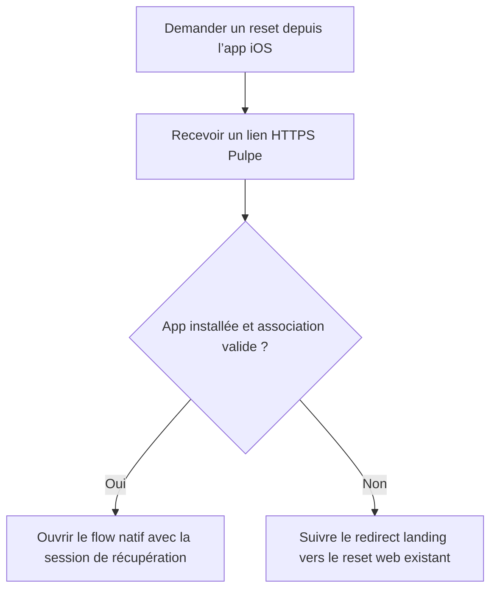

# Instruction: Protéger la récupération iOS

## Architecture projection

> Tree of the final files. ✅ create · ✏️ modify · ❌ delete

```txt
.
├── backend-nest/supabase/config.toml ✏️
├── docs
│   ├── DEPLOYMENT.md ✏️
│   ├── SCENARIOS.md ✏️
│   └── VERCEL_ROUTING.md ✏️
├── ios
│   ├── project.yml ✏️
│   ├── Pulpe.xcodeproj/project.pbxproj ✏️
│   ├── README.md ✏️
│   ├── Pulpe
│   │   ├── App
│   │   │   ├── Navigation/DeepLinkDestination.swift ✏️
│   │   │   ├── Navigation/DeepLinkHandler.swift ✏️
│   │   │   └── PulpeApp.swift ✏️
│   │   ├── Core/Config/AppConfiguration.swift ✏️
│   │   ├── Features/Auth/ResetPasswordFlowView.swift ✏️
│   │   └── Pulpe.entitlements ✏️
│   └── PulpeTests
│       ├── App/ResetPasswordDeepLinkRoutingTests.swift ✏️
│       └── Features/Auth/ResetPasswordFlowViewModelTests.swift ✏️
└── landing
    ├── public/.well-known/apple-app-site-association ✅
    └── vercel.json ✏️
```

## User Journey



## Tasks to do

### `1)` Établir l’association domaine-app

> Faire de `pulpe.app` l’unique propriétaire du callback iOS sensible.

1. Publier sur le frontend un fichier AASA limité au chemin `/reset-password` pour `AJ37X7C82G.app.pulpe.ios`, avec le type de contenu JSON explicite.
2. Ajouter `applinks:app.pulpe.app` aux entitlements XcodeGen et régénérer le projet.
3. Utiliser `https://app.pulpe.app/reset-password` comme `passwordResetRedirectURL`; conserver le parcours Angular comme repli web.

### `2)` Valider strictement le callback

> Accepter seulement le host et le chemin possédés.

1. Router le reset uniquement pour `https`, `app.pulpe.app` et `/reset-password`.
2. Ne plus accepter `pulpe://reset-password`; garder le schéma privé pour `add-expense` et `budget`.
3. Centraliser la classification des URLs dans le routeur testable existant, puis faire consommer son résultat par `PulpeApp`.
4. Continuer à déléguer la validation de la session de récupération au SDK Supabase, sans journaliser la destination complète, l’URL ni son fragment.

### `3)` Préserver le développement local et borner les redirects distants

> Garder le reset local fonctionnel sans automatiser de mutation des projets hébergés.

1. Remplacer le callback privé par `https://app.pulpe.app/reset-password` dans `backend-nest/supabase/config.toml`, afin que Supabase local accepte l’URL réellement envoyée par l’app.
2. Documenter la modification manuelle équivalente pour les projets Supabase preview et production, sans l’exécuter depuis l’agent ou la CI.
3. Remplacer dans la checklist distante `https://*.vercel.app/**` par les domaines Pulpe exacts. Si les previews dynamiques sont indispensables, n’autoriser que le motif officiel contenant le vrai slug de l’équipe propriétaire.
4. Distinguer dans la documentation les valeurs vérifiées dans le dépôt des valeurs restant à confirmer dans chaque dashboard.

### `4)` Verrouiller la régression

> Prouver que la récupération fonctionne sans repasser par le schéma interceptable.

1. Adapter les tests de routage et de session aux universal links.
2. Ajouter les refus du mauvais host, du mauvais path, de HTTP et de `pulpe://reset-password`.
3. Vérifier statiquement que l’AASA ne couvre que le bundle et le chemin attendus, que sa réponse Vercel porte `application/json` et que `/reset-password` pointe vers le reset web existant.
4. Construire les configurations iOS locale, preview et production puis exécuter les tests de routage ciblés.

### `5)` Formaliser les validations post-déploiement

> Ne jamais déclarer localement une preuve qui dépend d’un dashboard ou d’un appareil réel.

1. Ajouter une checklist opérateur pour vérifier l’AASA déployé, son type de contenu et l’ouverture du universal link sur un appareil signé.
2. Ajouter la confirmation qu’une app concurrente enregistrant seulement le schéma `pulpe` ne reçoit plus le callback de récupération.
3. Laisser ces points explicitement « à vérifier après déploiement » jusqu’à obtention d’une preuve humaine; ils ne bloquent pas le commit local du code et de ses tests.

## Test acceptance criteria

| Task | Acceptance criteria |
| --- | --- |
| 1 | L’entitlement, l’AASA et le redirect iOS désignent exactement `app.pulpe.app/reset-password`; sans app installée, Angular conserve le repli web. |
| 2 | Les tests prouvent que seul HTTPS + `app.pulpe.app` + `/reset-password` crée une destination de récupération; le schéma privé reste limité aux liens non sensibles et aucun fragment de token n’est journalisé. |
| 3 | Supabase local autorise le callback HTTPS; la documentation sépare les redirects distants exacts à appliquer des valeurs effectivement vérifiées, sans prétendre avoir modifié un dashboard. |
| 4 | Les tests ciblés et les builds iOS locale, preview et production passent; l’AASA et les headers Vercel satisfont les vérifications statiques. |
| 5 | La vérification sur appareil signé, le déploiement AASA et le test d’une app concurrente existent comme gates post-déploiement explicites et restent non cochés sans preuve humaine. |
