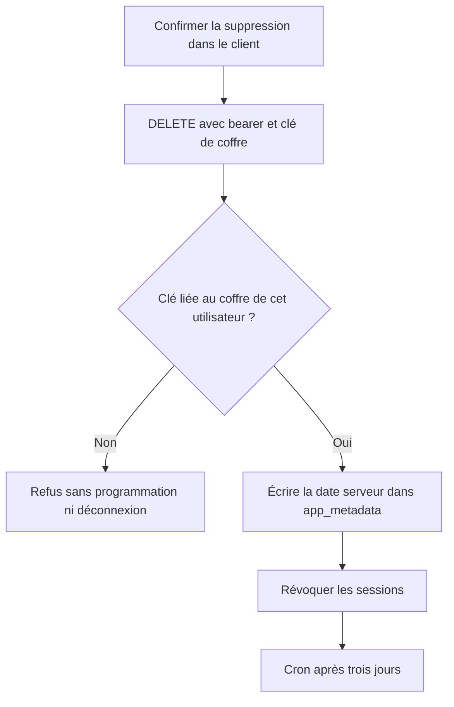

# Instruction: Fiabiliser la suppression de compte

## Architecture projection

> Tree of the final files. ✅ create · ✏️ modify · ❌ delete

```txt
.
├── backend-nest/src
│   ├── common/guards
│   │   ├── auth.guard.ts ✏️
│   │   ├── auth.guard.spec.ts ✏️
│   │   ├── user-throttler.guard.ts ✏️
│   │   └── user-throttler.guard.spec.ts ✏️
│   └── modules
│       ├── account-deletion
│       │   ├── account-deletion.integration.spec.ts ✏️
│       │   ├── domain
│       │   │   ├── account-deletion.entity.ts ✏️
│       │   │   └── ports/account-deletion-repository.port.ts ✏️
│       │   └── infrastructure/persistence
│       │       ├── supabase-account-deletion.repository.ts ✏️
│       │       └── supabase-account-deletion.repository.spec.ts ✏️
│       ├── encryption/domain/ports/encryption.port.ts ✏️
│       └── user
│           ├── application/schedule-account-deletion.use-case.ts ✏️
│           ├── application/schedule-account-deletion.use-case.spec.ts ✏️
│           ├── domain/user.entity.ts ✏️
│           ├── domain/ports/user-repository.port.ts ✏️
│           └── infrastructure/persistence
│               ├── supabase-user.repository.ts ✏️
│               └── supabase-user.repository.spec.ts ✏️
└── frontend/projects/webapp/src/app/core
    ├── auth
    │   ├── auth-credentials.service.ts ✏️
    │   ├── auth-credentials.service.spec.ts ✏️
    │   ├── auth-session.service.ts ✏️
    │   └── auth-session.service.spec.ts ✏️
```

## User Journey



## Tasks to do

### `1)` Déplacer l’état destructif côté serveur

> Ne plus faire dépendre le cron d’une valeur modifiable par l’utilisateur.

1. Lire et écrire `scheduledDeletionAt` dans `app_metadata`, en préservant les autres clés administratives.
2. Faire lire cette source par le cron, les guards et les clients qui affichent l’état de suppression.
3. Avant déploiement, vérifier les suppressions déjà programmées et les recopier par l’API admin; ne conserver aucun fallback de sécurité vers `user_metadata`.

### `2)` Lier la suppression à la clé de coffre

> Bloquer un bearer volé accompagné d’un faux header de 32 octets.

1. Exposer sur `ENCRYPTION_PORT` la validation de clé déjà utilisée par le flow `/encryption/validate-key`.
2. Valider `user.clientKey` avant toute écriture de date ou révocation de session.
3. Retourner une erreur contrôlée si la clé ne correspond pas au coffre, sans journaliser la clé ni créer de date.

### `3)` Tester l’ordre et les frontières

> Garder la programmation idempotente et la grâce de trois jours.

1. Couvrir clé valide, clé arbitraire, date absente, date existante et `app_metadata` invalide.
2. Vérifier qu’un `user_metadata.scheduledDeletionAt` antidaté n’est jamais pris en compte par le cron.
3. Vérifier que la révocation globale n’arrive qu’après validation et programmation.

## Test acceptance criteria

| Task | Acceptance criteria |
| --- | --- |
| 1 | Modifier ou antidater `user_metadata.scheduledDeletionAt` depuis un client authentifié ne bloque pas le compte et ne le rend pas éligible au cron. |
| 1 | Une date créée par le backend dans `app_metadata` reste visible après reconnexion et déclenche le cron uniquement après la grâce prévue. |
| 2 | Un bearer valide avec une clé arbitraire est refusé avant toute mutation; la vraie clé de coffre conserve le parcours actuel. |
| 3 | Une suppression déjà programmée reste idempotente et la révocation globale suit toujours l’écriture fiable de la date. |
