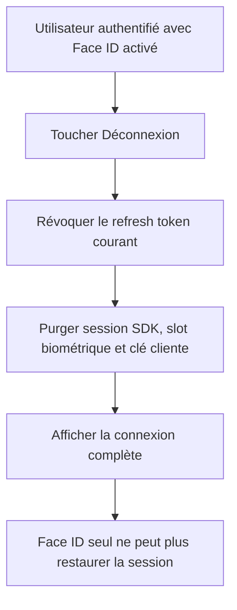

# Instruction: Rendre la déconnexion iOS réelle

## Architecture projection

> Tree of the final files. ✅ create · ✏️ modify · ❌ delete

```txt
.
├── docs/SCENARIOS.md ✏️
└── ios
    ├── Pulpe
    │   ├── App
    │   │   ├── AppAuthFlagsStore.swift ✏️
    │   │   ├── AppState+Auth.swift ✏️
    │   │   ├── AppState+Bootstrap.swift ✏️
    │   │   ├── AppState+SessionReset.swift ✏️
    │   │   ├── AppState.swift ✏️
    │   │   ├── Auth/StartupCoordinator.swift ✏️
    │   │   └── PulpeApp.swift ✏️
    │   ├── Core/Auth
    │   │   ├── AuthService.swift ✏️
    │   │   └── KeychainManager.swift ✏️
    │   └── Features/Auth/LoginView.swift ✏️
    └── PulpeTests
        ├── App
        │   ├── AppStateBackgroundLockTests.swift ✏️
        │   ├── AppStateLogoutBiometricTests.swift ✏️
        │   ├── AppStateStartupTimeoutIsolationTests.swift ✏️
        │   └── Auth/StartupCoordinatorTests.swift ✏️
        ├── Core/Auth/AuthServiceBiometricRefactorTests.swift ✏️
        └── Helpers/AppStateTestDoubles.swift ✏️
```

## User Journey



## Tasks to do

### `1)` Unifier la sémantique de sortie

> Une déconnexion explicite doit toujours terminer la session.

1. Faire passer le logout utilisateur par le sign-out Supabase réel puis par le nettoyage local existant.
2. Purger le slot biométrique et supprimer le chemin `logoutKeepingBiometricSession`.
3. Conserver Face ID pour le verrouillage d’une session active, pas comme session froide après logout.

### `2)` Retirer le chemin de réentrée devenu mort

> Supprimer l’état et les branches qui n’existent que pour restaurer un refresh token après logout.

1. Retirer le flag d’explicit logout utilisé par le bootstrap biométrique.
2. Simplifier `StartupCoordinator`, les doubles de test et les commentaires associés.
3. Garder les comportements de session expirée, reset password et suppression de compte inchangés.

### `3)` Verrouiller les invariants

> Tester la révocation, pas seulement l’état de l’écran.

1. Vérifier qu’après logout le slot biométrique est vide et qu’un refresh échoue.
2. Vérifier qu’un redémarrage ne propose pas de réentrée Face ID liée à la session quittée.
3. Vérifier que le verrouillage arrière-plan continue d’utiliser Face ID sur une session encore active.

## Test acceptance criteria

| Task | Acceptance criteria |
| --- | --- |
| 1 | Après « Déconnexion », aucun refresh token conservé ne permet de recréer une session et les clés locales sont purgées. |
| 2 | Le démarrage ne possède plus de branche spéciale « explicit logout » et suit le parcours normal non authentifié. |
| 3 | Face ID continue de déverrouiller l’app après mise en arrière-plan, sans devenir une méthode de reconnexion après logout. |
