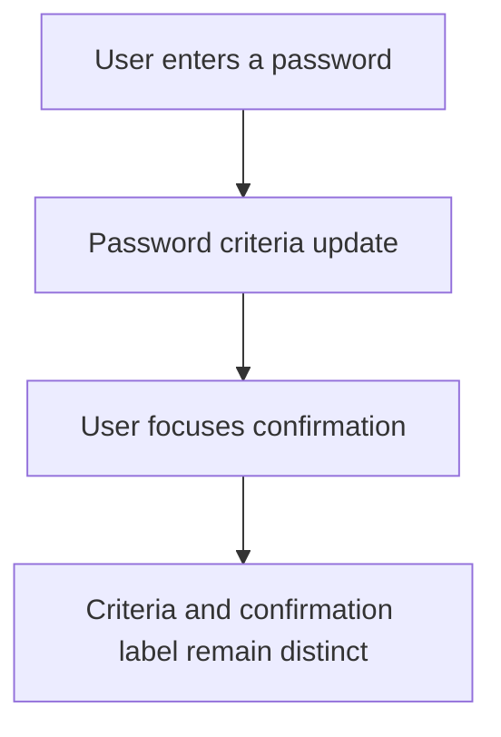

# Instruction: Restore the checklist host layout contract

## Architecture projection

> Tree of the final files. ✅ create · ✏️ modify · ❌ delete

```txt
frontend/
├── e2e/tests/features/
│   └── authentication.spec.ts                           ✏️ visual regression coverage
└── projects/webapp/src/app/ui/password-criteria/
    └── password-criteria.ts                             ✏️ block-level host contract
```

## User Journey



## Wireframe

```txt
┌─────────────────────────────────────┐
│ (1) Password field                  │
├─────────────────────────────────────┤
│ (2) Password criteria               │
│     ○ criterion                     │
│     ○ criterion                     │
│     ○ criterion                     │
├─────────────────────────────────────┤
│ (3) Confirmation field              │
└─────────────────────────────────────┘
```

1. Password field: the password entry control.
2. Password criteria: a compact group owned by the password field.
3. Confirmation field: a separate form control below the complete criteria box.

## Tasks to do

### `1)` Reproduce the overlap

> Lock the reported geometry before changing the component.

1. Add a narrow-viewport signup scenario to the existing authentication E2E suite.
2. Focus the confirmation field while criteria are unmet and assert that its floating label does not intersect the final criterion.
3. Enter a valid password and confirmation, then repeat the non-intersection assertion for the met state.

### `2)` Restore block layout

> Make the reusable component host participate in the parent form's vertical flow.

1. Add the existing project pattern `host: { class: 'block' }` to `PasswordCriteria`.
2. Keep the current `4px / 8px / 16px` spacing utilities unchanged.
3. Run the focused E2E regression and the existing password-criteria unit test.
4. Re-run the Impeccable layout scan; accept no unresolved layout finding.

## Test acceptance criteria

| Task | Acceptance criteria |
| ---- | ------------------- |
| 1 | The regression fails on the current layout because the confirmation label intersects the last criterion in the reported narrow viewport. |
| 1 | The scenario covers both unmet and met password criteria with the confirmation label floating. |
| 2 | The checklist host occupies its complete vertical box and the existing form spacing separates it from the confirmation field. |
| 2 | No compensating margin is added to the confirmation field and no global Material or form spacing is changed. |
| 2 | Password criteria logic, validation feedback, focus controls, and the signup form remain functional. |
