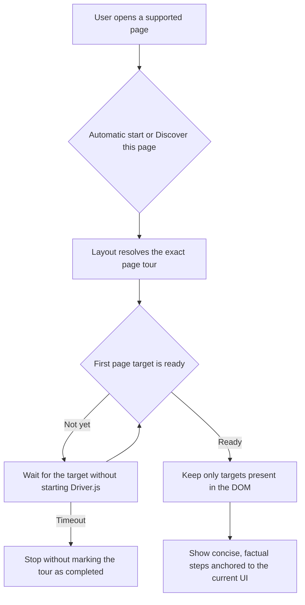

# Instruction: Repair and refresh every product tour

## Architecture projection

> Tree of the final files. ✅ create · ✏️ modify · ❌ delete

```txt
frontend/projects/webapp/src/app/
├── core/product-tour/
│   ├── product-tour.service.spec.ts                    ✏️ target-readiness and step-contract coverage
│   └── product-tour.service.ts                         ✏️ shared target guard and factual copy
└── layout/
    ├── main-layout.spec.ts                             ✏️ route and responsive navigation coverage
    └── main-layout.ts                                  ✏️ exact route classification and mobile tour target
```

## User Journey



## Wireframe

```txt
┌───────────────────────────────────────────────────────┐
│ Mes modèles de budget                 (2) Ajouter     │
├───────────────────────────────────────────────────────┤
│ (1) Modèles                                           │
│     ┌───────────────────────────────────────────┐     │
│     │ Template                                  │     │
│     └───────────────────────────────────────────┘     │
└───────────────────────────────────────────────────────┘
```

1. Template list: explains what a model contains and how it is reused.
2. Add action: explains how to create another model without assuming this is the user's first one.

## Tasks to do

The audit found four independent faults in the same flow: `/budget-templates` is captured by the generic `/budget` match; tours can start before async page targets exist; the intro has no visible navigation target on handset; and several descriptions no longer match the product or use the project's vocabulary.

### `1)` Reproduce and fix the route collision

> Prove that the manual action selects the budget-list tour on the templates route.

1. In the existing main-layout unit suite, navigate the mocked router to `/budget-templates`.
2. Trigger the existing page-tour action and expect `templates-list`.
3. Keep happy-path assertions for `/budget` and `/budget/:id`.
4. Match the specific budget templates route before the generic budget route. Do not add a new router abstraction for one ordering bug.

### `2)` Make target resolution safe in the shared service

> Never give Driver.js a missing selector, which is what produces the detached centered popovers.

1. Add a failing service test where the first page target is absent at `startPageTour()` time and appears after a DOM update.
2. Use the already injected `DOCUMENT` and the native `MutationObserver` to wait for the first targeted page step, bounded by a 10-second timeout. Keep one pending request; a request for another page replaces it.
3. On timeout or cancellation, disconnect the observer, clear the timer, do not create Driver.js, and do not mark the intro or page tour as completed.
4. Once the first page target exists, remove any remaining selector-based step whose element is not present before calling `setSteps()`. Elementless introduction steps remain intentional.
5. Cancel the pending wait from the existing `cancelActiveTour()` path so route changes cannot launch a stale tour later.
6. Target the always-present budget-details FAB with its existing `data-testid="add-budget-line-fab"` instead of the conditional footer action.
7. Remove the template-counter step. The counter stays in the page, but a conditional limit reminder is not needed to understand the feature and is absent when the list is empty.
8. Set Driver.js `animate` from `DOCUMENT.defaultView.matchMedia('(prefers-reduced-motion: reduce)')` so the tour follows the product motion contract without adding another dependency.

### `3)` Keep the introduction anchored on desktop and handset

> The desktop rail has the navigation target; the closed mobile drawer does not.

1. Reuse `data-tour="navigation"` on the handset menu button. Only one matching target is rendered at a time.
2. Keep the existing desktop navigation target and let the shared missing-target guard handle any future layout state safely.
3. Add a responsive layout assertion that desktop targets the rail and handset targets the visible menu button.

### `4)` Replace stale and promotional copy

> Keep the tutoiement, remove unverifiable timing claims, avoid "premier" on replayable tours, and use the product vocabulary: Prévision, Pointé, À pointer, Disponible à dépenser, Revenu, Dépense, Épargne, Récurrent, Prévu.

#### Introduction

1. **Bienvenue dans Pulpe**: "Pulpe t'aide à préparer tes mois et à suivre tes revenus, dépenses et épargnes. Voici les repères utiles pour commencer."
2. **Les espaces de Pulpe**:
   - "Tableau de bord : suis le mois en cours et pointe tes prévisions."
   - "Budgets : consulte, crée et ajuste chaque mois."
   - "Modèles : prépare des revenus, dépenses et épargnes à réutiliser."
   - "Objectifs : suis tes projets d'épargne et les prévisions qui leur sont liées."

#### Tableau de bord

1. **Disponible à dépenser**: "Ce montant résume ce qu'il reste pour le mois en tenant compte des revenus, dépenses et épargnes. Ouvre ce bloc pour accéder au budget détaillé."
2. **Prévisions à pointer et transactions**: "Retrouve ici les prévisions encore à pointer et les dernières transactions du mois. Ouvre le budget pour voir la liste complète."
3. **Ajouter une transaction**: "Ajoute un revenu, une dépense ou une épargne depuis ce bouton."

#### Budgets

1. **Parcourir les années**: "Passe d'une année à l'autre avec ces onglets."
2. **Ouvrir ou créer un mois**: "Sélectionne un mois existant pour ouvrir son budget, ou un mois vide pour le créer."
3. **Ajouter un budget**: "Choisis un mois et un modèle. Les prévisions du modèle sont copiées dans le nouveau budget."

#### Détail d'un budget

1. **Disponible du mois**: "Ce bloc résume les revenus, les dépenses, l'épargne et le report éventuel du mois précédent."
2. **Prévisions du mois**: "Pointe une prévision quand elle est réalisée. Ouvre une ligne pour la modifier ou consulter ses transactions."
3. **Ajouter une prévision**: "Ajoute un Revenu, une Dépense ou une Épargne, puis choisis sa fréquence : Récurrent ou Prévu."

#### Modèles

1. **Tes modèles de budget**: "Un modèle regroupe les revenus, dépenses et épargnes que tu veux réutiliser. Ouvre un modèle pour modifier ses prévisions."
2. **Ajouter un modèle**: "Crée un modèle, puis ajoute les prévisions à reprendre dans tes futurs budgets."

#### Objectifs

1. **Des objectifs à ton rythme**: "Seul le nom est obligatoire. Tu peux ajouter un montant cible, une date de début ou une échéance selon ton besoin. L'option d'épargne mensuelle peut préparer les prévisions associées sans créer de nouveaux budgets."
2. **Tes objectifs**: "Chaque carte affiche les informations renseignées. Ouvre un objectif pour suivre les prévisions liées et ajuster son plan."
3. **Nouvel objectif**: "Commence par le nom. Tu pourras compléter le montant, les dates et l'épargne mensuelle maintenant ou plus tard."

### `5)` Verify the complete tour contract

> Cover the reported bug and the shared failure mode without snapshotting every sentence.

1. In `product-tour.service.spec.ts`, mock the Driver.js factory and assert that `drive()` waits for the first page target, receives no missing selector, and is not called after timeout or cancellation.
2. Assert that the templates tour now contains only the list and add action, that the budget-details add step uses the always-present FAB, and that reduced-motion preference disables Driver.js animation.
3. In `main-layout.spec.ts`, assert the three budget route mappings and the responsive navigation target.
4. Run the focused Vitest files, then exercise each page tour manually at desktop and handset widths with loaded, empty, and slow-loading data.

## Test acceptance criteria

| Task | Acceptance criteria |
| ---- | ------------------- |
| 1 | The regression fails on the current code because `/budget-templates` resolves to `budget-list`; `/budget` and `/budget/:id` remain correct. |
| 1 | Starting "Découvrir cette page" from `/budget-templates` calls `startPageTour('templates-list')`. |
| 2 | Driver.js is not created until the first page target exists, and a timeout never marks a tour as seen. |
| 2 | No selector-based step reaches Driver.js without a matching DOM element. Centered popovers remain only for explicitly elementless introduction steps. |
| 2 | The template tour has two useful steps; an empty template list cannot fall back on the absent counter. |
| 2 | The budget-details add step remains anchored even when the budget has no existing prévision. |
| 2 | `prefers-reduced-motion: reduce` sets Driver.js `animate` to `false`; the default remains animated. |
| 3 | The navigation step anchors to the desktop rail or the visible handset menu button. |
| 4 | No tour promises "2 clics", "5 secondes", "30 secondes", "1 clic", or "2 minutes". |
| 4 | Replayable tours do not tell an existing user to create a "premier" model or goal. |
| 4 | The goals tour states that only the name is required and does not imply that Pulpe always creates budgets or a monthly plan. |
| 4 | Budget terminology matches the project vocabulary, including "Pointé", "À pointer", "Récurrent", and "Prévu". |
| 5 | Focused Vitest suites pass and every supported page tour stays attached at desktop and handset widths. |
