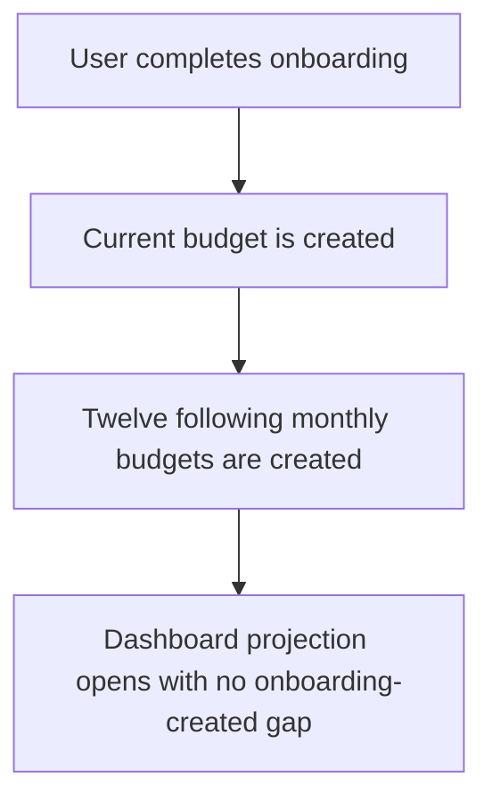

# Instruction: Generate a complete onboarding horizon

## Architecture projection

> Tree of the final files. ✅ create · ✏️ modify · ❌ delete

```txt
frontend/projects/webapp/src/app/core/complete-profile/
├── profile-setup.service.spec.ts                       ✏️ onboarding horizon regression coverage
└── profile-setup.service.ts                            ✏️ current period plus twelve future periods
```

## User Journey



## Tasks to do

### `1)` Reproduce the horizon mismatch

> Lock the contract between onboarding generation and the dashboard's future projection.

1. Freeze the profile-setup test clock on a known calendar period.
2. Assert that onboarding requests the current period plus twelve following periods.
3. Cover a year boundary so the thirteenth period rolls into the correct year.

### `2)` Include the full future horizon

> Keep the current budget and provide every month consumed by the twelve-month projection.

1. Change the initial generation count from twelve total periods to thirteen total periods.
2. Document the count locally as one current period plus twelve future periods.
3. Keep the backend generation formula, dashboard projection range, and missing-month warning unchanged.
4. Run the focused profile-setup and dashboard upcoming-budget tests.

## Test acceptance criteria

| Task | Acceptance criteria |
| ---- | ------------------- |
| 1 | The new regression fails on the current code because a count of 12 covers the current period and only eleven future periods. |
| 1 | A year-boundary case proves that all twelve following periods are requested in order. |
| 2 | A newly onboarded user receives thirteen consecutive budgets: the active period and the next twelve periods. |
| 2 | The dashboard still displays exactly twelve future months. |
| 2 | With untouched onboarding data, none of those twelve future months is reported missing. |
| 2 | The warning remains available for genuine gaps created later by deletion or incomplete user data. |
