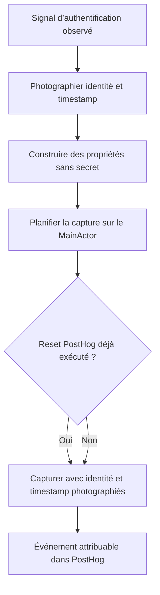

# Instruction: Rendre la capture déterministe et durable

## Architecture projection

> Tree of the final files. ✅ create · ✏️ modify · ❌ delete

```txt
.
├── .claude/rules/05-workflows-and-processes/
│   └── ✏️ posthog-events.md                              # documente l’événement et ses espaces de valeurs
└── ios/
    ├── ✏️ project.yml                                    # verrouille supabase-swift 2.54.0
    ├── Pulpe/Core/
    │   ├── Analytics/
    │   │   ├── ✏️ AnalyticsEvent.swift                   # renomme l’événement selon la convention
    │   │   └── ✏️ AnalyticsService.swift                 # photographie identité et timestamp avant le task
    │   └── Auth/
    │       ├── ✏️ AuthTypes.swift                         # accueille le mapping autonome User → UserInfo
    │       ├── ✏️ AuthService.swift                       # délègue les diagnostics et retire le disable global
    │       └── ✅ AuthSessionDiagnostics.swift            # isole état persistant et parsing du logger Supabase
    └── PulpeTests/Core/
        ├── Analytics/
        │   └── ✏️ AnalyticsServiceTests.swift             # reproduit la capture différée après reset
        └── Auth/
            └── ✏️ AuthServiceBiometricRefactorTests.swift # verrouille le contrat Supabase et l’absence de secrets
```

## User Journey



## Tasks to do

### `1)` Reproduire la perte d’identité

> Le test doit échouer tant que la capture différée relit l’identité après le reset.

1. Ajouter un test qui photographie un distinct ID et un instant, simule leur changement avant l’envoi, puis attend les valeurs initiales dans le snapshot capturé.
2. Garder la preuve locale et déterministe, sans appel réseau PostHog.
3. Mettre à jour l’attente de nom vers `auth_session_observed`.
4. Conserver les tests de sanitization financière.

### `2)` Capturer un événement immuable

> Le task différé transporte l’état de l’incident au lieu de le recalculer.

1. Lire `Date()` et `PostHogSDK.shared.getDistinctId()` avant de créer le task MainActor.
2. Transporter les champs dans un snapshot typé `Sendable`, y compris le futur indicateur `is_expected_user_action`.
3. Construire le dictionnaire `[String: Any]` uniquement sur le MainActor.
4. Dans le task, utiliser l’overload PostHog avec `distinctId` et `timestamp` explicites.
5. Continuer à passer toutes les propriétés par `sanitizeProperties`.
6. Ne pas ajouter de flush synchrone ni de nouvelle file d’attente.

### `3)` Stabiliser le diagnostic Supabase

> Le parser ne doit changer que lors d’une mise à jour SDK intentionnelle.

1. Remplacer `from: "2.0.0"` par `exactVersion: "2.54.0"` dans `project.yml`.
2. Régénérer le projet avec `xcodegen generate --use-cache` et vérifier la résolution 2.54.0.
3. Déplacer le logger, son parser et les helpers de lecture de session dans `AuthSessionDiagnostics.swift`.
4. Passer le storage au helper sans élargir le niveau d’accès de la propriété privée d’`AuthService`.
5. Retirer `swiftlint:disable file_length` et garder `AuthService.swift` sous le seuil configuré.
6. Préserver la whitelist des quatre codes terminaux et ignorer tout message de requête contenant un refresh token.
7. Déplacer le mapping autonome `User` → `UserInfo` dans `AuthTypes.swift` pour respecter le seuil sans disable.

### `4)` Aligner le contrat analytics

> Le nom et les propriétés doivent être exploitables sans relire le code.

1. Renommer le case Swift et sa raw value vers `auth_session_observed`.
2. Ajouter l’événement au catalogue iOS avec `source`, `outcome`, statuts, corrélation, stockage, expiration et classification.
3. Documenter les valeurs déjà émises et réserver les raisons terminales définies en phase 2.
4. Vérifier SwiftLint strict et les suites Analytics/Auth ciblées.

## Test acceptance criteria

| Task | Acceptance criteria |
| --- | --- |
| 1 | Une capture exécutée après un reset conserve le distinct ID et l’horodatage présents au moment exact du signal. |
| 1 | Le test ne dépend ni du réseau ni d’un projet PostHog actif. |
| 2 | Tous les diagnostics continuent à passer par le sanitizer et aucune propriété financière ou secrète n’est ajoutée. |
| 3 | Le projet généré résout exactement `supabase-swift` 2.54.0 et reconnaît les quatre codes terminaux du format livré. |
| 3 | Un log de requête contenant un refresh token ne produit aucun diagnostic. |
| 3 | `AuthService.swift` ne contient plus de disable `file_length` et respecte le seuil SwiftLint. |
| 4 | Le seul nom produit pour ce flux est `auth_session_observed`, documenté avec ses propriétés dans le catalogue. |
