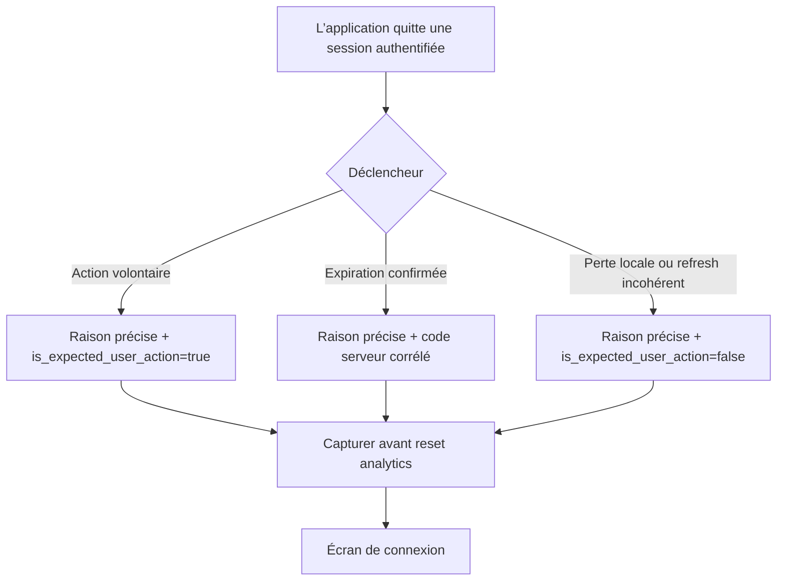

# Instruction: Classer chaque fin de session

## Architecture projection

> Tree of the final files. ✅ create · ✏️ modify · ❌ delete

```txt
.
├── .claude/rules/05-workflows-and-processes/
│   └── ✏️ posthog-events.md                    # finalise la taxonomie des fins de session
└── ios/
    ├── Pulpe/App/
    │   ├── ✏️ AppState+FlowState.swift         # distingue l’échec de refresh des autres resets
    │   └── ✏️ AppState+SessionReset.swift      # centralise raison, classification et capture terminale
    └── PulpeTests/App/
        ├── ✏️ AppStateLogoutScopeTests.swift   # verrouille actions utilisateur et raisons stables
        └── ✏️ AppStateBackgroundLockTests.swift # couvre la perte de session au retour du background
```

## User Journey



## Tasks to do

### `1)` Reproduire la taxonomie ambiguë

> Deux parcours différents ne doivent plus aboutir au même `system`.

1. Ajouter une table de tests pour toutes les valeurs terminales de `SessionResetScope`.
2. Attendre une raison non vide et unique pour logout utilisateur, suppression de compte, abandon d’inscription, abandon du retry, password reset, expiration API, expiration recovery, session absente au foreground et échec de refresh.
3. Attendre `is_expected_user_action=true` uniquement pour les parcours explicitement déclenchés ou confirmés par l’utilisateur.
4. Garder `system_unspecified` comme sentinelle anormale de compatibilité, jamais comme valeur d’un chemin production connu.

### `2)` Étendre le point central existant

> `resetSession` devient l’unique traduction d’un scope terminal vers le diagnostic.

1. Étendre `SessionResetScope` avec les raisons manquantes et leurs raw values stables.
2. Ajouter les propriétés calculées `diagnosticOutcome` et `isExpectedUserAction`.
3. Capturer `auth_session_observed` avec `source=session_reset` au début de `resetSession`.
4. Déplacer le reset PostHog du début de `logout` après la capture terminale, sans modifier le nettoyage Supabase, biométrique, client key ou navigation.
5. Conserver `logout_completed` pour la mesure produit existante.

### `3)` Qualifier chaque appel de production

> Aucun appel système connu ne doit retomber sur la sentinelle générique.

1. Marquer la session absente après déverrouillage biométrique comme `background_session_missing`.
2. Marquer l’abandon du retry de démarrage comme `startup_retry_abandoned`.
3. Passer une raison distincte à `clearLocalSignupState` pour `account_deleted` et `signup_abandoned`.
4. Marquer `sessionRefreshFailed` comme `session_refresh_failed`.
5. Conserver les scopes déjà précis : `user_logout`, `api_session_expired`, `recovery_session_expired` et `password_reset`.
6. Vérifier qu’aucun chemin production ne produit `system_unspecified`.

### `4)` Vérifier l’investigation de bout en bout

> Une future déconnexion doit fournir une séquence attribuable et interprétable.

1. Exécuter les tests de logout, background, flow state, Analytics et Auth diagnostics.
2. Vérifier qu’une action volontaire est distinguée d’une session perdue après quelques heures.
3. Vérifier qu’une expiration API reste corrélable au 401, au request ID et au retry; rattacher le code terminal lorsque Supabase en fournit un et rendre son absence explicite sinon.
4. Vérifier que reset, PIN et Face ID conservent leur comportement existant.
5. Relancer SwiftLint strict et le build optimisé `PulpeProd`.

## Test acceptance criteria

| Task | Acceptance criteria |
| --- | --- |
| 1 | Chaque scope terminal possède une raison stable unique et une classification explicite. |
| 1 | Suppression de compte, abandon d’inscription et perte de session au foreground ne partagent plus la valeur `system`. |
| 2 | L’événement terminal est photographié avec l’identité authentifiée avant que PostHog ne la réinitialise. |
| 2 | Les effets de logout, reset local, biométrie, PIN et navigation restent identiques. |
| 3 | Aucun chemin de production connu n’émet `system_unspecified`; cette valeur reste uniquement un garde-fou détectable. |
| 3 | Une expiration API conserve ses 401 backend, retries et request IDs dans la même chronologie utilisateur; un code terminal Supabase y apparaît lorsqu’il existe, sans être inventé sinon. |
| 4 | Les suites ciblées, SwiftLint strict et le build optimisé `PulpeProd` passent sur le même état de travail. |
