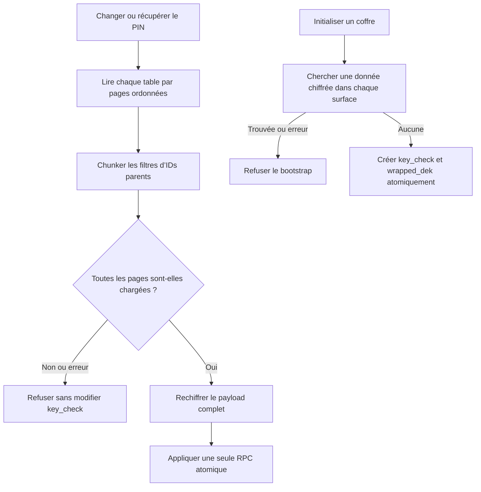

# Instruction: Rendre le rekey et le bootstrap exhaustifs

## Architecture projection

> Tree of the final files. ✅ create · ✏️ modify · ❌ delete

```txt
backend-nest/
└── src/modules/encryption/
    ├── encryption.integration.spec.ts ✏️
    └── infrastructure/crypto/
        ├── aes-gcm.crypto-service.ts ✏️
        └── aes-gcm.crypto-service.spec.ts ✏️
docs/
└── ENCRYPTION.md ✏️
```

## User Journey



## Tasks to do

### `1)` Paginer toutes les lectures du rekey

> Aucun plafond PostgREST ne doit pouvoir laisser une ligne sous l’ancienne DEK.

1. Réutiliser les méthodes privées de lecture existantes avec un ordre stable par `id` et des pages explicitement bornées sous la limite PostgREST.
2. Continuer tant qu’une page complète est reçue; échouer immédiatement sur toute erreur au lieu de retourner un lot partiel.
3. Découper les listes `budgetIds` et `templateIds` avant les filtres `.in(...)` pour éviter une URL trop longue, puis fusionner les résultats sans doublon.
4. Conserver une unique invocation de `rekey_user_encrypted_data` après validation du payload complet.

### `2)` Rendre le contrôle de coffre vide fail-closed

> Le bootstrap doit détecter une donnée chiffrée même hors de la première page.

1. Remplacer le chargement tronquable de toutes les lignes par des requêtes d’existence bornées à une ligne.
2. Pour les tables enfants, parcourir les IDs parents par chunks et s’arrêter dès la première colonne chiffrée non nulle.
3. Traiter toute erreur ou réponse ambiguë comme « coffre non vide ».

### `3)` Couvrir le seuil réel de 1 000 lignes

> Le test doit reproduire la limite configurée, pas seulement simuler deux petits tableaux.

1. Ajouter un test unitaire de pagination/chunking qui vérifie l’ordre et la propagation d’une erreur intermédiaire.
2. Ajouter un scénario d’intégration avec plus de 1 000 lignes et une sentinelle chiffrée sur la dernière page.
3. Vérifier qu’un rekey rend toutes les lignes lisibles avec la nouvelle clé et aucune avec l’ancienne.
4. Vérifier que la même sentinelle interdit un bootstrap de coffre.

### `4)` Aligner le contrat de chiffrement

> La documentation doit annoncer l’exhaustivité et l’atomicité réellement garanties.

1. Documenter la pagination, le chunking des IDs et le refus fail-closed.
2. Conserver la RPC atomique comme seul point de changement de `key_check`.

## Test acceptance criteria

| Task | Acceptance criteria |
| ---- | ------------------- |
| 1 | Un utilisateur avec 1 001 lignes dans une table est entièrement rechiffré; le compteur journalisé correspond au nombre réel de lignes. |
| 1 | Une erreur sur une page autre que la première arrête le rekey et laisse `key_check` inchangé. |
| 2 | Une seule donnée chiffrée située après les 1 000 premières lignes interdit le bootstrap. |
| 2 | Une erreur de requête d’existence interdit le bootstrap au lieu de considérer le coffre vide. |
| 3 | Après changement de PIN, la sentinelle de dernière page est lisible avec la nouvelle clé et rejetée avec l’ancienne. |
| 4 | `docs/ENCRYPTION.md` décrit le même ordre que le code : lecture exhaustive, validation, RPC atomique, changement de canari. |
