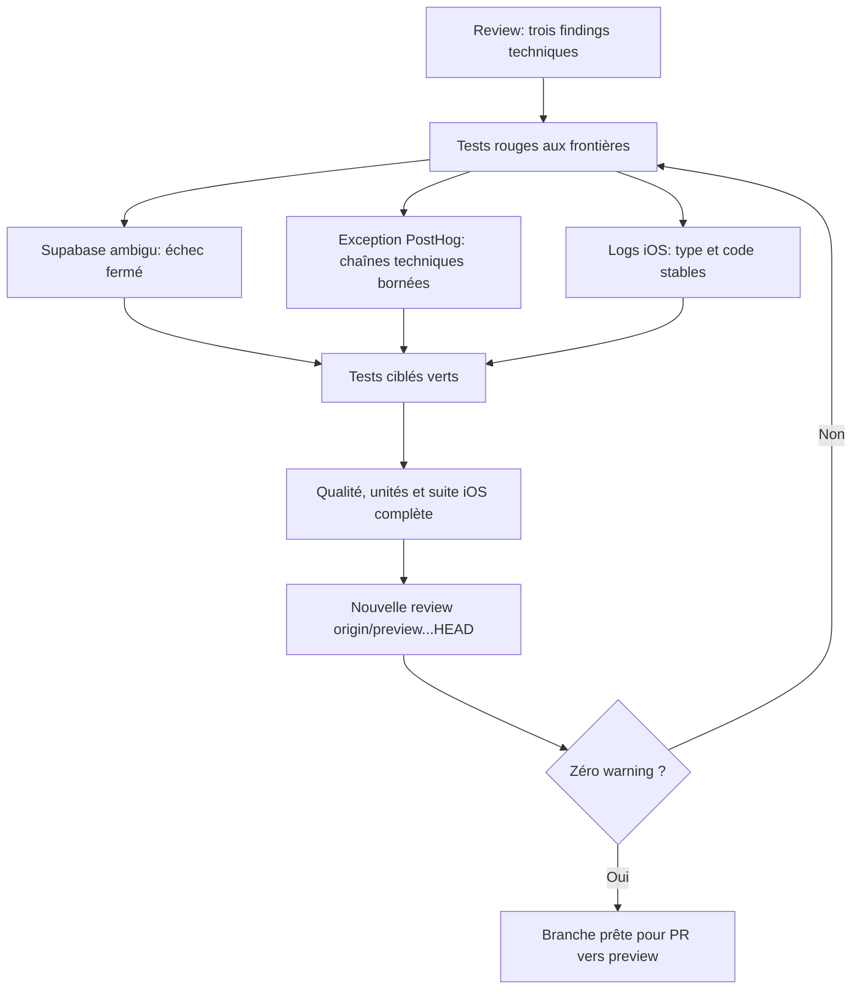

# Instruction: Fermer les findings finaux et revalider la branche

## Architecture projection

> Tree of the final files. ✅ create · ✏️ modify · ❌ delete

```txt
.
├── backend-nest/src/modules/encryption/infrastructure/crypto/
│   ├── aes-gcm.crypto-service.ts ✏️
│   └── aes-gcm.crypto-service.spec.ts ✏️
├── frontend/projects/webapp/src/app/core/analytics/
│   ├── posthog-sanitizer.ts ✏️
│   └── posthog-sanitizer.spec.ts ✏️
└── ios/
    ├── Pulpe/Core/Network/APIClient.swift ✏️
    └── PulpeTests/Core/Network/APIClientClientKeyHeaderTests.swift ✏️
```

## User Journey



## Tasks to do

### `1)` Reproduire les trois findings avant correction

> Chaque frontière laisse une preuve rouge minimale avant d’être modifiée.

1. Étendre le double Supabase existant pour pouvoir retourner `data: null` sans `error`, puis reproduire le bootstrap ambigu et une page de rekey ambiguë.
2. Placer la même sentinelle dans `type`, `module`, `function`, `platform`, `chunk_id`, `instruction_addr`, `addr_mode` et `mechanism.type` d’une exception PostHog.
3. Exposer dans `APIClient.swift` la plus petite fonction interne testable qui construit le diagnostic transport, puis vérifier qu’un `localizedDescription` sentinelle apparaît avant correction.
4. Exécuter chaque test isolément et conserver la cause fonctionnelle de l’échec; ne modifier aucune assertion métier existante pour obtenir le rouge.

### `2)` Refuser les réponses Supabase ambiguës

> Une absence de tableau n’est jamais assimilée à une réponse vide.

1. Dans `#queryHasRows`, propager l’erreur existante puis rejeter explicitement `data === null` avec une erreur locale stable.
2. Appliquer la même règle dans `#fetchAllPages` avant d’ajouter une page au snapshot.
3. Conserver l’ordre, le chunking, les retours sur tableaux vides et l’unique appel RPC après lecture complète.
4. Vérifier que le bootstrap ambigu n’appelle jamais `initializeVaultIfEmpty` et qu’une page ambiguë n’appelle jamais `rekey_user_encrypted_data`.

### `3)` Borner les chaînes techniques des exceptions PostHog

> Le grouping reste utile sans recopier une chaîne arbitraire de l’erreur.

1. Limiter `type`, `platform` et `mechanism.type` aux valeurs SDK/navigateur explicitement connues; remplacer ou omettre toute autre valeur.
2. Ne plus recopier `module`, `function`, `chunk_id`, `instruction_addr` ou `addr_mode` depuis l’exception brute.
3. Conserver le chemin déjà assaini, ligne, colonne, booléens de contexte et type stable nécessaires au grouping.
4. Garder l’échec fermé pour une structure invalide et ne modifier ni l’identification Supabase/PostHog, ni le consentement, ni le replay.

### `4)` Retirer les messages transport bruts des logs iOS

> Release conserve la corrélation réseau sans stocker le texte arbitraire d’une erreur.

1. Remplacer `localizedDescription` dans retry et échec final par request ID, type d’erreur et code numérique `URLError` lorsqu’il existe.
2. Réutiliser une seule construction de diagnostic dans les deux sinks, dans `APIClient.swift`, sans nouveau type ni nouvelle dépendance.
3. Conserver les niveaux warning/error, le retry unique, les erreurs retournées à l’appelant et le comportement HTTP actuel.
4. Couvrir une erreur sentinelle et un `URLError` réel; le diagnostic garde type, code et request ID mais jamais le message.

### `5)` Rejouer les preuves et remplacer la review

> La branche n’est prête que sur un seul HEAD entièrement validé.

1. Exécuter les trois specs ciblées, puis les tests analytics web existants qui couvrent identification, opt-out/in et replay.
2. Exécuter `pnpm quality`, la commande unitaire exacte de la CI, `git diff --check` et le test public-surface.
3. Un fichier iOS étant modifié, relancer obligatoirement la suite iOS CI-equivalent complète; ne pas réutiliser la preuve `8b91970c5`.
4. Refaire la review statique complète sur `origin/preview...HEAD + working tree`; ne modifier aucun environnement distant.

## Test acceptance criteria

| Task | Acceptance criteria |
| ---- | ------------------- |
| 1 | Les trois findings techniques de la review du 29 juillet 2026 échouent avant correction pour la cause attendue puis passent après correction. |
| 2 | `data: null` sans erreur interdit le bootstrap, laisse `initializeVaultIfEmpty` intact et ne peut jamais signifier « coffre vide ». |
| 2 | Une page de rekey `data: null` sans erreur arrête le flux avant le RPC; une page `[]` valide conserve le comportement actuel. |
| 3 | La sentinelle placée dans chaque champ texte de `$exception_list` est absente du payload; type stable, fichier assaini, ligne et colonne restent exploitables. |
| 3 | Identification UUID/email/prénom, opt-out/in, feature flags et replay conservent leurs comportements existants. |
| 4 | Retry et échec final iOS ne journalisent jamais `localizedDescription`; request ID, type et code `URLError` restent visibles sans modifier l’erreur reçue par l’appelant. |
| 5 | Qualité, unités CI, analytics ciblés, diff-check, public-surface et suite iOS complète sont verts sur le même HEAD. |
| 5 | La review finale est `approve`, sans critical, warning, critère correctif non vérifié ni modification distante. |
