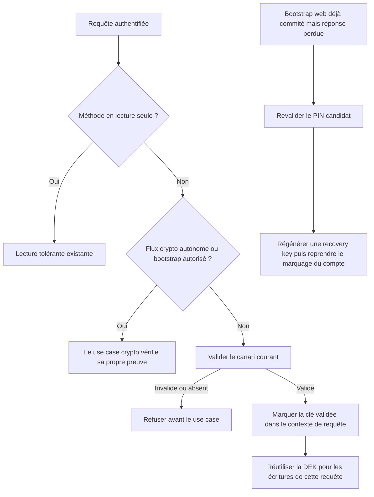

# Instruction: Exiger une preuve de coffre fraîche pour chaque mutation

## Architecture projection

> Tree of the final files. ✅ create · ✏️ modify · ❌ delete

```txt
backend-nest/src/
├── common/
│   ├── decorators/
│   │   └── allow-vault-bootstrap.decorator.ts ✅
│   └── guards/
│       ├── auth.guard.ts ✏️
│       └── auth.guard.spec.ts ✏️
└── modules/
    ├── encryption/
    │   ├── infrastructure/crypto/
    │   │   ├── aes-gcm.crypto-service.ts ✏️
    │   │   └── aes-gcm.crypto-service.spec.ts ✏️
    │   └── infrastructure/http/encryption.controller.ts ✏️
    └── savings-goal/infrastructure/persistence/
        ├── supabase-savings-goal.repository.ts ✏️
        └── supabase-savings-goal.repository.spec.ts ✏️
docs/
└── ENCRYPTION.md ✏️
frontend/projects/webapp/src/app/feature/auth/setup-vault-code/
├── setup-vault-code.ts ✏️
└── setup-vault-code.spec.ts ✏️
```

## User Journey



## Tasks to do

### `1)` Rendre le cache strict par requête

> Une DEK cachée ne vaut pas preuve après un rekey effectué par une autre instance.

1. Sur `ensureUserDEK`, relire le `key_check` courant avant d’accepter une entrée de cache dans une nouvelle requête.
2. Réutiliser le contexte CLS existant pour mémoriser uniquement l’empreinte déjà validée dans la requête courante.
3. Sur mismatch, évincer et zéroiser la DEK stale avant de lever l’erreur métier.
4. Hors contexte HTTP, ne jamais appliquer d’exception temporelle : chaque appel d’écriture doit vérifier le canari courant.

### `2)` Protéger les mutations à la frontière d’authentification

> Un header bien formé ne doit pas suffire à modifier ou supprimer des données.

1. Dans `AuthGuard`, appeler la primitive stricte pour toute méthode authentifiée non sûre après résolution de l’utilisateur.
2. Réutiliser `@SkipClientKey()` pour les flux qui portent et vérifient leur preuve dans le body.
3. Ajouter `@AllowVaultBootstrap()` uniquement à `setup-recovery`, qui a besoin du header mais crée le premier canari.
4. Ne pas changer les GET/HEAD ni le mode démo.

### `3)` Fermer le cas `targetAmount`

> Valeur et `null` doivent exiger la même preuve avant toute écriture.

1. Dès que `patch.targetAmount !== undefined`, obtenir une DEK via `ensureUserDEK`.
2. Utiliser cette DEK pour chiffrer la valeur ou autoriser l’effacement.
3. Laisser les autres champs optionnels suivre les primitives strictes existantes.

### `4)` Tester les frontières, pas chaque endpoint

> Un test partagé doit prouver que tous les contrôleurs protégés héritent de la règle.

1. Couvrir GET tolérant, POST/PATCH/DELETE stricts, bootstrap autorisé et flux crypto autonomes.
2. Simuler deux instances du service partageant le même repository : rekey sur l’une, tentative d’écriture stale sur l’autre.
3. Couvrir `targetAmount` avec valeur et avec `null`, canari absent puis invalide.
4. Vérifier qu’une clé valide n’ajoute qu’une validation DB par requête même si plusieurs montants sont chiffrés.

### `5)` Rendre le bootstrap web reprenable

> Un succès serveur suivi d’une perte de réponse ne doit pas enfermer l’utilisateur dans l’onboarding.

1. Distinguer `RECOVERY_KEY_ALREADY_EXISTS` des échecs où aucun coffre n’a été créé.
2. Sur ce code seulement, conserver la clé candidate le temps d’appeler `validate-key`.
3. Si la clé est valide, appeler `regenerate-recovery`, afficher la nouvelle recovery key puis reprendre `vaultCodeConfigured`; sinon effacer la candidate et demander le PIN existant.
4. Si `updateUser` échoue après affichage de la recovery key, permettre au retry de suivre le même chemin de réconciliation sans recréer le coffre.

## Test acceptance criteria

| Task | Acceptance criteria |
| ---- | ------------------- |
| 1 | Une DEK mise en cache avant un rekey est rejetée dans la requête suivante et ne peut chiffrer aucune nouvelle valeur. |
| 1 | Plusieurs champs chiffrés dans la même mutation réutilisent la preuve de la requête sans relire le canari pour chaque champ. |
| 2 | Une clé arbitraire de 32 octets ne peut exécuter aucun POST, PATCH, PUT ou DELETE métier protégé. |
| 2 | Les lectures continuent à produire leur fallback actuel et le premier `setup-recovery` reste possible. |
| 3 | `targetAmount` ne peut être ni remplacé ni effacé avec un canari absent ou invalide. |
| 4 | Changement de PIN, récupération et mode démo gardent leurs résultats fonctionnels actuels. |
| 5 | Une réponse `setup-recovery` perdue après commit est récupérable au retry : le PIN est revalidé, une nouvelle recovery key est affichée et `vaultCodeConfigured` est posé. |
| 5 | Un échec de `updateUser` après le dialogue ne provoque ni boucle setup ni perte d’accès au coffre lors du retry. |
