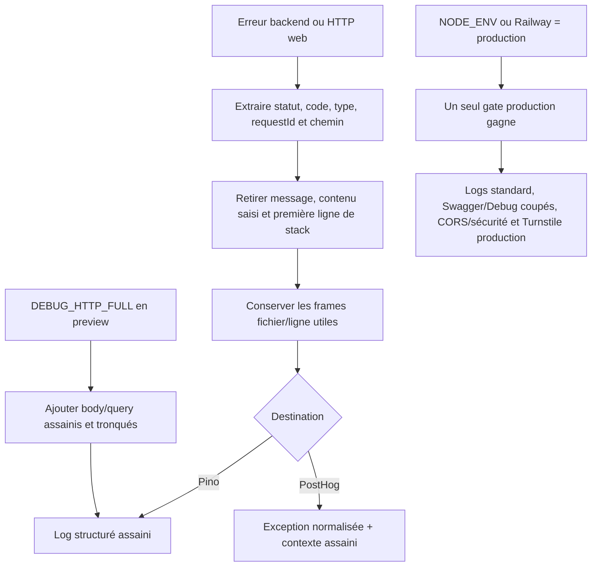

# Instruction: Assainir les erreurs et verrouiller le runtime production

## Architecture projection

> Tree of the final files. ✅ create · ✏️ modify · ❌ delete

```txt
backend-nest/src/
├── app.module.ts ✏️
├── common/
│   ├── filters/
│   │   ├── global-exception.filter.ts ✏️
│   │   └── global-exception.filter.spec.ts ✏️
│   └── services/
│       ├── turnstile.service.ts ✏️
│       └── turnstile.service.spec.ts ✏️
├── config/
│   ├── environment.ts ✏️
│   └── environment.spec.ts ✏️
├── main.ts ✏️
└── test/
    └── redaction.spec.ts ✏️
frontend/projects/webapp/src/app/core/
├── analytics/
│   ├── http-error-interceptor.ts ✏️
│   ├── http-error-interceptor.spec.ts ✏️
│   ├── posthog-sanitizer.ts ✏️
│   └── posthog-sanitizer.spec.ts ✏️
└── transaction/
    └── transaction-api.ts ✏️
docs/
└── MONITORING.md ✏️
```

## User Journey



## Tasks to do

### `1)` Retirer les messages arbitraires des logs Pino

> Production et preview doivent journaliser une forme stable, jamais l’objet `Error` brut.

1. Remplacer `err`, `customErrorMessage` et les messages libres par `errorType`, `errorCode`, `statusCode`, `requestId`, opération et contexte assaini.
2. Conserver les frames de stack utiles sans sa première ligne contenant le message et sans URL/query sensible.
3. Garder `requestBody` et `requestQuery` uniquement quand `DEBUG_HTTP_FULL=true` est autorisé en preview.
4. Ne pas modifier la réponse HTTP envoyée au client.

### `2)` Normaliser les erreurs HTTP avant PostHog

> Le support doit pouvoir grouper une panne sans transmettre le message du backend.

1. Construire une erreur avec un libellé stable basé sur statut, code et type.
2. Retirer `errorMessage`, `backendErrorMessage`, cause et payload libre du contexte.
3. Conserver méthode, statut, code backend, request ID, chemin assaini, release et commit.
4. Ajouter `q` aux paramètres de recherche protégés.

### `3)` Durcir `before_send` sur les exceptions

> Une capture directe ou future ne doit pas pouvoir réintroduire une valeur brute.

1. Normaliser récursivement `$exception_list` et retirer toute `value` arbitraire.
2. Conserver les champs techniques de grouping qui ne contiennent pas de contenu utilisateur.
3. Faire échouer fermé l’événement si la structure ne peut pas être assainie.

### `4)` Vérifier la sortie réellement sérialisée

> Les tests doivent inspecter ce qui part vers Pino et PostHog, pas seulement un helper.

1. Injecter une même sentinelle sensible dans message, stack, cause, query `q`, payload backend et exception PostHog.
2. Tester logs standard production et détaillés preview.
3. Tester le parcours interceptor jusqu’à `before_send`.
4. Vérifier que request ID, code, statut et frame fichier/ligne restent exploitables.

### `5)` Unifier la détection du runtime production

> Un déploiement Railway production ne doit jamais rester partiellement en mode développement.

1. Étendre le helper `isProductionLike` existant pour considérer ensemble `NODE_ENV` et `RAILWAY_ENVIRONMENT_NAME`, avec priorité au signal production.
2. Réutiliser ce helper unique dans Pino, `DebugModule`, Swagger, Helmet, CORS et Turnstile; ne pas créer un second resolver concurrent.
3. Conserver les comportements actuels de preview, test et développement quand aucun signal production n’est présent.
4. Ne pas modifier le compromis Turnstile documenté sur le token vide; corriger uniquement le bypass dû à une mauvaise classification d’environnement.

## Test acceptance criteria

| Task | Acceptance criteria |
| ---- | ------------------- |
| 1 | La sentinelle n’apparaît nulle part dans la ligne Pino sérialisée en production ni en preview détaillée. |
| 1 | Le mode preview détaillé conserve body/query assainis, request ID et frames; production reste en niveau `info`. |
| 2 | Une recherche en erreur ne transmet ni `q`, ni message client, ni message backend, mais conserve statut et code. |
| 3 | `$exception_list[].value` ne peut contenir aucune chaîne brute issue de l’erreur originale. |
| 4 | Le payload HTTP reçu par l’application et son comportement d’erreur restent inchangés. |
| 5 | Avec `RAILWAY_ENVIRONMENT_NAME=production` et `NODE_ENV=development`, les logs restent standards, DebugModule/Swagger sont absents, CORS/Helmet sont stricts et Turnstile ne prend pas le bypass d’environnement. |
| 5 | Preview avec `DEBUG_HTTP_FULL=true` garde le diagnostic détaillé assaini; local, test et production conservent leurs comportements attendus. |
