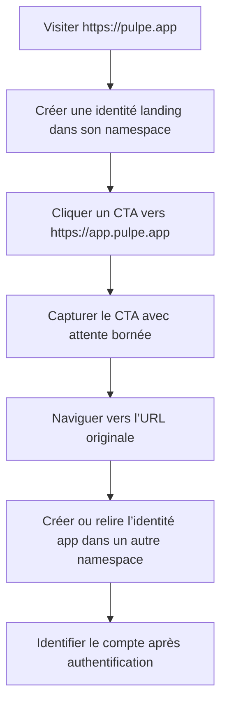

# Instruction: Isoler les identités landing et app sans perdre les CTA

## Architecture projection

> Tree of the final files. ✅ create · ✏️ modify · ❌ delete

```txt
frontend/projects/webapp/src/app/core/analytics/
├── posthog.ts ✏️
└── posthog.spec.ts ✏️
landing/
├── app/accessibility.test.tsx ✏️
├── components/PostHogProvider.tsx ✏️
└── lib/posthog.ts ✏️
docs/
├── MONITORING.md ✏️
└── VERCEL_ROUTING.md ✏️
```

## User Journey



## Tasks to do

### `1)` Séparer réellement les persistences PostHog

> Même clé projet ne doit plus signifier même identité navigateur entre domaines.

1. Définir `cross_subdomain_cookie: false` sur landing et app.
2. Définir des `persistence_name` distincts et stables pour landing et app.
3. Expirer avant initialisation l’ancien cookie PostHog partagé sur le domaine parent et le domaine courant, sans effacer le choix local d’opt-out.
4. Ne jamais ajouter d’identité à l’URL.

### `2)` Restaurer la livraison bornée des CTA

> Le premier événement doit avoir une chance d’être envoyé sans bloquer la navigation.

1. Faire retourner à `trackCTAClick` une promesse résolue par le callback de capture ou par un timeout court.
2. Dans le listener délégué, intercepter uniquement un clic principal sans modificateur vers l’app dans la même fenêtre.
3. Préserver clic secondaire, nouvel onglet, téléchargement, liens internes et accessibilité native.
4. Naviguer vers l’attribut `href` original, sans `ph_did` ni autre handoff.

### `3)` Tester le comportement effectif

> Un grep de configuration ne prouve ni la persistence ni la navigation.

1. Capturer les options passées à `posthog.init` dans les deux apps.
2. Précharger un cookie legacy et vérifier qu’il est expiré avant initialisation.
3. Tester capture rapide, import lent, échec d’import et timeout.
4. Vérifier qu’une navigation landing vers app ne réutilise ni `distinct_id`, ni `device_id`, ni session.

### `4)` Corriger les contrats de routage et monitoring

> La documentation doit refléter l’isolation et les deux domaines réels.

1. Remplacer la revendication de cookie partagé dans `VERCEL_ROUTING.md`.
2. Réaffirmer landing `https://pulpe.app`, app `https://app.pulpe.app` et identité app issue de l’authentification.

## Test acceptance criteria

| Task | Acceptance criteria |
| ---- | ------------------- |
| 1 | Landing et app initialisent PostHog avec cookie cross-subdomain désactivé et deux noms de persistence différents. |
| 1 | Un ancien cookie `.pulpe.app` ne peut plus initialiser l’identité d’aucune des deux apps. |
| 2 | Un CTA navigue toujours avant la borne maximale, même si PostHog ne se charge pas. |
| 2 | Ctrl/Cmd-clic, clic milieu, `target="_blank"` et liens internes gardent le comportement natif. |
| 3 | L’URL finale reste exactement celle du CTA et ne contient aucune donnée d’identité. |
| 4 | Les documents ne décrivent plus de session analytics partagée entre landing et app. |
