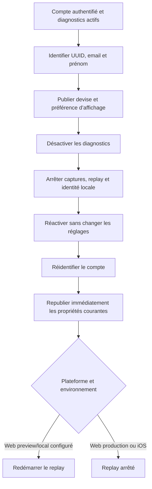

# Instruction: Restaurer complètement l’analytics après opt-in

## Architecture projection

> Tree of the final files. ✅ create · ✏️ modify · ❌ delete

```txt
frontend/projects/webapp/src/app/core/analytics/
├── analytics.ts ✏️
├── analytics.spec.ts ✏️
├── posthog.ts ✏️
└── posthog.spec.ts ✏️
ios/
├── Pulpe/Core/Analytics/
│   ├── AnalyticsService.swift ✏️
│   └── CurrencyAnalyticsSyncModifier.swift ✏️
└── PulpeTests/Core/Analytics/
    └── AnalyticsServiceTests.swift ✏️
docs/
└── MONITORING.md ✏️
```

## User Journey



## Tasks to do

### `1)` Rendre le cycle web symétrique

> Opt-in après opt-out doit restaurer le même état qu’une initialisation active.

1. Mémoriser le gate de replay calculé à l’initialisation.
2. Après `opt_in_capturing`, rétablir propriétés globales, tracking SPA et replay uniquement si le gate hors production l’autorise.
3. Après `identify`, publier immédiatement la devise et `showCurrencySelector` déjà chargés au lieu d’attendre un changement de settings.
4. Garder UUID Supabase, email et prénom dans l’identification.

### `2)` Rendre le cycle iOS symétrique

> Les propriétés courantes doivent survivre au cycle local d’opt-out.

1. Mettre en cache les dernières propriétés personne assainies, même quand la capture est arrêtée.
2. Après opt-in et ré-identification, les republier immédiatement.
3. Conserver l’UUID Supabase, l’email et le prénom dans `cachedIdentity`.
4. Quand le partage est désactivé, faire retourner `false` à `isFeatureEnabled` et terminer `reloadFeatureFlags` localement sans appel SDK ni réseau.

### `3)` Désactiver explicitement le replay iOS risqué

> Ne pas annoncer un replay SwiftUI qui ne fonctionne qu’avec des screenshots financiers.

1. Fixer `sessionReplay = false` sur iOS indépendamment de la variable distante.
2. Fixer `captureNetworkTelemetry = false`.
3. Supprimer le helper de gate iOS devenu inutile et adapter ses tests.
4. Documenter que le replay configurable hors production est web-only.

### `4)` Tester deux cycles complets

> Les tests doivent couvrir l’absence de modification des settings entre opt-out et opt-in.

1. Web : initialiser, identifier, opt-out, opt-in et vérifier identité, propriétés, tracking et gate replay.
2. iOS : identifier, publier les propriétés, opt-out, opt-in et vérifier la republication.
3. Vérifier production web, preview web et iOS séparément.
4. Après opt-out iOS puis authentification, vérifier qu’aucun reload de flags n’est envoyé et que son callback se termine.

## Test acceptance criteria

| Task | Acceptance criteria |
| ---- | ------------------- |
| 1 | Après opt-out puis opt-in web, UUID, email, prénom, devise et préférence d’affichage sont de nouveau présents sans action utilisateur supplémentaire. |
| 1 | Le replay redémarre en preview/local seulement quand configuré et ne démarre jamais en production. |
| 2 | Après le même cycle iOS, l’identité et les deux propriétés de préférence sont republiées une seule fois. |
| 3 | La configuration iOS transmise au SDK désactive replay et télémétrie réseau dans tous les environnements. |
| 4 | L’opt-out continue d’arrêter toute capture et d’effacer l’identité locale sans toucher au compte Supabase. |
| 4 | Après opt-out iOS, les feature flags retournent `false` et leur reload se termine sans requête PostHog, y compris après une nouvelle authentification. |
