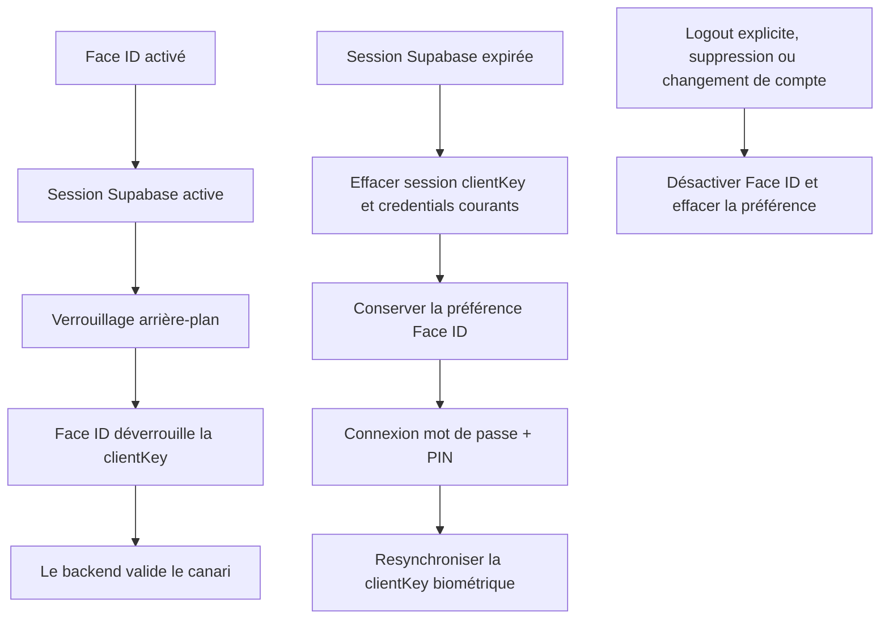

# Instruction: Simplifier Face ID autour du vrai flux actif

## Architecture projection

> Tree of the final files. ✅ create · ✏️ modify · ❌ delete

```txt
ios/
├── Pulpe/
│   ├── App/
│   │   ├── AppState.swift ✏️
│   │   ├── AppState+Bootstrap.swift ✏️
│   │   ├── AppState+SessionReset.swift ✏️
│   │   ├── AppStateDependencies.swift ✏️
│   │   ├── BiometricManager.swift ✏️
│   │   └── Auth/SessionLifecycleCoordinator.swift ✏️
│   └── Core/Auth/
│       ├── AuthService.swift ✏️
│       └── KeychainManager.swift ✏️
└── PulpeTests/
    ├── App/AppStateBiometricColdStartTests.swift ✏️
    ├── App/Auth/SessionLifecycleCoordinatorTests.swift ✏️
    ├── App/Auth/StartupCoordinatorTests.swift ✏️
    └── Core/Auth/AuthServiceBiometricResyncTests.swift ❌
```

## User Journey



## Tasks to do

### `1)` Préserver la préférence lors d’une expiration

> Une expiration de session n’est pas un choix utilisateur de désactiver Face ID.

1. Retirer `biometric.isEnabled = false` du traitement cold-start expiré.
2. Aligner expiration à froid, 401 à chaud et logout système sur la conservation de la préférence.
3. Réserver la désactivation à l’action explicite de logout, la suppression de compte et le changement de compte.

### `2)` Retirer le cold-start biométrique mort

> Le démarrage actif valide la session SDK puis demande PIN/Face ID pour la clientKey.

1. Supprimer `attemptBiometricSessionValidation`, son résultat dédié et la dépendance injectable `validateBiometricSession`.
2. Conserver dans `SessionLifecycleCoordinator` uniquement le verrouillage arrière-plan et la validation de clientKey réellement appelés.
3. Supprimer les tests qui prouvaient le pipeline injoignable et renforcer ceux du startup réel.

### `3)` Arrêter de dupliquer les tokens Supabase en Keychain biométrique

> Le stockage SDK reste l’unique source de session; Face ID protège uniquement la clientKey.

1. Retirer snapshot access/refresh token, resynchronisation à chaque rotation et retry foreground.
2. Simplifier `BiometricManager.enable` et `syncAfterAuth` autour du prompt et de `ClientKeyManager`.
3. Au bootstrap, effacer les anciennes entrées token biométriques laissées par les versions précédentes sans toucher à la clientKey ni à la préférence.
4. Garder la validation backend de la clientKey après déverrouillage Face ID.

### `4)` Prouver les parcours actifs

> Les tests doivent couvrir les transitions utilisateur, pas les anciens seams.

1. Cold start avec session valide : route PIN puis déverrouillage Face ID.
2. Retour foreground après délai : masque, prompt, validation de clé, restauration.
3. Expiration : préférence conservée, credentials courants effacés, réactivation après reconnexion.
4. Logout explicite : préférence et credentials effacés.

## Test acceptance criteria

| Task | Acceptance criteria |
| ---- | ------------------- |
| 1 | Une session expirée à froid ou à chaud laisse Face ID activé dans les préférences mais sans credential utilisable avant reconnexion. |
| 1 | Un logout explicite, une suppression de compte ou un changement de compte désactive toujours Face ID. |
| 2 | Aucun code de production ne référence `attemptBiometricSessionValidation` ni `validateBiometricSession`. |
| 3 | Aucun access token ni refresh token Supabase n’est écrit dans les slots biométriques; les anciennes entrées sont nettoyées au démarrage. |
| 4 | Le déverrouillage PIN et Face ID, le privacy shield et le timeout foreground gardent leur comportement actuel. |
