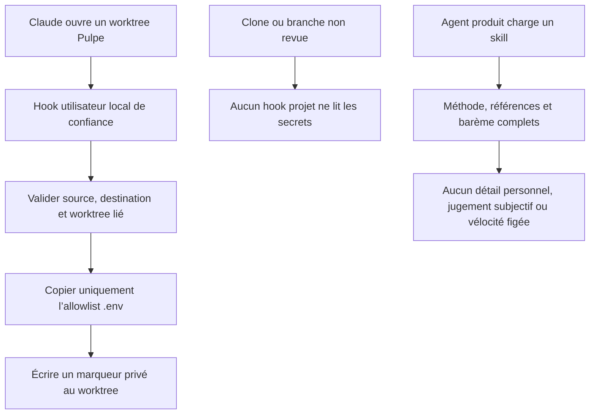

# Instruction: Sécuriser les workflows locaux et assainir les skills sans les appauvrir

## Architecture projection

> Tree of the final files. ✅ create · ✏️ modify · ❌ delete

```txt
pulpe-workspace/
├── .claude/
│   ├── hooks/sync-env-on-worktree-start.sh ❌
│   ├── settings.json ✏️
│   └── skills/
│       ├── product-designer/
│       │   ├── SKILL.md ✏️
│       │   └── references/process-design.md ✏️
│       └── product-owner/
│           ├── SKILL.md ✏️
│           └── references/user-story-format.md ✏️
├── .github/scripts/public-surface.test.mjs ✏️
├── aidd_docs/tasks/2026_07/
│   ├── 2026_07_28_driver-js-1-8-accessibility/ ❌ suivi Git seulement
│   └── 2026_07_28_fix_signup_password_criteria_overlap/ ❌ suivi Git seulement
└── sync-env.sh

~/.claude/
├── settings.json ✏️
└── hooks/pulpe-sync-env-on-worktree-start.sh ✅
```

## User Journey



## Tasks to do

### `1)` Sortir l’exécutable automatique de la branche

> Le dépôt ne doit pas décider quel code lit les `.env` au démarrage.

1. Retirer le hook `SessionStart` de `.claude/settings.json` et supprimer son wrapper versionné.
2. Conserver `sync-env.sh` inchangé pour l’exécution manuelle volontaire.
3. Réinstaller le hook dans `~/.claude/settings.json` en fusionnant la configuration existante, sans écraser les autres hooks utilisateur.
4. Placer son script dans `~/.claude/hooks/`, hors de tout worktree.

### `2)` Garder le sync automatique sûr et idempotent

> Le script local doit copier, jamais exécuter du code de la branche.

1. Lire le JSON `SessionStart`, détecter un worktree lié et ignorer le checkout principal.
2. Valider `PULPE_MAIN_WORKSPACE` ou `CONDUCTOR_ROOT_PATH`, refuser source/destination identiques, symlinks inattendus et chemins hors du repo Pulpe attendu.
3. Copier directement l’allowlist actuelle des quatre `.env`; ne jamais appeler `sync-env.sh` depuis le worktree.
4. Conserver le marqueur dans le git-dir privé et ne l’écrire qu’après succès.

### `3)` Réparer le garde de surface publique

> La CI doit empêcher le retour de ce vecteur sans interdire les hooks légitimes sans secrets.

1. Vérifier qu’aucun hook projet `SessionStart` ne référence le sync d’environnement ou une lecture de `.env`.
2. Vérifier que le wrapper supprimé n’est plus suivi.
3. Garder les contrôles existants sur permissions, chemins personnels, noms privés et dumps.
4. Retirer de l’index uniquement les sept fichiers `aidd_docs/tasks` réintroduits par le merge de `preview`; conserver leurs copies locales ignorées et ne réécrire aucun historique Git.

### `4)` Assainir chirurgicalement les skills produit

> Ne retirer que ce qui peut vieillir ou mettre l’auteur en porte-à-faux.

1. Remplacer « QI dans la moyenne » par une contrainte observable de simplicité sans toucher au profil ni aux standards UX.
2. Remplacer l’exemple « Maxime, 32 ans » par un persona générique en gardant le même contexte d’usage.
3. Retirer la table de vélocité personnelle figée et tout backfill rétroactif des issues Done.
4. Calculer la vélocité uniquement depuis les estimations déjà présentes; signaler les Done non estimées sans les réécrire.
5. Conserver intégralement apps de référence, méthodes, étapes, UX science, template exact, barème et intégration Linear.

## Test acceptance criteria

| Task | Acceptance criteria |
| ---- | ------------------- |
| 1 | Un clone public n’enregistre aucun hook capable de lire automatiquement des `.env`. |
| 1 | Sur la machine du développeur, ouvrir un nouveau worktree déclenche encore le sync automatique sans lancer de fichier du worktree. |
| 2 | Le premier démarrage copie l’allowlist; le second est un no-op; un chemin source invalide ou un symlink ne copie rien. |
| 3 | `public-surface.test.mjs` échoue si le hook projet dangereux est réintroduit et reste vert pour `sync-env.sh` manuel. |
| 3 | `git ls-files -- aidd_docs/tasks` est vide; les sept fichiers réintroduits restent disponibles localement et aucun autre fichier utile n’est supprimé. |
| 4 | Les skills ne contiennent plus QI, âge/prénom d’exemple ni référence de vélocité personnelle figée. |
| 4 | Les sections méthodologiques, références, contraintes UX, template, barème et commandes Linear restent présentes et dans le même ordre. |
