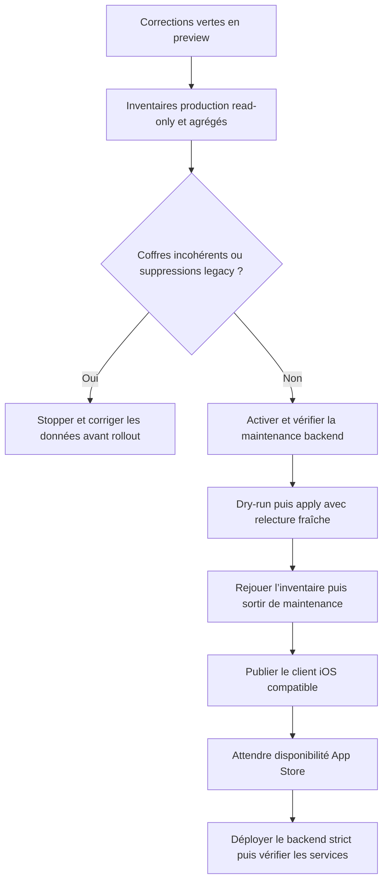

# Instruction: Verrouiller le rollout production et les contrats documentés

## Architecture projection

> Tree of the final files. ✅ create · ✏️ modify · ❌ delete

```txt
backend-nest/
├── package.json ✏️
└── scripts/
    ├── migrate-scheduled-deletion-metadata.ts ✅
    └── migrate-scheduled-deletion-metadata.spec.ts ✅
docs/
├── CONSENT.md ✏️
├── DEPLOYMENT.md ✏️
├── ENCRYPTION.md ✏️
├── MONITORING.md ✏️
└── VERSIONING.md ✏️
```

## User Journey



## Tasks to do

### `1)` Construire et documenter les gates de données production

> Les migrations opérationnelles doivent être prouvées avant le backend strict.

1. Documenter un inventaire read-only agrégé des coffres avec données chiffrées mais sans `key_check`.
2. Documenter les comptes avec `wrapped_dek` absent séparément, sans exporter identité ni données financières.
3. Garder l’outil admin paginé, idempotent, dry-run par défaut et protégé par `--apply`; ne jamais afficher identité ou donnée métier.
4. En apply uniquement, relire chaque candidate avec `getUserById`, recalculer l’éligibilité depuis les metadata fraîches, ignorer une claim devenue propriétaire et fusionner uniquement le `app_metadata` frais.
5. Encapsuler erreurs retournées et promesses rejetées de `listUsers`, `getUserById` et `updateUserById` dans des erreurs stables contenant seulement étape et page; le point d’entrée ne doit jamais imprimer un message inconnu brut.
6. Documenter le runbook obligatoire : préparer la commande avant l’interruption, activer `MAINTENANCE_MODE=true` sur Railway, attendre `maintenanceMode: true` sur l’endpoint public et un `503 MAINTENANCE` sur une route protégée, exécuter dry-run/apply/dry-run, puis remettre explicitement le flag à `false`.
7. Rendre explicite l’effet de bord opérationnel : toutes les routes non exemptées sont indisponibles pendant la fenêtre; health, statut de maintenance et version restent accessibles pour le contrôle et le rollback.
8. Tester dry-run sans relecture ni écriture, pagination, idempotence, metadata fraîche, claim apparue entre list et update, date legacy retirée/invalide et erreurs retournées ou rejetées contenant email/UUID sentinelles.
9. Réserver toute exécution production à une approbation explicite ultérieure; cette phase ne lance aucun `--apply` distant.
10. Interdire tout fallback runtime vers `user_metadata`.

### `2)` Ordonner la compatibilité iOS/backend

> L’ancien client distribué ne doit pas rencontrer `/validate-key` strict avant sa mise à jour.

1. Publier le client qui utilise `setup-recovery` pour une création contre le backend actuel.
2. Attendre sa disponibilité réelle et mesurer les versions encore actives.
3. Si nécessaire, utiliser `MIN_IOS_VERSION` seulement après disponibilité de la version cible.
4. Déployer ensuite le backend strict et documenter le rollback de `MIN_IOS_VERSION`.

### `3)` Aligner les chemins et domaines publics

> Les documents doivent pointer vers les libellés réellement visibles.

1. Web : `Paramètres → Données de diagnostic → Partager les diagnostics`.
2. iOS : `Préférences → Données et confidentialité → Partager les diagnostics`.
3. App production : `https://app.pulpe.app`; landing : `https://pulpe.app`.
4. Maintenir la description de l’analytics identifié et de l’opt-out sans rouvrir le fondement juridique dans ce correctif.

## Test acceptance criteria

| Task | Acceptance criteria |
| ---- | ------------------- |
| 1 | Les inventaires production sont agrégés, sans PII; aucun coffre chiffré sans canari n’est exposé au backend strict. |
| 1 | L’outil parcourt toutes les pages et le dry-run ne relit ni n’écrit individuellement aucun compte. |
| 1 | En apply, une claim apparue après `listUsers` ou toute autre metadata ajoutée entre-temps est préservée depuis la relecture fraîche. |
| 1 | Une erreur retournée ou rejetée contenant email, UUID ou message fournisseur n’apparaît jamais dans la sortie; seuls étape, page et compteurs agrégés restent visibles. |
| 1 | Le runbook impose une maintenance vérifiée avant apply et le retour à zéro du compteur legacy avant sortie de maintenance. |
| 1 | Le nombre de suppressions valides présentes uniquement dans `user_metadata` est zéro avant déploiement. |
| 2 | Une ancienne app iOS n’est jamais forcée vers un backend incompatible avant disponibilité de la version corrigée. |
| 3 | Les deux chemins de réglage et les deux domaines correspondent exactement aux interfaces déployées. |
