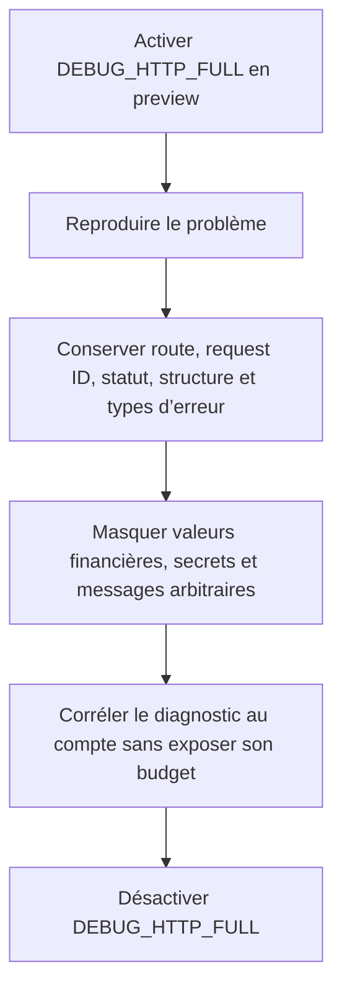

# Instruction: Fermer les fuites résiduelles des logs détaillés

## Architecture projection

> Tree of the final files. ✅ create · ✏️ modify · ❌ delete

```txt
backend-nest/src/
├── common/
│   └── utils/
│       ├── log-anonymization.ts ✏️
│       └── log-anonymization.spec.ts ✏️
├── modules/
│   └── encryption/
│       └── infrastructure/
│           └── crypto/
│               ├── aes-gcm.crypto-service.ts ✏️
│               └── aes-gcm.crypto-service.spec.ts ✏️
└── test/
    └── redaction.spec.ts ✏️
docs/
└── MONITORING.md ✏️
```

## User Journey



## Tasks to do

### `1)` Étendre le sanitizer backend à toutes les valeurs financières

> Une correction dans `sanitizeLogValue` doit couvrir automatiquement serializers, middleware de réponse et filtre global.

1. Étendre `isSensitiveLogKey` existant au vocabulaire financier réellement renvoyé par l’API : clés contenant montant ou solde et agrégats tels que revenu, dépense, épargne, disponible, restant, rollover et consommé, en camelCase ou snake_case.
2. Préserver noms de champs, structure, statuts, codes, request IDs, enums, booléens et compteurs techniques afin que le debug distant reste exploitable.
3. Ne pas créer de second sanitizer, ne pas déplacer la politique dans `shared` et ne modifier ni serializers ni middleware : leurs appels actuels au helper central doivent suffire.
4. Ne changer ni le gate `DEBUG_HTTP_FULL`, ni le niveau production, ni le payload HTTP effectivement envoyé.

### `2)` Retirer les messages bruts des warnings crypto

> Les logs directs des services ne passent pas par le filtre global.

1. Réutiliser `sanitizeLogTechnicalValue` pour n’émettre qu’un `errorType` stable dérivé du nom de l’erreur, avec fallback `UnknownError`.
2. Appliquer la même forme aux cinq branches : fallback de déchiffrement, restore/nullify de récupération et restore/nullify de changement de PIN.
3. Conserver opération, sévérité, user ID utile au support et longueur du ciphertext; ne journaliser ni message, cause, valeur rejetée, clé ou ciphertext.
4. Ne pas modifier les exceptions propagées, les codes métier, les rollbacks de `wrapped_dek` ni le fallback fonctionnel de déchiffrement.

### `3)` Prouver les sinks et les non-régressions

> Les tests doivent capturer les objets réellement remis aux loggers et les parcours request/response existants.

1. Étendre les tests du helper avec objets imbriqués et listes contenant variantes camelCase/snake_case des montants, soldes et agrégats.
2. Étendre les tests des serializers, du filtre global et du middleware de réponse avec une même sentinelle financière; vérifier la réponse HTTP originale inchangée.
3. Injecter un message sentinelle dans chacune des cinq branches crypto et vérifier son absence après sérialisation des appels logger, tout en conservant `errorType` et `operation`.
4. Mettre à jour les assertions qui attendaient volontairement `error: "DB write failed"`; ne pas élargir les tests aux flux analytics, iOS ou landing non modifiés.
5. Préciser dans `docs/MONITORING.md` que les valeurs financières sont masquées mais que la structure technique reste disponible.

## Test acceptance criteria

| Task | Acceptance criteria |
| ---- | ------------------- |
| 1 | Requête, query, erreur et réponse contenant `amount`, `original_amount`, `targetAmount`, `endingBalance`, `totalIncome`, `totalExpenses`, `totalSavings`, `remaining`, `available`, `rollover` ou `consumed` gardent leur structure mais jamais leurs valeurs. |
| 1 | Route, request ID, statut, code, enums, booléens et compteurs non financiers restent visibles en preview détaillée; production reste standard. |
| 2 | La même sentinelle placée dans les cinq erreurs crypto n’apparaît dans aucun argument logger sérialisé; `errorType`, `operation` et le comportement métier restent identiques. |
| 3 | Le middleware de réponse journalise une copie assainie sans modifier statut, headers ou payload reçu par le client. |
| 3 | L’identification PostHog, l’opt-out/in, le replay, Face ID, la landing et les workflows ne changent pas; aucun de leurs fichiers n’est modifié par cette phase. |
