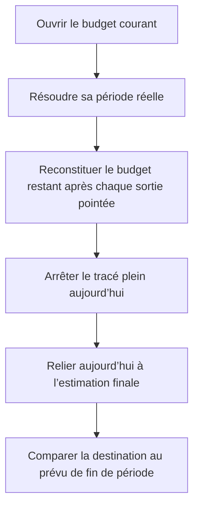

# Instruction: Trajectoire budgétaire et périodes réelles

## Architecture projection

> Tree of the final files. ✅ create · ✏️ modify · ❌ delete

```txt
ios/
├── Pulpe/
│   └── Domain/
│       ├── Formulas/
│       │   └── BalanceTrajectory.swift                         ✏️ rendre la trajectoire explicite et compatible avec les périodes de paie
│       └── Store/
│           └── CurrentMonthStore.swift                         ✏️ transmettre la période et retirer la projection hybride sans appelant
└── PulpeTests/
    ├── Domain/Store/
    │   └── CurrentMonthStoreDashboardTests.swift               ✏️ retirer l’assertion de compatibilité et verrouiller le raccord du store
    └── Features/CurrentMonth/
        └── HomeHeroCardTests.swift                              ✏️ couvrir la trajectoire civile et les périodes traversant deux mois
```

Aucun fichier source n’est créé ou supprimé.

## User Journey



## Tasks to do

### `1)` Utiliser la vraie période budgétaire

> Faire suivre au chart la même période que le chargement du budget.

1. Ajouter le jour de paie à l’entrée de `calculateBalanceTrajectory`.
2. Dériver le début, la fin, le nombre de jours et la position d’aujourd’hui avec `BudgetPeriodCalculator.periodDates`.
3. Indexer chaque point par son décalage depuis le début de période, y compris lorsque celle-ci traverse un changement de mois ou d’année.
4. Filtrer les sorties pointées à l’intérieur de cette fenêtre au lieu de supposer un premier jour de mois civil.
5. Retourner une trajectoire uniquement lorsque la date de référence appartient réellement à la période du budget.

### `2)` Nommer et verrouiller le burn-down

> Assumer une consommation du budget plutôt qu’un faux solde bancaire.

1. Renommer les séries internes `actual` et `projected` pour exprimer le suivi pointé et le connecteur du reste prévu.
2. Conserver comme origine le montant complet disponible pour la période, puis soustraire les sorties pointées cumulées avec la logique d’enveloppes existante.
3. Garder un point par jour jusqu’à aujourd’hui afin de produire la courbe organique, sans générer de valeur future intermédiaire.
4. Limiter le connecteur futur à deux points : le dernier point suivi et `metrics.remaining` au dernier jour de la période.
5. Conserver `plannedBalance` comme référence finale calculée sans transactions.

### `3)` Retirer la projection hybride et tester les frontières

> Éviter deux définitions incompatibles d’une projection dans le store.

1. Supprimer `CurrentMonthStore.projection`, désormais sans appelant produit.
2. Retirer l’assertion de test qui transforme cette propriété en API de compatibilité.
3. Ne pas modifier `BudgetFormulas.Projection`, `calculateProjection` ni `ProjectionCard`.
4. Couvrir un mois civil, un jour de paie en première quinzaine et un jour de paie en seconde quinzaine.
5. Couvrir une période traversant une année, une sortie avant la période, une sortie dans la période et la date de fin.

## Test acceptance criteria

| Task | Acceptance criteria |
| ---- | ------------------- |
| 1 | Le chart reste disponible et positionne correctement aujourd’hui pendant toute période budgétaire courante, même lorsqu’elle traverse deux mois civils. |
| 1 | Une sortie située hors de la période n’affecte aucun point ; une sortie pointée dans la période affecte le jour correspondant. |
| 1 | Le premier et le dernier jour d’une période issue du jour de paie sont inclus exactement une fois. |
| 2 | Le tracé plein correspond au montant disponible du budget moins les sorties pointées cumulées et ne se présente plus comme un solde bancaire réel. |
| 2 | Le connecteur futur contient exactement aujourd’hui et la destination de fin de période, sans point intermédiaire daté. |
| 2 | La destination du connecteur égale toujours `metrics.remaining` et la référence horizontale égale toujours `plannedRemaining`. |
| 3 | `CurrentMonthStore` n’expose plus de projection mêlant estimation par enveloppes et rythme journalier. |
| 3 | Les formules et composants historiques de projection restent inchangés hors du parcours de l’accueil. |
