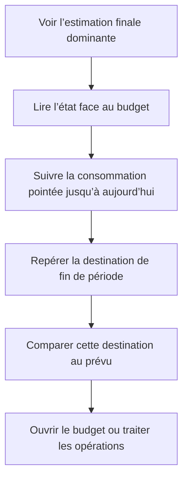

# Instruction: Chart organique et lecture immédiate

## Architecture projection

> Tree of the final files. ✅ create · ✏️ modify · ❌ delete

```txt
ios/
├── DESIGN.md                                                   ✏️ documenter le burn-down et les repères de fin de période
├── Pulpe/
│   └── Features/CurrentMonth/Components/
│       └── HomeHeroCard.swift                                  ✏️ clarifier les séries et leur destination sans perdre le rendu organique
└── PulpeTests/
    └── Features/CurrentMonth/
        └── HomeHeroCardTests.swift                              ✏️ verrouiller structure, domaine, microcopie et confidentialité
```

Aucun fichier source n’est créé ou supprimé.

## User Journey



## Wireframe

```txt
┌─────────────────────────────────────┐
│ (1) Période · compte                 │
│                                     │
│ (2) Estimation finale · état         │
│                                     │
│ (3) Trajectoire budgétaire           │
│     suivi ──────────●┄┄┄┄○          │
│                     │     destination│
│     ┄┄ repère de fin de période ┄┄  │
│                  maintenant          │
│                                     │
│ (4) Accès au budget                  │
├─────────────────────────────────────┤
│ (5) Opérations à traiter             │
│ (6) Activité récente                 │
└─────────────────────────────────────┘
```

1. En-tête : situe la période et conserve l’accès au compte.
2. Synthèse : garde une seule réponse financière dominante et son état.
3. Chart : conserve la courbe organique, distingue le suivi, maintenant, la destination et le repère final.
4. Budget : garde l’accès au détail sans métrique concurrente.
5. Traitement : conserve les éléments nécessitant une action.
6. Activité : conserve l’historique récent.

## Tasks to do

### `1)` Conserver l’esthétique du chart

> Garder la présence visuelle du modèle de référence avec les primitives natives.

1. Conserver le chart pleine largeur, sa hauteur actuelle et son absence de conteneur.
2. Tracer le suivi pointé en plein avec interpolation monotone, extrémités et jointures arrondies.
3. Conserver le marqueur unique d’aujourd’hui et la liaison pointillée vers la fin de période.
4. Ajouter un marqueur secondaire à la destination finale afin que le pointillé se lise comme un raccord entre deux états connus.
5. Réutiliser exclusivement les tokens, couleurs et styles de trait existants.

### `2)` Clarifier les repères sans ajouter de chrome

> Faire comprendre le dessin sans axe, légende ou panneau analytique.

1. Remplacer le libellé horizontal ambigu par une référence explicite à la fin de période.
2. Nommer la destination droite comme fin de période, sans répéter le montant déjà dominant.
3. Ne pas afficher de valeur intermédiaire, de cadence, de pourcentage, d’axe, de grille, de tooltip ou de légende.
4. Positionner les deux annotations sur des côtés distincts et prévoir leur empilement aux grandes tailles de texte.
5. Garder le chart masqué à VoiceOver et faire porter le sens financier par le résumé accessible existant.
6. Garder le masquage des montants appliqué à l’ensemble du chart.

### `3)` Valider la lecture et aligner la règle iOS

> Vérifier que l’esthétique renforce la compréhension au lieu de devenir décorative.

1. Mettre à jour les tests de structure et de domaine avec les séries renommées et le point final.
2. Vérifier sur simulateur un mois civil et une période de paie traversant deux mois.
3. Capturer les états conforme, meilleur que prévu, moins bon que prévu et déficit global.
4. Contrôler clair, sombre, Dynamic Type standard et accessibilité, ainsi que les montants masqués.
5. Vérifier en trois secondes que l’estimation reste prioritaire, puis qu’un nouveau lecteur distingue aujourd’hui, fin de période et prévu.
6. Mettre à jour uniquement la règle Dashboard de `ios/DESIGN.md` pour décrire le burn-down et le connecteur non prédictif.

## Test acceptance criteria

| Task | Acceptance criteria |
| ---- | ------------------- |
| 1 | Le hero conserve une grande courbe arrondie, un segment plein, un segment pointillé et deux marqueurs visuellement subordonnés au montant principal. |
| 1 | Le point d’aujourd’hui termine le suivi plein et le point de fin de période termine exactement le connecteur pointillé. |
| 1 | Aucun nouveau composant, token, effet décoratif ou animation propre au chart n’est introduit. |
| 2 | Un nouveau lecteur peut distinguer aujourd’hui, la fin de période et le prévu sans interpréter le trait pointillé comme une cadence chiffrée. |
| 2 | Aucun axe, grille, légende, tooltip, montant répété ou rythme quotidien ne concurrence la synthèse. |
| 2 | VoiceOver ne parcourt pas les marques du chart et le masquage ne révèle aucune forme financière lisible. |
| 3 | Le rendu reste lisible sans collision en clair, sombre et grandes tailles de texte pour un mois civil comme pour une période décalée. |
| 3 | Les tests ciblés et la build `PulpeLocal` valident les quatre états financiers sans régression du montant principal ni du verdict. |
