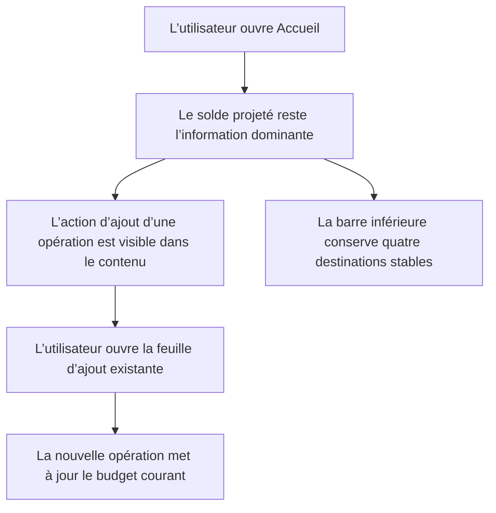

# Instruction: Séparer l’ajout d’opération de la navigation

## Architecture projection

```text
ios/
├── Pulpe/
│   ├── App/
│   │   └── MainTabView.swift                              ✏️ modify
│   └── Features/
│       └── CurrentMonth/
│           └── CurrentMonthView.swift                     ✏️ modify
└── PulpeTests/
    └── App/
        └── MainTabViewLayoutTests.swift                    ✏️ modify
```

## User Journey



## Wireframe

```text
┌──────────────────────────────────┐
│ (1) Période + compte             │
│                                  │
│ (2) Solde projeté + graphique    │
│     Repères financiers clés      │
│                                  │
│ (3) ＋ Ajouter une opération      │
│                                  │
│ (4) À pointer / Activité         │
│                                  │
│ (5) Accueil Budgets Objectifs    │
│     Modèles                      │
└──────────────────────────────────┘

(1) Navigation locale et identité du compte.
(2) Priorité de lecture à trois secondes, inchangée.
(3) Action contextuelle, libellée, cible tactile de 44 pt minimum.
(4) Contenu opérationnel existant.
(5) Navigation globale uniquement, sans bouton de création.
```

## Tasks to do

### `1)` Verrouiller la responsabilité de la barre globale

- Étendre `MainTabViewLayoutTests` avec un invariant vérifiant que `MainTabView` rend uniquement les quatre destinations de navigation et ne présente plus `AddTransactionSheet`.
- Conserver les scénarios existants qui prouvent que la barre reste visible à une profondeur Budget de `1` et se masque au-delà de `1`.
- Faire échouer ce test avant l’implémentation pour confirmer qu’il détecte bien le bouton d’action actuel.

### `2)` Réduire `MainTabView` à la navigation

- Supprimer de `MainTabView` l’état `addTransactionBudgetId`, la feuille d’ajout, `actionFAB`, son arrière-plan dédié et les helpers devenus inutilisés.
- Rendre les quatre segments de navigation de façon identique dans les variantes iOS 26 et antérieures.
- Ne pas modifier `shouldHideFloatingTabBar`, le routage des onglets ni les transitions clavier existantes.

### `3)` Donner l’ajout d’opération à Accueil

- Étendre la destination de feuille déjà possédée par `CurrentMonthView` pour présenter `AddTransactionSheet`.
- Réutiliser `CurrentMonthStore.addTransaction` après validation de la feuille ; ne pas dupliquer le chargement du budget ou la logique métier.
- Placer une action textuelle avec icône plus au début de `dashboardDetails`, après le hero financier et avant les cartes d’actions. Réutiliser les tokens et styles Pulpe existants, sans nouvelle carte, nouveau composant ou FAB.
- Afficher l’action uniquement lorsqu’un budget courant chargé peut recevoir l’opération.
- Fournir le libellé VoiceOver explicite « Ajouter une opération » et une cible tactile minimale de 44 × 44 pt.
- Préserver les modifications locales déjà présentes dans `CurrentMonthView` et `HomeHeroCard`.

### `4)` Vérifier le comportement et la hiérarchie visuelle

- Exécuter `xcodegen generate --use-cache`.
- Exécuter `xcodebuild test -scheme PulpeLocal -destination 'platform=iOS Simulator,name=iPhone 17 Pro Max,OS=26.2' -only-testing:PulpeTests/MainTabViewLayoutTests CODE_SIGNING_ALLOWED=NO`.
- Construire l’app avec `xcodebuild build -scheme PulpeLocal -destination 'platform=iOS Simulator,name=iPhone 17 Pro Max' CODE_SIGNING_ALLOWED=NO`.
- Vérifier sur simulateur que le hero reste la première information perçue, que l’action ne concurrence pas le solde et que la barre conserve la même géométrie dans les quatre onglets.
- Vérifier les apparences claire et sombre, les tailles de texte d’accessibilité, VoiceOver et l’ouverture du clavier dans la feuille.

## Test acceptance criteria

| Scenario | Expected observable behavior |
|---|---|
| Accueil avec un budget courant chargé | Le solde projeté reste dominant ; « Ajouter une opération » apparaît sous le hero et ouvre la feuille existante. |
| Enregistrement d’une opération valide | La feuille se ferme et le budget courant reflète l’opération via le store existant. |
| Accueil sans budget exploitable | Aucune action d’ajout incohérente n’est affichée. |
| Navigation entre les quatre onglets | La barre garde quatre destinations, sans bouton central ni changement de forme lié à l’onglet actif. |
| Ouverture directe d’un détail Budget | La barre reste visible au premier niveau ; les parcours plus profonds et le clavier conservent le masquage actuel. |
| Accessibilité | L’action est annoncée « Ajouter une opération », reste activable à grande taille de texte et possède une cible d’au moins 44 × 44 pt. |
| Compatibilité | Le test ciblé et le build `PulpeLocal` réussissent sur le simulateur de référence. |
