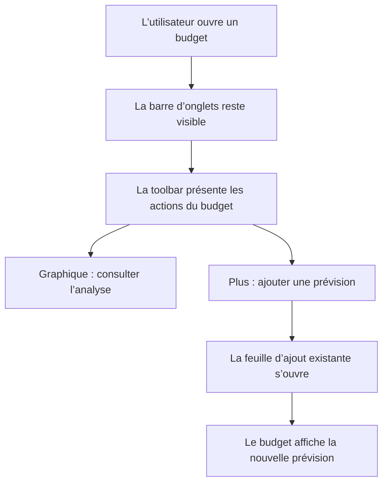

# Instruction: Contextualiser les créations métier

## Architecture projection

```text
ios/
├── DESIGN.md                                                 ✏️ modify
├── Pulpe/
│   └── Features/
│       ├── Budgets/
│       │   └── BudgetDetails/
│       │       ├── BudgetDetailsView.swift                   ✏️ modify
│       │       └── BudgetDetailsAddFAB.swift                 ❌ delete
│       └── Templates/
│           └── TemplateList/
│               └── TemplateListView.swift                    ✏️ modify
└── PulpeTests/
    └── Architecture/
        └── BudgetDetailsArchitectureTests.swift              ✏️ modify
```

## User Journey



## Wireframe

```text
┌──────────────────────────────────┐
│ ‹  Budget juillet      ◉    ＋   │
│                         (1)  (2) │
│                                  │
│ (3) Résumé du budget             │
│                                  │
│ (4) Filtres                      │
│ ──────────────────────────────── │
│ (5) Prévisions et opérations     │
│                                  │
│ Accueil Budgets Objectifs        │
│ Modèles                          │
└──────────────────────────────────┘

(1) Accès au graphique existant.
(2) Ajout contextuel d’une prévision dans la toolbar native.
(3) Résumé métier existant.
(4) Filtres existants.
(5) Liste existante, sans bouton flottant superposé.
```

## Tasks to do

### `1)` Décrire par test la structure cible du détail Budget

- Étendre `BudgetDetailsArchitectureTests` pour exiger que l’action `.addBudgetLine` soit déclenchée depuis la toolbar du détail.
- Vérifier que `BudgetDetailsView` ne superpose plus de bouton en bas de l’écran et que `BudgetDetailsAddFAB.swift` n’existe plus.
- Garder le test centré sur la responsabilité et la structure, sans répliquer le rendu SwiftUI complet.

### `2)` Utiliser la toolbar native pour l’ajout de prévision

- Regrouper l’accès au graphique existant et un bouton plus dans `ToolbarItemGroup(placement: .topBarTrailing)`.
- Faire appeler au bouton plus le routage existant `router.present(.addBudgetLine)`.
- Ajouter le libellé VoiceOver explicite « Ajouter une prévision » et conserver des cibles tactiles de 44 × 44 pt.
- Retirer l’overlay bas-droite de `BudgetDetailsView` puis supprimer `BudgetDetailsAddFAB.swift` et son modificateur d’arrière-plan devenus sans appelant.
- Ne pas toucher à la feuille `AddBudgetLineSheet`, au routeur, aux calculs financiers ni à la marge basse réservée à la barre d’onglets.

### `3)` Aligner les autres créations déjà contextuelles

- Conserver l’action toolbar existante d’Objectifs, déjà contextuelle et explicitement labellisée.
- Ajouter à l’action toolbar existante de Modèles le libellé VoiceOver « Créer un modèle », sans modifier son placement ni son état désactivé.
- Mettre à jour `ios/DESIGN.md` : quatre destinations dans la barre globale, ajout d’opération dans Accueil, ajout de prévision dans la toolbar Budget, barre visible au premier niveau du détail.

### `4)` Régénérer et valider les deux variantes iOS

- Exécuter `xcodegen generate --use-cache` après la suppression du fichier Swift ; ne pas éditer le projet Xcode généré.
- Exécuter `xcodebuild test -scheme PulpeLocal -destination 'platform=iOS Simulator,name=iPhone 17 Pro Max,OS=26.2' -only-testing:PulpeTests/BudgetDetailsArchitectureTests -only-testing:PulpeTests/MainTabViewLayoutTests CODE_SIGNING_ALLOWED=NO`.
- Construire l’app avec `xcodebuild build -scheme PulpeLocal -destination 'platform=iOS Simulator,name=iPhone 17 Pro Max' CODE_SIGNING_ALLOWED=NO`.
- Vérifier sur un petit iPhone que les deux contrôles trailing restent distincts, lisibles et activables avec les grandes tailles de texte.
- Vérifier les apparences claire et sombre, VoiceOver, la variante verre iOS 26 et le fallback antérieur.

## Test acceptance criteria

| Scenario | Expected observable behavior |
|---|---|
| Ouverture d’un détail Budget | La toolbar montre l’analyse et l’ajout ; aucun FAB ne flotte au-dessus du contenu. |
| Appui sur le bouton plus du Budget | La feuille existante d’ajout de prévision s’ouvre. |
| Appui sur l’action graphique | Le parcours d’analyse existant reste inchangé. |
| Premier niveau du détail Budget | La barre à quatre destinations reste visible sans collision avec le contenu. |
| Écran Modèles | L’action existante est annoncée « Créer un modèle » sans changement visuel ou fonctionnel. |
| Petit écran et grande taille de texte | Les actions toolbar restent identifiables, séparées et activables avec une cible de 44 × 44 pt. |
| Structure du projet | Le FAB Budget supprimé n’a plus de référence ; `xcodegen`, les tests ciblés et le build réussissent. |
